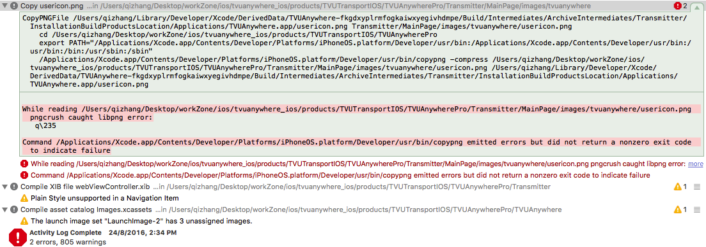
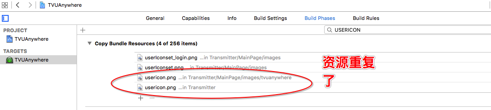

## 1.UIAlertController

### Situations

TVUAnywhere 使用二维码扫描配对R，由于从二维码扫描界面返回到主view界面的过程相对来说有点慢，所以当利用UIAlertController提示配对成功时出现了上述异常，导致界面显示错乱。

### Solution

自定义UIAlertController的样式，让其以一个子view的形式添加到父view上。

### Summary

如果使用UIAlertController 不当，最直接导致的一个问题就是警告框弹不出来，有时候会发生更严重的异常，甚至会导致页面显示错误。当需要弹出一个 UIAlertController 的时候，需要注意一下两点：

* 弹出操作必须在主线程中。
* 警告框弹出时，所在控制器必须是 window 的最顶层控制器，即当前正在显示的控制器，否则会发生一种异常。

如果我们注意到以上两点之后，还不能解决关于警告框弹出的问题，那么我们就可以自定义警告框来避免一些问题。

## 2.CopyPNGFile Error

### Situations

当构建app发布到App Store中的时候，期间发生了 CopyPNGFile Error 错误。如图所示：

在网上找到了一些解决方法，分别是 

* 重新导出png图片放到工程中。 
* 在build settings里把工程里的Compress PNG files设置为NO，问题解决，但这样设置以后，弄出来的ipa会很大，不推荐使用。

### Solution

在 target -> Build Phases -> Copy Bundle Resources 中查看。看看这些报错的资源是否有异常。修改过来就可以了。如图：

### Summary
资源错误有多重情况： 重复，不存在等……

## 3.UITableView cell's text label not the full width of the UITableView

### Situations

Since updating to iOS 9, table view cell's in iPad landscape no longer stretch the full width of the table in my unit tests.

### Solution

	 // iOS9
	if([self.tableView respondsToSelector:@selector(setCellLayoutMarginsFollowReadableWidth:)]) {
	    self.tableView.cellLayoutMarginsFollowReadableWidth = NO;
	}