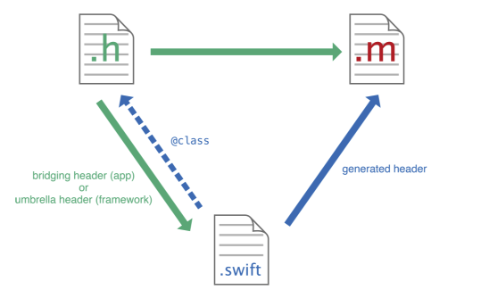

## 同一项目中使用swift和Objective-C

swift和Objective-C的兼容性使你可以在同一项目中使用这两种文件。利用这一特性，你可以进行OC和swift的混编。使用混编，你可以使用最新的功能，swift实现你的应用程序部分功能，并无缝地整合到你的OC项目中去。

### 混编OC和Swift

OC和Swift可以同时存在于一个项目中，无论这个项目是OC写的项目还是Swift写的项目。你可以在OC项目中添加swift文件，也可以在swift项目中添加OC文件。

混编和单一语言的程序略有不同，这取决于你写的是一个应用还是一个框架。用两种语言混编一个应用的描述如下：


## 同一项目中导入另一种语言

我们经常会遇到在一个swift项目中引入OC文件，或者在一个OC项目中引入Swift文件，下面我们就对这两种情况做具体说明。

### 在swfit项目中引入Objective-C文件

当你在swift项目中引入OC文件时，需要依靠 OC桥接头文件来向swift曝光这些OC文件。当你在Swift项目中创建OC文件或者在OC项目中创建swift文件时，XCode会提示你是否创建这个桥接文件。

如果你接受创建桥接头文件，Xcode创建的头文件的名称是你的工程名称后面接着 `-Bridging-Header.h`。

当然，你也可以手动创建这个桥接头文件。File > New > File >(ios,watchOS,tvOS,or macOS) > Source > Header File.

你需要编辑桥接头文件，暴露OC文件给你的swift项目。

### 在同一个target中导入OC代码到swift项目中

1. 导入你的OC桥接头文件，在该文件中导入每一个你想暴露给swift的头文件。

	```
		#import "XYZCustomCell.h"
		#import "XYZCustomView.h"
		#import "XYZCustomViewController.h"
	```
2. In Build Settings, in Swift Compiler - Code Generation, make sure the Objective-C Bridging Header build setting under has a path to the bridging header file.
The path should be relative to your project, similar to the way your Info.plist path is specified in Build Settings. In most cases, you should not need to modify this setting.

Any public Objective-C headers listed in this bridging header file will be visible to Swift. The Objective-C functionality will be available in any Swift file within that target automatically, without any import statements. Use your custom Objective-C code with the same Swift syntax you use with system classes.

### 在Objective-C项目中引入swift文件

当你在OC项目中引入swift文件时，你依靠Xcode自动创建的桥接头文件来暴露这些文件给OC文件。这个自动生成的文件是一个OC头文件，它为你的应用程序声明了swift接口。这个桥接头文件可以被看做是你swift文件的保护伞。你应用的头文件是你应用的名称后面加上`-Swift.h`。


## 在swift项目中引入用oc写的framework静态库(手动)

eg: 我要在项目中使用`UNetAnalysisSDK`

1. 创建桥接文件，在桥接文件中导入你要使用的第三方`framework`
    `#import <UNetAnalysisSDK/UNetAnalysisSDK.h>`
2. 在项目的`build setting`中设置桥接文件的路径(最好使用相对路径)
3. 然后再swift项目中就可以使用OC的framework了，并且Apple会自动将OC转化成swift语言。

比较变化，如图： 

UNetAnalysisSDK.framework 中的开放类： 


在项目中时机运用：


