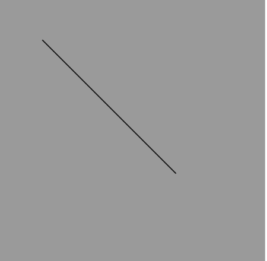
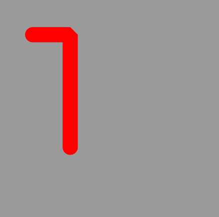
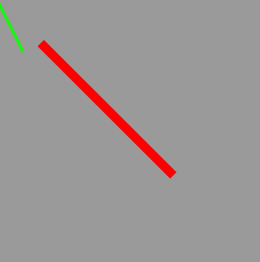
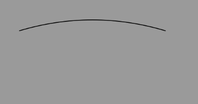
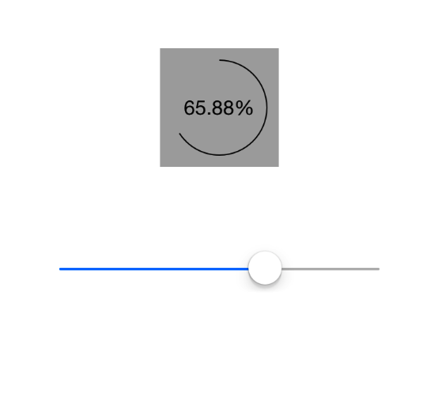
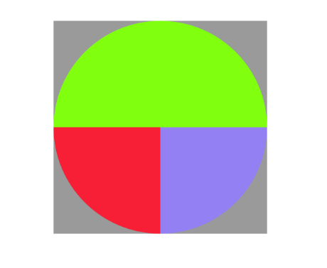

## 1.说明

Quartz 2D 是一个二维绘图引擎，同时支持ios和mac系统。Quartz 2D能完成以下工作：

* 绘制图形：线条\三角形\矩形\圆\弧等
* 绘制文字
* 绘制\生成图片（图像）
* 读取\生成PDF
* 截图\裁剪图片
* 自定义UI控件

## 图形上下文

图形上下文（Graphics Context）：是一个CGContextRef类型的数据。

作用：
* 保存绘图信息，绘图状态。
* 决定回执的输出目标（绘制到什么地方去？），输出目标可以使PDF文件、Bitmap或者显示器窗口上。 步骤： 绘制好的图形（保存）->图形上下文（显示）->输出目标

## 2.画线

### 1)画一条线

画如下图所示的一条线，有以下几种方式：

第一种方式：

	- (void)drawLine1
	{
	// 1. 获取图形上下文
	CGContextRef ctx = UIGraphicsGetCurrentContext();
	    
	// 2. 描述路径
	CGMutablePathRef path= CGPathCreateMutable();
	    
	// 设置起点
	CGPathMoveToPoint(path, NULL, 50, 50);
	    
	// 添加一根线到某个点
	CGPathAddLineToPoint(path, NULL, 200, 200);
	    
	// 3. 把路径添加到上下文
	CGContextAddPath(ctx, path);
	    
	// 4. 渲染上下文
	CGContextStrokePath(ctx);
}

第二种方式：

	- (void)drawLine2
	{
	    // 1. 获取图形上下文
	    CGContextRef ctx = UIGraphicsGetCurrentContext();
	    
	    // 描述路径
	    // 设置起点
	    CGContextMoveToPoint(ctx, 50, 50);
	    CGContextAddLineToPoint(ctx,200, 200);
	    // 渲染上下文
	    CGContextStrokePath(ctx);
	
	}
	
第三种方式：

	- (void)drawLine3
	{
	    // 贝瑟尔路径
	    // 创建路径
	    UIBezierPath *path = [UIBezierPath bezierPath];
	    // 设置起点
	    [path moveToPoint:CGPointMake(50, 50)];
	    // 添加一根线到某个点
	    [path addLineToPoint:CGPointMake(200, 200)];
	    // 绘制路径
	    [path stroke];
	}

### 2)画两条线

1.如图所示

代码：

	- (void)drawCtxState
	{
	    // 获取上下文
	    CGContextRef ctx = UIGraphicsGetCurrentContext();
	    // 描述路径
	    CGContextMoveToPoint(ctx, 50, 50);
	    CGContextAddLineToPoint(ctx, 100, 50);
	    // 默认下一根线的起点就是上一根线的终点
	    CGContextAddLineToPoint(ctx, 100, 200);
	    
	    // 设置绘图状态
	    // 颜色
	    [[UIColor redColor] setStroke];
	    
	    // 线宽
	    CGContextSetLineWidth(ctx, 20);
	    
	    // 设置连接样式
	    CGContextSetLineJoin(ctx, kCGLineJoinBevel);
	    
	    // 设置顶角样式
	    CGContextSetLineCap(ctx, kCGLineJoinRound);
	    
	    // 渲染上下文
	    CGContextStrokePath(ctx);
	}

2. 如图所示：

代码：

	- (void)drawUIBezierState
	{
	    UIBezierPath *path = [UIBezierPath bezierPath];
	    [path moveToPoint:CGPointMake(50, 50)];
	    [path addLineToPoint:CGPointMake(200, 200)];
	    path.lineWidth = 10;
	    [[UIColor redColor] set];
	    [path stroke];
	    
	    UIBezierPath *path1 = [UIBezierPath bezierPath];
	    [path1 moveToPoint:CGPointMake(0, 0)];
	    [path1 addLineToPoint:CGPointMake(30, 60)];
	    [[UIColor greenColor] set];
	    path1.lineWidth = 3;
	    [path1 stroke];
	
	}
 
### 3)绘制曲线

如图所示：

代码：

	- (void)drawRect:(CGRect)rect {
	    // Drawing code
	    // 绘制曲线
	    // 原生绘制方法
	    CGContextRef ctx = UIGraphicsGetCurrentContext();
	    
	    // 描述路径
	    // 设置起点
	    CGContextMoveToPoint(ctx, 50, 50);
	    
	    // cpx:控制点的x  cpy:控制点的y
	    CGContextAddQuadCurveToPoint(ctx, 150, 20, 250, 50);
	    
	    // 渲染上下文
	    CGContextStrokePath(ctx);
	}

## 3.画图形

### 1）圆角矩形
	UIBezierPath *path = [UIBezierPath bezierPathWithRoundedRect:CGRectMake(20, 20, 200, 200) cornerRadius:10];
	    [path stroke];

### 2）圆形

	// 线条圆形
    UIBezierPath *path = [UIBezierPath bezierPathWithRoundedRect:CGRectMake(20, 20, 200, 200) cornerRadius:100];
    [path stroke];
	// 填充
	UIBezierPath *path = [UIBezierPath bezierPathWithRoundedRect:CGRectMake(20, 20, 200, 200) cornerRadius:100];
	[path fill];  // 填充：必须是一个完整的封闭路径
	
### 3）圆弧
	    // center: 圆心
	    // startAngle : 弧度
	    // clockwise: YES:顺时针  NO：逆时针
	    UIBezierPath *path = [UIBezierPath bezierPathWithArcCenter:CGPointMake(125, 125) radius:100 startAngle:0 endAngle:M_PI_2 clockwise:YES];
	    [path stroke];
	    
### 4）扇形
	 CGPoint center = CGPointMake(125, 125);
	    UIBezierPath *path = [UIBezierPath bezierPathWithArcCenter:center radius:100 startAngle:0 endAngle:M_PI_2 clockwise:YES];
	    // 添加一根线到圆形
	    [path addLineToPoint:center];
	    
	    // 关闭路径：默认从路径的终点到起点
	    [path closePath];
	    
	    // 填充 : 必须是一个封闭的路径，默认会自动关闭路径
	    [path fill];

## 4.重绘

### 说明

只要在 drawRect:(CGRect)rect 方法中才能获取到图形上下文。但是图形上下文我们自己创建不了，只能由系统创建，然后传递给我们。所以 drawRect 不能手动调用。

重绘图形使用 [self setNeedsDisplay] ,系统会首先创建于view相关联的上下文，然后调用 drawRect 。

### 例子

我们要写一个下载进度条的demo，如图所示：

关键代码：

ViewController:

	#import "ViewController.h"
	#import "DownloadProgressView.h"
	
	@interface ViewController ()
	@property (weak, nonatomic) IBOutlet UILabel *progressValueLab;
	
	@property (weak, nonatomic) IBOutlet DownloadProgressView *progressView;
	@end
	
	@implementation ViewController
	
	- (void)viewDidLoad {
	    [super viewDidLoad];
	    // Do any additional setup after loading the view, typically from a nib.
	}
	
	- (void)didReceiveMemoryWarning {
	    [super didReceiveMemoryWarning];
	    // Dispose of any resources that can be recreated.
	}
	
	- (IBAction)slideProgress:(UISlider *)slider {
	    self.progressValueLab.text = [NSString stringWithFormat:@"%.2f%%",slider.value * 100];
	    self.progressView.progress = slider.value;
	}
	
DownloadProgressView：

	#import "DownloadProgressView.h"
	
	@implementation DownloadProgressView
	
	
	- (void)setProgress:(float)progress
	{
	    _progress = progress;
	    
	    // 重绘
	    [self setNeedsDisplay];
	    
	}
	
	// Only override drawRect: if you perform custom drawing.
	// An empty implementation adversely affects performance during animation.
	- (void)drawRect:(CGRect)rect {
	    // Drawing code
	    
	    // 创建贝瑟尔路径
	    CGFloat radius = rect.size.width * 0.5;
	    CGPoint center = CGPointMake(radius, radius);
	    
	    CGFloat endA = -M_PI_2 + _progress * M_PI * 2;
	    
	    UIBezierPath *path = [UIBezierPath bezierPathWithArcCenter:center radius:radius-10 startAngle:-M_PI_2 endAngle:endA clockwise:YES];
	    [path stroke];
	}	

	
示例代码: [DownloadProgress](https://github.com/MaxwellQi/LearnQuartz2D)

## 5.饼状图

效果图如图所示：

代码：

	- (void)drawRect:(CGRect)rect {
	    // Drawing code
	    
	    NSArray *array = @[@25,@25,@50];
	    
	    CGFloat radius = rect.size.width * 0.5;
	    CGPoint center = CGPointMake(radius, radius);
	    
	    CGFloat startA = 0;
	    CGFloat angle = 0;
	    CGFloat endA = 0;
	    
	    for (int i = 0; i < array.count; i++) {
	        startA = endA;
	        angle = [array[i] doubleValue] / 100.0 * M_PI * 2;
	        endA = startA + angle;
	        UIBezierPath *path = [UIBezierPath bezierPathWithArcCenter:center radius:radius startAngle:startA endAngle:endA clockwise:YES];
	        [path addLineToPoint:center];
	        
	        [[self colorRandom] set];
	        
	        [path fill];
	    }
	}
	- (UIColor *)colorRandom
	{
	    CGFloat r = arc4random_uniform(256) / 255.0;
	    CGFloat g = arc4random_uniform(256) / 255.0;
	    CGFloat b = arc4random_uniform(256) / 255.0;
	    return [UIColor colorWithRed:r green:g blue:b alpha:1];
	}
	
	- (void)touchesBegan:(NSSet *)touches withEvent:(UIEvent *)event
	{
	    [self setNeedsDisplay];
	}
	

## 6.柱状图

效果图如图所示：

代码：

	- (void)drawRect:(CGRect)rect {
	    
	    NSArray *arr = @[@25,@25,@50];
	    
	    CGFloat x = 0;
	    CGFloat y = 0;
	    CGFloat w = 0;
	    CGFloat h = 0;
	    
	    for (int i = 0; i < arr.count; i++) {
	        w = rect.size.width / (2 * arr.count -1);
	        x = 2 * w * i;
	        h = [arr[i] floatValue] / 100.0 * rect.size.height;
	        y = rect.size.height - h;
	        
	        UIBezierPath *path = [UIBezierPath bezierPathWithRect:CGRectMake(x, y, w, h)];
	        
	        [[self colorRandom] set];
	        
	        [path fill];
	    }
	}

## 7.绘制文字和图片

### 1)绘制文字

效果图如图：

代码：

	// 绘制文字
	- (void)drawWords
	{
	    NSString *words = @"Hello World!!";
	    
	    // Text attributes
	    NSMutableDictionary *textDict = [NSMutableDictionary dictionary];
	    
	    // 文字颜色
	    textDict[NSForegroundColorAttributeName] = [UIColor redColor];
	    
	    // 字体
	    textDict[NSFontAttributeName] = [UIFont systemFontOfSize:30];
	    
	    // 设置文字的空心颜色和宽度
	    textDict[NSStrokeWidthAttributeName] = @3;
	    textDict[NSStrokeColorAttributeName] = [UIColor yellowColor];
	    
	    // 创建阴影对象
	    NSShadow *shadow = [[NSShadow alloc] init];
	    shadow.shadowColor = [UIColor greenColor];
	    shadow.shadowOffset = CGSizeMake(4, 4);
	    shadow.shadowBlurRadius = 3;
	    textDict[NSShadowAttributeName] = shadow;
	    
	    // 富文本：给普通的文字添加颜色，字体大小
	//    [words drawAtPoint:CGPointZero withAttributes:textDict];  // 不会自动换行
	    [words drawInRect:self.bounds withAttributes:textDict]; // 会自动换行
	
	}

### 2)绘制图片

绘制图片代码：

	// 绘制图片
	- (void)drawImages
	{
	    // 超出裁剪区域的内容全部裁减掉，裁剪必须放在绘制之前
	    UIRectClip(CGRectMake(0, 0, 50, 50));
	    UIImage *image = [UIImage imageNamed:@"001"];
	    
	    // 绘图
	    [image drawAsPatternInRect:self.bounds];
	}

### 3)自定义UIImageView

代码：

TVUImageView.h

	#import <UIKit/UIKit.h>
	
	@interface TVUImageView : UIView
	@property (nonatomic,strong) UIImage *image;
	
	- (instancetype)initWithImage:(UIImage *)image;
	@end

TVUImageView.m

	#import "TVUImageView.h"
	
	@implementation TVUImageView
	
	
	- (instancetype)initWithImage:(UIImage *)image
	{
	    self = [super initWithFrame:CGRectMake(0, 0, image.size.width, image.size.height)];
	    if (self) {
	        _image = image;
	    }
	    return self;
	}
	
	- (void)setImage:(UIImage *)image
	{
	    _image = image;
	    [self setNeedsDisplay];  // 重绘
	}
	
	// Only override drawRect: if you perform custom drawing.
	// An empty implementation adversely affects performance during animation.
	- (void)drawRect:(CGRect)rect {
	    // Drawing code
	    
	    [_image drawInRect:rect];
	}
	
	
	@end

### 4)绘图时使用定时器

在绘图的时候很少使用 NSTimer 开启一个定时器，因为其调度优先级别比较低，并不会准时调用。 因此需要使用 CADisplayLink 开启一个定时器。

下面来看一个雪花的例子：

	#import "DrawView.h"
	static CGFloat _snowY = 0;
	@implementation DrawView
	
	
	// Only override drawRect: if you perform custom drawing.
	// An empty implementation adversely affects performance during animation.
	- (void)drawRect:(CGRect)rect {
	    // Drawing code
	    
	    UIImage *image = [UIImage imageNamed:@"雪花"];
	    [image drawAtPoint:CGPointMake(50, _snowY)];
	    _snowY += 10;
	    if (_snowY > rect.size.height) {
	        _snowY = 0;
	    }
	    
	}
	
	/* 
	 如果在绘图的时候需要用到定时器，通常
	 NSTimer很少用于绘图，因为调度优先级比较低，并不会准时调用  */
	- (void)awakeFromNib
	{
	    CADisplayLink *link = [CADisplayLink displayLinkWithTarget:self selector:@selector(timeChange)];
	    [link addToRunLoop:[NSRunLoop mainRunLoop] forMode:NSDefaultRunLoopMode];
	}
	
	- (void)timeChange
	{
	    // 注意：这个方法并不会马上调用drawRect,这个方法只是给当前控件添加刷新的标记，等下一次屏幕刷新的时候才会调用drawRect
	    [self setNeedsDisplay];
	}
	
	@end
	
	

## 自定义View

首先，得有图形上下文，因为它能保存绘图信息，并且决定着绘制到什么地方去。其次，那个图形上下文必须跟view相关联，才能将内容绘制到view上面。 

自定义view的步骤：

* 新建一个类，继承自UIView
* 实现 - (void)drawRect:(CGRect)rect方法，然后在这个方法中： 1.取得跟当前view相关联的图形上下文 2.绘制相应的图形内容 3.利用图形上下文将绘制的内容渲染显示到view上面

