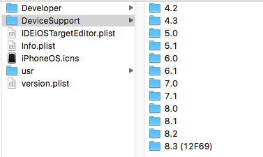
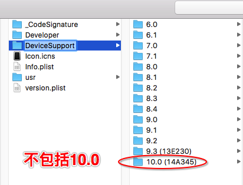
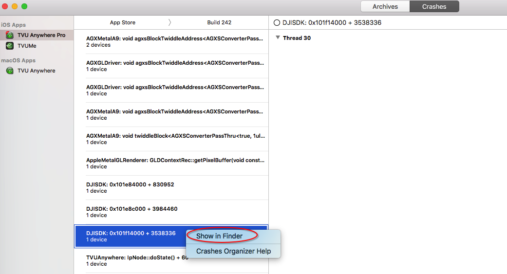
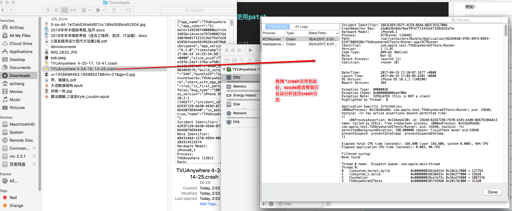

## AppStore审核不通过，类名与系统类名冲突

app审核不通过的原因有很多，其中一种就是我们自己命名的方法名或者类名与系统中的类名有冲突。解决方法就是把这些有冲突的方法名重新命名。但是找这些冲突所在的位置是比较难找的，如果是我们自己写的方法是比较好找的，但是如果这个冲突的地方在我们引用的第三方库中，那么就比较难找了。用下面的方法可以找到第三方库中有冲突的地方。

eg: 场景（有一个类名或方法名reader与系统的类名或方法名有冲突）

```
// 进入到静态库所在的目录，然后执行
find ./ -name *.a lxargs strings lgrep reader
```

## 手机已升级到IOS10.x,如何用XCode6.3.2或XCode7.3来进行真机调试

场景如题，我们可以查看低版本的XCode所支持的ios系统版本。例如XCode6.3.2和XCode7.3支持的系统版本如图所示：（`/Applications/XcodeX.app/Contents/Developer/Platforms/iPhoneOS.platform/DeviceSupport`）

xcode6.3.2支持的



xcode7.3支持的



所以，当我们用低版本的XCode进行真机调试最新的ios系统时 ，总是报xcode版本过低，所以我们最简单的方法解决方法就是安转最新版本的xcode后，直接进入以上目录中，把与当前手机对应的系统直接拷贝到低版本的XCode的对应目录。也可以做一个目录映射。上图所示xcode7.3中的10.0就是我在XCode8.0中拷贝过来的。因为我的手机升级到ios10.0 了。


## 使用SVN打patch和使用patch

```
// 产生一个patch
svn diff > ~/Desktop/qiqi.diff
// 应用一个patch
patch -p0 -i ~/Desktop/qiqi.diff
// 回滚一个patch
patch -p0 -R < ~/Desktop/qiqi.diff

// 如果svn应用一个patch失败，那么用以下命令查看：
svn status |grep orig  // orig保存的是修改之前的文件内容,所以可用用重命名命令来回退到应用patch之前的状态：
mv libasf/src/AsfDataDemux.cpp.orig libasf/src/AsfDataDemux.cpp

// svn 移除当前修改
svn revert -R ./
// svn 更新代码到22937版本
svn update -r 22937

```

## 在C++中使用C语言函数

在C++中使用C语言函数的时候，需要做一些特别处理，不然会出现编译错误的问题。具体的处理方法是：在导入包含该C语言函数的头文件的时候一定要用一个宏包着。

例如：

```
extern "C"
{
#include "libavformat/avformat.h"
#include "libavcodec/avcodec.h"
#include "libavutil/avutil.h"
}
```

## 查看Crash日志

在XCode的`window>>organizer>>`如图：



如果要找到这次 crash 的log信息，那么就通过以下目录去找 `.xccrashpoint->show package contents->DistributionInfos->all->Logs-> .crash`

## 利用XCode分析手机里的crash log

如果XCode连接到手机之后，能获取到手机的crash日志，则xcode就可以自动分析crash日志，并提取出我们需要的信息。我说的一种情况是，当手机连接到xcode时，xcode里面获取不到你想要的crash日志，但是这次crash真实发生了，在手机的`用户诊断与数据`中可以查看到，那么我们如何让xcode来分析手机里面的这个crash日志呢？

具体方法是：拷贝手机里面的crash日志内容，并分享到电脑上。修改`*.txt`为`*.crash`，然后把这个`*.crash`文件直接拖到xcode里面的分析器中。如图：



注意 `*.crash`的命名格式，当我们操作的时候直接就按照这种形式去命名。
