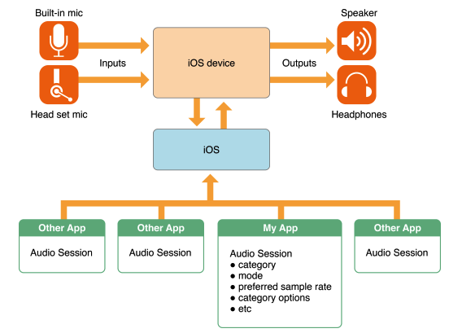
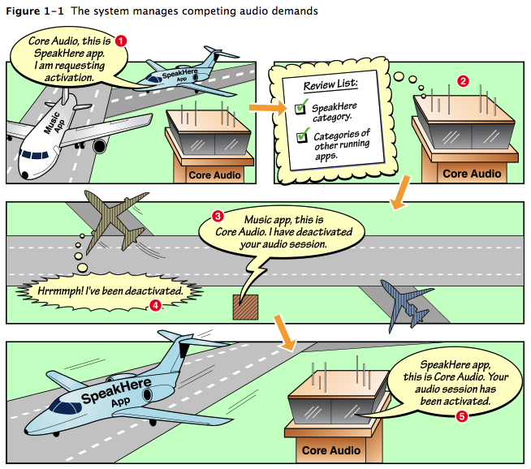
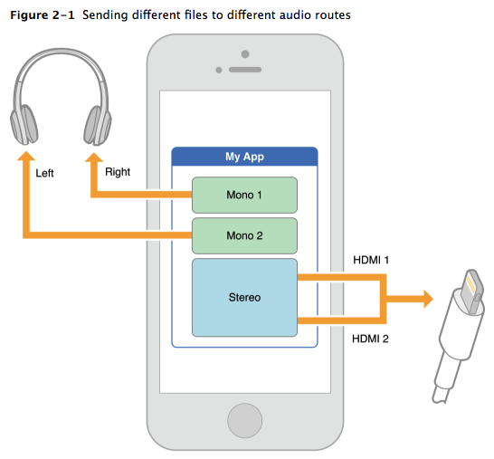
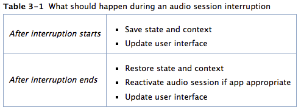
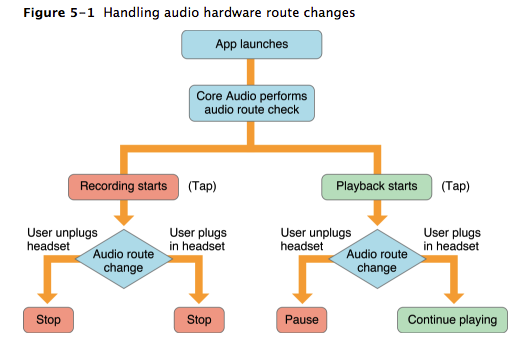

## 介绍 

在ios中，处理跨应用，设备级别以及应用本身中的音频是通过 ``AVAudioSession`` 来处理的。



使用 ``AVAudioSession`` 你可以处理一下问题：

* 你的应用是否应该随着 手机的铃声/静音 模式的切换而变为静音。是的，如果音频在你的应用中不是必要的。比如说一个记录会议的app就不应该在开会的时候发出声响来打扰别人。但是一个发音的词典就应该忽略手机的 铃声/静音 模式而一直可以播放出词语的声音。
* 当你开始一个音频的时候，音乐应该继续播放吗？当然，如果你的应用是一个模拟钢琴的应用，那就应该让他随着音乐的播放而伴奏。另一方面，如果你的应用播放一个从网络音频的时候，音乐app就应该停止。


``AVAudioSession`` 提供给你处理app中音频的表现行为：

* 为你的app选择一个适当的音频通信路径
* 决定你的app如何与其它app结合
* 处理你的app被其它app的音频打断的情景
* 配置你app中音频的类型等

## 定义一个 Audio Session

audio session(音频会话) 是你的app和其它配置了audio行为的app之间的桥梁。在你的app启动的时候，会自动得到一个单例audio session. 可以通过配置这个 audio session 来表达你app中的音频表现。例如：

* 当你的app启动时，你想和其它app同时播放出声音吗？或者当你的app启动的时候，让其他app静音。
* 你的app应该如何处理音频被打断的情况，比如当闹钟响起的时候。
* 你的app应该如何处理用户插入和拔出耳机的操作。

### Audio Session 默认的行为

Audio Session(音频会话)带有一些默认的行为。特别是：

* 启用播放，并禁用录制。
* 当用户将静音开关(或IPhone上的铃声/静音开关)移动到 "静音" 位置时，你的音频会静音。
* 当用户按下睡眠/唤醒按钮锁定屏幕时，或当自动锁定时间段到期时，您的音频将被静音。
* 当你的音频应用启动时，设备上的其它的音频应用——(比如已播放音乐的应用程序)音频将会被静音。

所有上述行为由默认音频会话类别``AVAudioSessionCategorySoloAmbient```提供。 使用类别提供了有关如何将类别合并到应用程序中的信息。

当你开始录制或播放一个音频的时候，你的音频会话自动开启；然而，依赖于默认激活对于您的应用程序是一种风险状态。例如，如果iPhone响起并且用户忽略了呼叫，则您的应用程序正在运行 - 您的音频可能无法播放，具体取决于您使用的播放技术。下一节描述了处理这些问题的一些策略，“响应中断”深入讨论了这一主题。

在开发中，你可以利用这些默认行为。但是，只有这些时间，您才能安全地忽略应用程序的音频会话：

* 你的应用程序使用系统的音频服务（System Sount Services）或者 UIKit playInputClick 方法，不适用其它的音频 API。System Sound Services是用于播放用户界面音效和调用振动的iOS技术。 它不适合用于其他目的。
* UIKit 中的 playinputclick的方法能让你在一个自定义的输入或键盘附件查看播放标准键盘点击。它的音频会话行为是由系统自动处理的。
* 你的app没有用的音频服务。

在所有其他情况下，请不要使用默认音频会话在应用程序中。

### 为什么默认的 Audio Session 通常不是你想要的

如果您不初始化，配置和明确使用您的音频会话，您的应用程序不能响应中断或音频硬件路由更改。此外，您的应用程序无法控制操作系统决定关于应用程序之间的音频混合。

以下是一些演示音频会话默认行为以及如何更改它的方案：

* 场景1： 你写了一个有声阅读应用。一个用户用户开始听威尼斯商人。 一旦Lord Bassanio进入，自动锁定超时，屏幕锁定，你的音频变得沉默。为了确保当屏幕锁定时播放继续，请配置你的音频会话支持锁屏继续播放的类别，并在 ``UIBackgroundMode``中设置音频标记。

* 场景2：你基于 OpenAL 的音效写了一个射击游戏应用。您还提供背景音乐，但包括一个选项，用户可以关闭它，并从用户的音乐库中播放歌曲。在启动激励歌曲之后，用户在敌舰上发射光子鱼雷，并且音乐停止。要确保音乐不会中断，请配置音频会话以允许混音。使用 ``AVAudioSessionCategoryAmbient`` 类别，或者更改 ``AVAudioSessionCategoryPlayback ``类别支持混音。

* 场景3：您编写的流式电台应用程序使用音频队列服务进行播放。当用户正在收听时，电话呼叫到达并停止您的声音，如预期。用户选择忽略呼叫并关闭警报。用户再次点击播放以恢复音乐流，但什么也不发生。要恢复播放，用户必须退出应用程序并重新启动。要正常处理音频队列的中断，请设置适当的类别并注册``AVAudioSessionInterruptionNotification``并让您的应用程序做出相应响应。

### 系统如何解决竞争的 Audio Session 需求

随着 ios 应用启动，系统内建的应用(如 Message,Music,Safari)可能会在后台运行。这些应用中的每一个都有可能会产生一个音频：一条信息到达，你10分钟之前播放的博客继续播放等。

如果你认为一个 ios 设备是一个飞机场，那么app就相当于每一架飞机,系统的一系列服务就相当于一些控制塔台。你的应用可以发出音频请求并制定所需的优先级，但对于在停机坪上发生的事情的最终权威来自系统。您使用音频会话与“控制塔台”通信。下图说明了一个典型的情况 - 您的应用想要在音乐应用已经在播放时使用音频。 在这种情况下，您的应用程序会中断音乐应用程序。


 

系统具有激活或停用设备上存在的任何音频会话的最终权限。 系统遵循不可侵犯的规则，“电话总是赢得”。没有应用程序，无论它需要优先，多么强烈，可以胜过电话。 当呼叫到达时，用户会收到通知，您的应用程序会中断 - 无论您正在进行什么音频操作，无论您设置了什么类别。

### 结合 AVCaptureSession

AVFoundation 捕获 API(AVCaptureDevice,AVCaptureSession)使您能够从摄像头和麦克风输入捕获同步的音频和视频。从 ios7开始，代表麦克风输入的AVCaptureDevice对象可以共享您的应用程序的AVAudioSession。默认情况下，AVCaptureSession将在您的AVCaptureSession使用麦克风时最佳地配置您的AVAudioSession以进行录制。将``automaticallyConfiguresApplicationAudioSession``属性设置为NO以覆盖默认行为，AVCaptureDevice将使用您当前的AVAudioSession设置，而不更改它们。

### 初始化你的 Audio Session

	AVAudioSession *session = [AVAudioSession shareInstance];

### 添加音量和线路控制

使用MPVolumeView类来呈现应用程序的音量和路由控制。音量视图提供了一个用于控制应用程序内部音量的滑块以及用于选择输出音频路径的按钮。当将音频路由到内置扬声器时，Apple建议使用AVAudioSessionPortOverride上的MPVolumeView线路选择。

### 响应远程控制时间

远程控制事件让用户控制应用的多媒体。如果您的应用播放音频或视频内容，您可能希望其响应来自传输控制或外部配件的遥控事件。iOS转换UIEvent对象中的命令，并将事件传递给应用程序。 应用程序将它们发送到第一个响应者，如果第一个响应者不处理它们，它们会在响应者链上向上传播。您的应用程式必须是「正在播放」的应用程序，目前正在播放音频，才能回应活动。

### 设置你的 Audio Session 为活动和不活动状态

系统在应用启动时激活您的音频会话。 即使如此，Apple建议您在``viewDidLoad``方法中明确激活会话，并在激活音频会话之前设置首选硬件值。看[Setting Preferred Hardware Values ](https://developer.apple.com/library/content/documentation/Audio/Conceptual/AudioSessionProgrammingGuide/OptimizingForDeviceHardware/OptimizingForDeviceHardware.html#//apple_ref/doc/uid/TP40007875-CH6-SW9)代码示例。这使您有机会测试激活是否成功。但是，如果您的应用程序有播放/暂停UI元素，请编写您的代码，以便用户必须在激活会话之前按播放。同样，当更改音频会话的活动/非活动状态时，请检查以确保呼叫成功。编写代码以正常处理系统拒绝激活会话。

系统拒绝激活你的音频会话可能是因为一个闹钟，或者是一个呼入的电话。当用户关闭警报或选择忽略电话时，系统将允许您的会话再次处于活动状态。是否在中断结束时重新激活会话取决于应用类型，如所述[ Audio Guidelines By App Type](https://developer.apple.com/library/content/documentation/Audio/Conceptual/AudioSessionProgrammingGuide/AudioGuidelinesByAppType/AudioGuidelinesByAppType.html#//apple_ref/doc/uid/TP40007875-CH11-SW1)

激活一个Audio Session 使用 AVFoundation中的：

	NSError *activationError = nil;
	BOOL success = [[AVAudioSession sharedInstance] setActive: YES error: &activationError];
	if (!success) { /* handle the error in activationError */ }
	
在使用AVAudioPlayer或AVAudioRecorder对象播放或记录音频的特定情况下，系统在中断结束时负责音频会话重新激活。 尽管如此，Apple建议您注册通知消息并明确重新激活您的音频会话。 因此，您可以确保重新启动成功，并且您可以更新应用程序的状态和用户界面。

### 在我们的应用启动时检测其它应用是否正在播放音频

用户启动您的应用时，声音可能已在设备上播放。 例如，音乐应用程序可能正在播放音乐，或者Safari可能是您的应用程序启动时的流式音频。 如果你的应用程序是一个游戏，这种情况尤其突出。许多游戏都有音乐声轨以及声音效果。在这种情况下，[ios Human Interface Guidelines]建议您假设用户期望其他音频继续播放游戏，同时仍然播放游戏的声音效果。

检查[otherAudioPlaying](https://developer.apple.com/reference/avfoundation/avaudiosession/1616610-otheraudioplaying)属性，以确定在您启动应用程序时是否已经在播放音频。 如果应用程式启动时播放其他音讯，请将您的游戏音轨设为静音，然后指派[AVAudioSessionCategorySoloAmbient](https://developer.apple.com/reference/avfoundation/avaudiosessioncategorysoloambient)类别。 有关类别的详细信息，请参阅[working with category](https://developer.apple.com/library/content/documentation/Audio/Conceptual/AudioSessionProgrammingGuide/AudioSessionBasics/AudioSessionBasics.html#//apple_ref/doc/uid/TP40007875-CH3-SW1)。

## 使用类别

音频会话类别是标识应用程序的一组音频行为的键。 通过设置类别，您可以向系统指示您的音频意图，例如，在翻转铃声/静音开关时是否应继续播放音频。 iOS中的七个音频会话类别，以及一组覆盖和修改开关，可让您自定义应用程序的音频行为。

每个音频会话类别为以下行为中的每一个指定特定模式“是”和“否”，具体：

* `Interrupts non-mixable apps audio:`: 如果是``yes``，当您的应用程式启动音讯工作阶段时，不可混合的应用程序将会中断。
* `Silenced by the Silent switch `:如果是`yes`,当用户将静默开关移动到静音时，您的音频会静音。 （在iPhone上，此开关称为铃声/静音开关。）
* `Supports audio input`:如果是`yes`,应用程序音频输入（录制），被允许。
* `Supports audio output`:如果是'yes',应用程序音频播放（录制），被允许。

大多数应用只需在启动时设置一次类别。 也就是说，您可以根据需要频繁更改类别，无论您的会话是活动还是非活动，都可以这样做。 如果您的会话处于非活动状态，则在激活会话时会发送类别请求。 如果您的会话已处于活动状态，则会立即发送类别请求。

### 选择最合适的类别

与每个类别相关联的精确行为不在您的应用程序的控制之下，而是由操作系统设置。苹果可能会在未来版本的iOS中改进类别行为。您最好的策略是选择最准确地描述您想要的音频行为的意图的类别。附录[Audio Session Categories and Modes](https://developer.apple.com/library/content/documentation/Audio/Conceptual/AudioSessionProgrammingGuide/AudioSessionCategoriesandModes/AudioSessionCategoriesandModes.html#//apple_ref/doc/uid/TP40007875-CH10-SW1)总结每个类别的行为详细信息。

以下列表描述了与其关联的类别和音频行为。 ``AVAudioSessionCategoryAmbient``类别允许其他音频继续播放; 也就是说，它是一个可混合的应用程序。 其余类别表示您希望在会话变为活动状态时停止其他音频。 但是，您可以自定义非混音“播放”和“播放和录制”类别以允许混音，如[Fine-Tuning a Category](https://developer.apple.com/library/content/documentation/Audio/Conceptual/AudioSessionProgrammingGuide/AudioSessionBasics/AudioSessionBasics.html#//apple_ref/doc/uid/TP40007875-CH3-SW8)所述。

* `AVAudioSessionCategoryAmbient`——仅播放。 播放声音，增加润色或兴趣，但不是必不可少的应用程序的使用。 使用此类别，您的音频会被铃声/静音开关和屏幕锁定时静音。
* `AVAudioSessionCategorySoloAmbient`——（默认）仅播放。 当用户将铃声/静音开关切换到“静音”位置和屏幕锁定时，静音音频。 此类别与AVAudioSessionCategoryAmbient类别的区别仅在于它会中断其他音频。
* `AVAudioSessionCategoryPlayback`——仅播放。 即使屏幕锁定并且铃声/静音开关设置为静音，也能播放音频。 将此类别用于音频播放最重要的应用。

	提示：
	
	如果您选择一个音频会话类别，允许音频在屏幕锁定时继续播放，您必须在应用程序的info.plist中设置[UIBackgroundModes](https://developer.apple.com/library/content/documentation/General/Reference/InfoPlistKeyReference/Articles/iPhoneOSKeys.html#//apple_ref/doc/plist/info/UIBackgroundModes)音频。 有关详细信息，请参阅UIBackgroundModes。 您通常不应通过idleTimerDisabled属性禁用系统的睡眠定时器。 如果您禁用了睡眠定时器，请确保在您的应用不需要阻止屏幕锁定时将此属性重置为NO。 睡眠定时器确保在用户指定的时间间隔后屏幕变暗，节省电池电量。
	
* `AVAudioSessionCategoryRecord`——仅录屏。 如果您的应用程序还播放音频，请使用AVAudioSessionCategoryPlayAndRecord。
* `AVAudioSessionCategoryPlayAndRecord`——播放和录制。 输入和输出不需要同时发生，但如果需要可以。 用于音频聊天应用程序。
* `AVAudioSessionCategoryAudioProcessing`——仅离线音频处理。 执行离线音频处理，无需播放或录音。
* `AVAudioSessionCategoryMultiRoute`——
播放和录制。 允许同时输入和输出不同的音频流，例如USB和耳机输出。 DJ应用程序将受益于使用多路由类别。 DJ经常需要听一个音轨的音轨，而另一个音轨正在播放。 使用多路径类别，DJ应用程序可以播放未来的轨道通过耳机，而当前轨道为舞者播放。

### 使用 Multiroute Category 扩展选项

多路径类别的工作方式与其他类别稍有不同。 所有类别都遵循“最后胜利”规则，决定于其中插入输入或输出线路的最后一个设备。 但是，多线路类别使应用程序能够使用所有连接的输出端口，而不仅仅是最后一个端口。 例如，如果您通过HDMI输出路径收听音频并插入一套耳机，则音频会通过耳机播放。 您的应用程序可以通过HDMI输出路径继续播放音频，同时通过耳机播放音频。

您的应用程序可以将不同的音频流发送到不同的输出线路。 例如，您的应用程序可以向左耳机发送一个音频流，向右耳机发送另一个音频流，以及向HDMI路由发送第三个音频流。 图2-1显示了将多个文件发送到不同音频路由的示例。



根据设备和任何连接的附件，以下是有效的输出路由组合：

* USB和耳机
* HDMI和耳机
* LineOut和耳机

多路由类别支持使用单个输入端口。

### 设置 Audio Session 的类别

于大多数iOS应用程序，在启动时设置音频会话类别 - 从不更改它 - 很好。 这提供了最佳的用户体验，因为设备的音频行为在您的应用运行时保持一致。

	NSError *setCategoryError = nil;
	BOOL success = [[AVAudioSession sharedInstance]
	                setCategory: AVAudioSessionCategoryAmbient
	                      error: &setCategoryError];
	 
	if (!success) { /* handle the error in setCategoryError */ }

### 使用模式专门化类别

虽然类别设置了应用程序的基本行为，但模式用于专门设置音频会话类别。 设置类别的模式以进一步定义应用程序的音频行为。 有七种模式可供选择：

* `AVAudioSessionModeDefault`——与所有类别一起使用并配置设备以供一般使用的默认模式。
* `AVAudioSessionModeVoiceChat`——用于IP语音（VoIP）应用程序。 此模式只能与AVAudioSessionCategoryPlayAndRecord类别一起使用。 通过系统提供的信号处理对信号进行优化，并且模式设置AVAudioSessionCategoryOptionAllowBluetooth。

	该组允许的音频线路被优化用于语音聊天体验。 当使用内置麦克风时，系统会自动选择内置麦克风的最佳组合进行语音聊天。
* `AVAudioSessionModeVideoChat`——用于视频聊天应用程序，如FaceTime。 视频聊天模式只能与AVAudioSessionCategoryPlayAndRecord类别一起使用。 通过系统提供的信号处理对信号进行优化，并设置AVAudioSessionCategoryOptionAllowBluetooth和AVAudioSessionCategoryOptionDefaultToSpeaker。

	该组允许的音频线路被优化用于视频聊天体验。 当使用内置麦克风时，系统会自动选择内置麦克风的最佳组合进行视频聊天。
	
	注意：Apple建议使用语音或视频聊天的应用程序也使用语音处理I / O音频单元。 语音处理I / O单元为VOIP应用程序提供了几个功能，包括自动增益校正，语音处理调整和静音。 有关详细信息，请参阅语音处理I / O单元。
	
* `AVAudioSessionModeGameChat`——游戏应用程序。 此模式由使用GKVoiceChat对象和AVAudioSessionCategoryPlayAndRecord类别的应用程序自动设置。 游戏聊天模式使用与视频聊天模式相同的线路参数。
* `AVAudioSessionModeVideoRecording`——
	对于使用相机捕获视频的应用程序。 视频录制模式只能与AVAudioSessionCategoryPlayAndRecord和AVAudioSessionCategoryRecord类别一起使用。 信号由系统提供的信号处理修改。

	使用AVCaptureSession API与视频录制模式配合使用，以更好地控制输入和输出线路。 例如，设置automaticallyConfiguresApplicationAudioSession属性会根据所使用的设备和摄像机自动选择最佳输入线路。

* `AVAudioSessionModeMeasurement`——对于需要最小化系统提供的信号处理量以输入和输出信号的应用程序。 此模式只能用于以下类别：录制，播放和录制和播放。 输入信号通过设备的主麦克风路由。
* `AVAudioSessionModeMoviePlayback`——适用于播放电影的应用程式。 此模式只能与AVAudioSessionCategoryPlayback类别一起使用。

### 为 AirPlay选择类别和模式

只有特定类别和模式支持AirPlay。 以下类别支持Airplay的镜像版本和非镜像版本：

* AVAudioSessionCategorySoloAmbient
* AVAudioSessionCategoryAmbient
* AVAudioSessionCategoryPlayback

AVAudioSessionCategoryPlayAndRecord类别仅支持镜像的Airplay。

模式仅在与播放和记录类别结合使用时才支持AirPlay。 以下模式仅支持AirPlay镜像：

* AVAudioSessionModeDefault
* AVAudioSessionModeVideoChat
* AVAudioSessionModeGameChat

### 微调类别

您可以通过多种方式微调音频会话类别。 根据类别，您可以：

* 在类别通常不允许时，允许其他音频（例如来自音乐应用）与您的音频混合
* 如果没有其他线路可用，请更改从接收器到扬声器的音频输出线路
* 指定当音频会话处于活动状态时，其他音频应在音量（“duck”）中减少

您可以覆盖AVAudioSessionCategoryPlayback，AVAudioSessionCategoryPlayAndRecord和AVAudioSessionCategoryMultiRoute类别的中断特性，以便允许其他音频与您的音频混合。 要执行覆盖，请将AVAudioSessionCategoryOptionMixWithOthers属性应用于音频会话。 当您将应用设置为可混合时，您的应用在其音频会话变为活动状态时不会中断来自其他不可混合应用的音频。 此外，您应用的音频不会被其他应用的不可混合音频会话（例如音乐应用）中断。


您可以以编程方式影响音频输出线路。 当使用AVAudioSessionCategoryPlayAndRecord类别时，音频通常发送到接收器（在打电话时，您握住耳朵的小扬声器）。 您可以使用overrideOutputAudioPort：error：方法将音频重定向到手机底部的扬声器。

最后，您可以增强类别，以在播放音频时自动降低其他音频的音量。 这可以用于，例如，在锻炼应用程序。 假设用户正在练习音乐应用程序，当您的应用程序想要覆盖语言消息时，例如，“你已经划船10分钟”。要确保来自您的应用程序的消息是可理解的，请应用AVAudioSessionCategoryOptionDuckOthers属性 您的音频会话。 当低音发生时，设备上的所有其他音频（除了手机音频）降低音量。 使用回避的应用程序必须管理其会话的激活状态。 在播放音频之前激活音频会话，在播放音频后取消激活会话。

## 响应中断

添加音频会话代码以处理中断，可确保在电话来电，闹钟或日历闹钟响起，或其他应用程序激活其音频会话时，应用的音频会继续正常运行。

音频中断是指应用程序的音频会话停用 - 根据您使用的技术，会立即停止或暂停您的音频。 当来自应用程序的竞争音频会话激活并且该会话没有被系统分类以与您的混合时，中断发生。 在会话变为非活动状态后，系统将发送“您被中断”消息，您可以通过保存状态，更新用户界面等来响应。

你的app可能会暂时挂起当一个中断到来时。 当用户决定接受电话呼叫时，会发生这种情况。 如果用户改为选择忽略呼叫或关闭报警，系统将发出中断结束的消息，并且您的应用程序继续运行。 要恢复音频，您的音频会话必须重新激活。

### 音频响应中断处理技术

通过注册通知的形式来处理音频中断。您在中断代码中做什么取决于您使用的音频技术以及您正在使用它进行播放，录制，音频格式转换，读取流式音频包等。一般来说，从用户的角度看，你要尽可能小的扰乱应用，并且尽快的恢复应用状态。

表3-1总结了中断期间的适当音频会话行为。 如果使用AVAudioPlayer或AVAudioRecorder对象，则系统会自动处理这些步骤中的一些步骤。



表3-2总结了几种音频技术的中断

音频技术  | 如何处理中断
------------- | -------------
AV Foundation framework  | ``AVAudioPlayer``和``AVAudioRecorder``都提供了相应的代理方法来处理音频中断。系统会在中断时自动暂停播放或录制，并在恢复播放或录制时重新激活音频会话。<br>如果要在应用启动的时候保存和恢复播放位置，要在中断时以及退出应用时保存播放位置。
Audio Queue Services, I/O audio unit  | 这些技术使您的应用程序控制处理中断。 您负责保存播放或录制位置，并在中断结束后重新启动音频会话。
OpenAL | 当使用OpenAL播放时，注册适当的NSNotification通知 - 当使用音频队列服务时。 但是，代理必须另外管理OpenAL上下文。 请参见OpenAL和音频中断。
System Sound Services | 使用系统声音服务播放的声音在中断开始时保持静音。 如果中断结束，它们可以自动再次使用。 应用程序不能影响使用此播放技术的声音的中断行为。

#### 处理来自 Siri 的音频中断

当您的应用程序在Siri播放期间中断时，您必须跟踪Siri发出的任何遥控命令，同时音频会话中断。 在中断状态期间，跟踪由Siri发出的任何命令，并且在中断结束时相应地进行响应。 例如，在中断期间，用户要求Siri暂停应用程序的音频播放。 当应用程序收到中断已结束的通知时，它不应自动恢复播放。 相反，您的应用的用户界面应该指示它处于暂停状态。

## 优化你应用程序的硬件设备

利用 audio session 的属性，你可以优化你应用程序音频的行为在硬件设备的层面上。

音频会话的属性能让你做以下操作：

* 指定采样率和I / O缓冲区持续时间的首选硬件设置
* 查询许多硬件特性，其中包括输入和输出延迟，输入和输出通道数，硬件采样率，硬件音量设置以及音频输入是否可用
* 响应设备特定通知

### 设置首选硬件值

在激活音频会话之前设置首选硬件值。 当应用程序设置首选值时，它不会生效，直到音频会话被激活。 在音频会话重新激活后，请验证所选的值。 当您的应用程序正在运行时，Apple建议您在更改任何设置值之前停用音频会话。 清单4-1显示了如何设置首选硬件值以及如何检查所使用的实际值。

	NSError *audioSessionError = nil;
	AVAudioSession *session = [AVAudioSession sharedInstance];
	[session setCategory:AVAudioSessionCategoryPlayback error:&audioSessionError];
	if (audioSessionError) {
	     NSLog(@"Error %ld, %@, (long)audioSessionError.code, audioSessionError.localizedDescription);
	}
	 
	NSTimeInterval bufferDuration =.005;
	[session setPreferredIOBufferDuration:bufferDuration error:&audioSessionError];
	if (audioSessionError) {
	     NSLog(@"Error %ld, %@, (long)audioSessionError.code, audioSessionError.localizedDescription);
	}
	 
	double sampleRate = 44100.0
	[session setPreferredSampleRate:samplerate error:&audioSessionError];
	if (audioSessionError) {
	     NSLog(@"Error %ld, %@, (long)audioSessionError.code, audioSessionError.localizedDescription);
	}
	 
	[[NSNotificationCenter defaultCenter] addObserver:self
	                                         selector:@selector(handleRouteChange:)
	                                             name:AVAudioSessionRouteChangeNotification
	                                           object:session];
	 
	[session setActive:YES error:&audioSessionError];
	if (audioSessionError) {
	     NSLog(@"Error %ld, %@, (long)audioSessionError.code, audioSessionError.localizedDescription);
	}
	 
	sampeRate = session.sampleRate;
	bufferDuration = session.IOBuffferDuration;
	NSLog(@"Sampe Rate:%0.0fHZ I/O Buffer Duration:%f", sampleRate, bufferDuration);


### 查询硬件特征

ios设备的硬件特征可以在你应用运行的时候去改变，并且不同的设备也有不同的特征值。例如，当您对原始iPhone使用内置麦克风时，录制采样率限制为8 kHz; 连接耳机和使用耳机麦克风提供较高的采样率。 较新的iOS设备支持内置麦克风的更高硬件采样率。您应用的音频会话可以告诉您设备的许多硬件特性。 这些特性可以在运行时改变。 例如，当用户插入耳机时，输入采样率可能改变。 有关属性的完整列表，请参阅“AVAudioSession类参考”。

在指定首选硬件特性之前，请确保音频会话处于非活动状态。 建立您的首选项后，激活会话，然后查询它以确定实际特性。 这最后一步很重要，因为在某些情况下，系统不能提供您要求的特性值（有可能设备不支持）。

要获取有意义的硬件特性值，请确保在发出查询之前，音频会话已初始化并处于活动状态。

两个最有用的音频会话硬件属性是sampleRate和outputLatency。 sampleRate属性包含设备的硬件采样率。 outputLatency属性包含设备的播放延迟。


#### 指定首选硬件I / O缓冲区持续时间

使用AVAudioSession类来指定首选硬件采样率和首选硬件I / O缓冲区持续时间，如清单4-2所示。 要设置首选采样率，您需要使用类似的代码：

	NSError *setPreferenceError = nil;
	NSTimeInterval preferredBufferDuration = 0.005;
	[[AVAudiosession sharedInstance]
	            setPreferredIOBufferDuration: preferredBufferDuration
	                                   error: &setPreferenceError];

## 响应音频线路变化

随着应用程序运行，用户可能会插入或拔下耳机，或使用带音频连接的扩展坞。 编写音频会话代码以处理音频硬件线路更改。 某些类型的应用程序（如游戏）并不总是对线路更改做出响应。 但是，其他类型的应用程序（如媒体播放器）必须响应所有线路更改。

### 音频硬件线路变化的种类

音频硬件线路是用于音频信号的有线电子路径。当iOS设备的用户插入或拔出耳机时，系统自动更改音频硬件线路。 您的应用程序可以通过``AVAudioSessionRouteChangeNotification``方式监听此类更改。



### 响应音频硬件线路更改

相应应用的音频线路更改需要做两部分：

1. 实现音频线路更改时调用的方法
2. 监听音频线路更改的通知 ``AVAudioSessionRouteChangeNotification ``

例如，当用户在播放期间拔下耳机时，您的应用会收到通知。 按照苹果指南，您的应用程序暂停。 然后，您的应用可以提供一个显示，提示用户继续播放。

当系统发送音频线路更改通知时，它提供您需要了解要采取的操作的信息。 注册``AVAudioSessionRouteChangeNotification``通知，如图所示：

	NSNotificationCenter *nc [NSNotificationCenter defaultCenter];
	[nc addObserver:self
	       selector:@selector(routeChanged:)
	           name:AVAudioSessionRouteChangeNotification
	         object:nil];
	        
收到通知后，您的应用会调用您指定的方法，并根据通知中包含的信息更改其行为。 ``AVAudioSessionRouteChangeNotification`` 中的 userInfo 自爱的那包含了一下信息：

* 为什么线路会更改
* 以前的线路是什么

通知中的字典信息的 key 是 ``AVAudioSessionRouteChangeReasonKey `` 和 `` AVAudioSessionRouteChangePreviousRouteKey`` 。 硬件音频线路更改的各种原因，通过 ``AVAudioSessionRouteChangeReasonKey `` 来获取，并在 ``AVAudioSessionRouteChangeReason``中有描述。由``AVAudioSessionRouteChangePreviousRouteKey``键访问的先前音频线路信息是描述从线路改变之前的音频线路设置的对象。

在iOS中音频硬件线路更改的一个原因是``AVAudioSessionRouteChangeReasonCategoryChange``。 换句话说，系统在该上下文中认为音频会话类别的改变是线路改变，并且将调用线路改变通知。 因此，如果您的通知响应方法旨在仅响应耳机插入和拔出，则应明确忽略此类线路更改。


