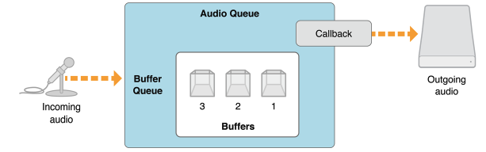
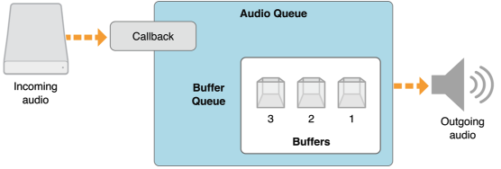
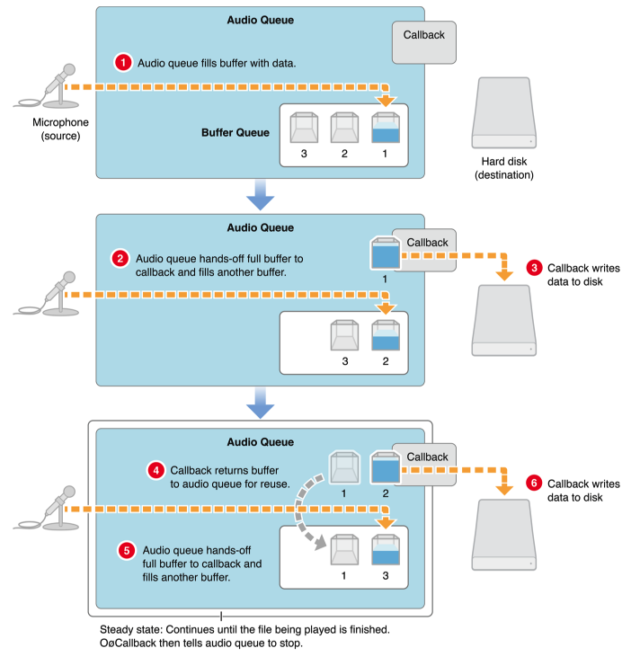
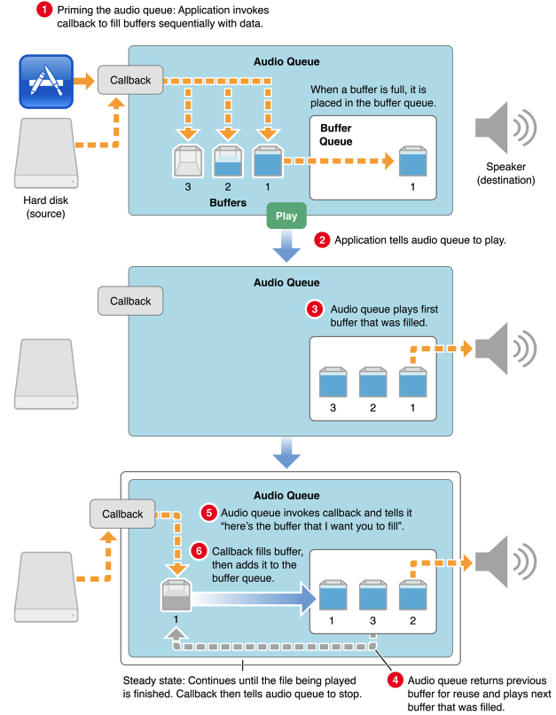
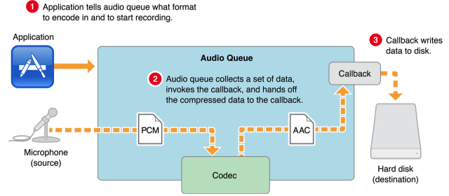
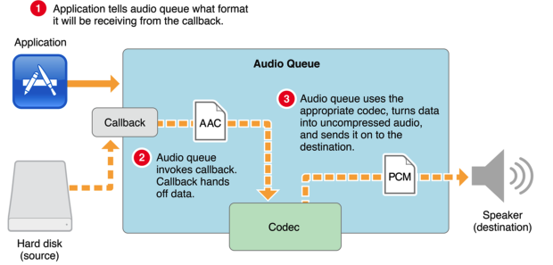

## 介绍

`Audio Queue`服务是比较高级的服务。它可以让你的应用程序使用硬件进行录音和回放音频（如麦克风和扬声器），而不需要知道硬件接口。同时音频队列服务支持一些高级功能。它提供精细的定时控制以及支持预定播放和同步。你可以使用它来同步多个音频队列的播放，并使音频与视频同步。

音频队列服务是一个纯C接口，您可以在Cocoa应用程序以及Mac OS X命令行工具中使用。 为了帮助保持专注于音频队列服务，本文档中的代码示例有时通过使用Core Audio SDK中的C ++类进行简化。 但是，使用音频队列服务不需要SDK和C ++语言。

## Audio Queues

在这个章节中，你会了解到音频队列的功能，体系结构和内部工作原理。将会向你介绍音频队列，音频队列缓冲区以及音频队列用于音频录制和回放的回调函数。你还可以了解到关于音频队列状态和参数的信息。

### 什么是 Audio Queue

一个 Audio queue(音频队列)是用于在 ios 和 mac 平台上的播放和录制音频的软件对象。它由 AudioQueueRef 类型表示，在 AudioQueue.h 头文件中声明。

一个 Audio queue(音频队列)做如下工作：

* 连接音频硬件
* 管理内存
* 采用的编解码器会根据需要压缩音频格式
* 音频录制和回放

#### Audio Queue结构

所有的 audio queue 都大致有相同的结构，都有以下部分构成：

* 一组音频队列缓冲区，每个缓冲区是一些音频数据的临时存储库
* 缓冲区队列，音频队列缓冲区的有序列表
* 一个音频队列 callback 函数，这是需要你定义的。

该结构根据音频队列是用于记录还是播放而变化。 差异在于音频队列如何连接其输入和输出，以及在回调函数的作用。

**录制的音频队列**

一个录制的音频队列，使用 `AudioQueueNewInput` 函数创建，具有如下结构：

记录音频队列的输入侧通常连接到外部音频硬件，例如麦克风.在iOS中，音频来自麦克风或耳机连接的设备。 在Mac OS X的默认情况下，音频来自系统的默认音频输入设备，由用户在系统首选项中设置。

录制音频队列的输出端是你的回调函数。当记录到磁盘时，回调将从其音频队列接收的新音频数据的缓冲器写入音频文件。然而，可以以其它方式使用记录音频队列。您还可以使用一个，例如，在实时音频分析仪。 在这种情况下，您的回调将直接提供音频数据到您的应用程序，而不是写入磁盘。

每一个音频队列——无论是录制的或者是播放的，都有一个或多个音频队列缓冲器。这些缓冲器以称为缓冲器队列的特定顺序排列。如图所示，音频队列缓冲器根据它们被填充的顺序被编号,这是它们被切换到回调的相同的顺序。

**播放的音频队列**

一个播放的音频队列，使用`AudioQueueNewOutput`函数创建，具有如下结构：

在播放音频队列中，回调在输入侧。回调负责从磁盘（或一些其他源）获取音频数据并将其移交到音频队列。当没有更多的数据要播放时，回放回调也会告诉他们的音频队列停止。

#### Audio Queue Buffers(音频队列缓冲区)

一个 audio queue buffer(音频队列缓冲区)是一个 `AudioQueueBuffer` 类型的数据结构，声明在 `AudioQueue.h` 中：

	typedef struct AudioQueueBuffer {
	    const UInt32   mAudioDataBytesCapacity;
	    void *const    mAudioData;
	    UInt32         mAudioDataByteSize;
	    void           *mUserData;
	} AudioQueueBuffer;
	typedef AudioQueueBuffer *AudioQueueBufferRef;

上面结构中的 `mAudioData` 字段，它指向缓冲区本身:a block of memory that serves as a container for transient blocks of audio data being played or recorded. 其它字段帮助 audio queue 管理缓冲区。

音频队列可以使用你的应用程序指定的任意数量的缓冲区。不过一般都是指定为3个。这样就允许一个去写数据到磁盘，另一个正在填充新的数据，如果需要补偿诸如磁盘I / O延迟之类的事情，则第三缓冲器可用。

Audio queues(音频队列)为其缓冲区提供内存管理。

* 当您调用AudioQueueAllocateBuffer函数时，audio queue会分配一个缓冲区
* 当您通过调用AudioQueue Dispose函数释放audio queue（音频队列）时，队列释放其缓冲区

这提高了添加到应用程序中的录制和播放功能的鲁棒性。 它还有助于优化资源使用。

#### The Buffer Queue and Enqueuing

**录音过程**

**播放过程**

**控制播放过程**

音频队列缓冲区总是按它们入队的顺序播放。 但是，音频队列服务使用`AudioQueueEnqueueBufferWithParameters`函数为您提供了对播放过程的一些控制。 此功能允许您：

* 设置缓冲区的精确播放时间。 这允许您支持同步。
* 修剪音频队列缓冲区的开始或结束处的帧。 这允许您删除前导或尾部静音。
* 以缓冲区的粒度设置播放增益

#### Audio Queue的回调函数

通常，使用音频队列服务的大部分编程工作包括编写音频队列回调函数。

在记录或播放期间，音频队列回调由拥有它的音频队列重复调用。 呼叫之间的时间取决于音频队列缓冲器的容量，并且通常在半秒到几秒的范围内。

音频队列回调的一个职责，不管是用于记录还是播放，都是将音频队列缓冲区返回到缓冲区队列。 回调使用`AudioQueueEnqueueBuffer`函数将缓冲区添加到缓冲区队列的末尾。 对于播放，如果需要更多的控制，您可以改用`AudioQueueEnqueueBufferWithParameters`函数，如控制播放过程中所述。

**录制音频队列的回调函数**

本节介绍了在将音频录制到磁盘文件的常见情况下编写的回调。 下面是`AudioQueue.h`头文件中声明的录音音频队列回调的原型：

	AudioQueueInputCallback (
	    void                               *inUserData,
	    AudioQueueRef                      inAQ,
	    AudioQueueBufferRef                inBuffer,
	    const AudioTimeStamp               *inStartTime,
	    UInt32                             inNumberPacketDescriptions,
	    const AudioStreamPacketDescription *inPacketDescs
	);
	
记录音频队列在调用回调时提供回调需要将下一组音频数据写入音频文件的所有内容：

**回放音频队列的回调函数**

	AudioQueueOutputCallback (
	    void                  *inUserData,
	    AudioQueueRef         inAQ,
	    AudioQueueBufferRef   inBuffer
	);

回放音频队列在调用回调时提供回调需要从音频文件读取下一组音频数据的内容:

### 使用编解码器和音频数据格式

音频队列服务可以根据不同的音频格式来转换需要使用的编解码器(音频数据编码和解码)。您的录音或播放应用程序可以使用任何已安装编解码器的音频格式，你不需要去编写自定义代码来处理各种音频格式。简单来说也就是你的回调不需要知道具体的音频数据格式。

下图所示的是它如何工作的。每一个音频队列对应一种音频数据格式，音频数据格式使用`AudioStreamBasicDescription`描述。当你为 `mFormatID`字段设置值得时候，音频队列就会使用与之相对应的编解码器，然后你再为其定义采样率和通道数。

如上图所示，第一步，你的应用程序告诉音频队列要使用的音频数据格式，并开始录制。第二步，音频队列将根据您指定的格式使用编解码器获取新的音频数据并对其进行转换。 音频队列然后调用回调，处理一个包含适当形成的音频数据的缓冲区。第三部，你的回调将格式化的音频数据写入磁盘。 同样，你的回调不需要知道数据格式。

下图是表示音频回放是如何回放的。

* 第一步，你的应用程序告诉音频队列所要播放的音频数据的格式，并开始播放。
* 第二步，音频队列调用你的回调，从音频文件读取数据。 回调将数据以其原始格式移交给音频队列。
* 第三步，音频队列使用适当的编解码器，然后将音频发送到目的地。

音频队列可以使用任何已安装的编解码器，无论是Mac OS X原生的还是由第三方提供的。

### 音频队列控制和状态

音频队列在创建和处理之间有一个生命周期。 您的应用程序管理此生命周期，并使用AudioQueue.h头文件中声明的六个函数来控制音频队列的状态：

* **Start(AudioQueueStart)**. Call to initiate recording or playback.
* **Prime (AudioQueuePrime)**.For playback, call before calling AudioQueueStart to ensure that there is data available immediately for the audio queue to play. This function is not relevant to recording。
* **Stop (AudioQueueStop)**.Call to reset the audio queue (see the description below for AudioQueueReset) and to then stop recording or playback. A playback audio queue callback calls this function when there’s no more data to play.
* **Pause (AudioQueuePause)**.Call to pause recording or playback without affecting buffers or resetting the audio queue. To resume, call the AudioQueueStart function.
* **Flush (AudioQueueFlush)**.Call after enqueuing the last audio queue buffer to ensure that all buffered data, as well as all audio data in the midst of processing, gets recorded or played.
* **Reset (AudioQueueReset)**.Call to immediately silence an audio queue, remove all buffers from previously scheduled use, and reset all decoder and DSP state.

你可以使用 `AudioQueueStop`函数在同步或异步模式下：

* **Synchronous** stopping happens immediately, without regard for previously buffered audio data.
* **Asynchronous** stopping happens after all queued buffers have been played or recorded.

## 音频录制

## 使用Audio Queue需要注意的问题

在这里将会罗列出我使用`Audio Queue` 的时候所遇到的问题，及需要注意的事项的等问题。

### 如果音频缓冲队列中长时间没有音频数据的时播放回调会终止

利用`Audio Queue`播放音频是，如果音频队列中长时间没有数据时，播放的回调会自动停止。所以即使往音频队列中拷贝空的音频数据也可以，这样就避免了播放的回调自动终止。

下面是示例代码：

		void AudioPlayer::handleTVUWebRTCAudioOutputBuffer(void * aqData,AudioQueueRef inAQ , AudioQueueBufferRef inBuffer)
	{   
	    TVUWebRTCManager *webRTCManager = [TVUWebRTCManager shareInstance];
	    
	    if (!webRTCManager) {
	        return;
	    }
	    
	    if (webRTCManager.isEndupCall) {
	        NSLog(@"isEndupCall is YES...");
	    }else{
	        NSLog(@"isEndupCall is NO...");
	    }
	    
	    RTCPeerConnection *rtcPeerConn = [webRTCManager getNewestPeerConnection];
	    
	    if (rtcPeerConn == NULL || rtcPeerConn == nil) {
	        //        [mLock unlock];
	        return;
	    }
	    int8_t * source = [rtcPeerConn getPlayoutAudioBuffer];   // 拷贝空的音频数据到缓冲队列中
	    if (source == NULL || source == nil) {
	        inBuffer->mAudioDataByteSize = kTVUWebRTCAudioDataByteSize;
	        memset(inBuffer->mAudioData,0,kTVUWebRTCAudioDataByteSize);
	        AudioQueueEnqueueBuffer(inAQ,inBuffer,0,NULL);
	        //        [mLock unlock];
	        return;
	    }
	    inBuffer->mAudioDataByteSize = kTVUWebRTCAudioDataByteSize;
	    if ([rtcPeerConn isWebRTCPlayoutActived] || [rtcPeerConn isWebRTCAudioFrameAvailable])
	    {
	        memset(inBuffer->mAudioData,0,kTVUWebRTCAudioDataByteSize);
	        AudioQueueEnqueueBuffer(inAQ,inBuffer,0,NULL);
	        //        [mLock unlock];
	        return;
	    }
	    
	    // demon add , caculate volume db
	    caculateVolumeDB(inBuffer, 0, k_Mono);
	    
	    memcpy(inBuffer->mAudioData, source, kTVUWebRTCAudioDataByteSize);
	    AudioQueueEnqueueBuffer(inAQ,inBuffer,0,NULL);
	    //    [mLock unlock];
	    return ;
	
	}

## AudioQueue中的一些方法

### AudioQueueStop

功能：停止音频的播放或录制

描述：如果音频队列未被其它音频服务使用，则此功能将重置音频队列并停止与队列相关联的音频硬件。同步停止(synchronous stops)会立刻执行播放或录制，无论音频队列中是否有音频内容；异步停止(asynchronous stops)直到音频队列中的音频数据被播放完后，才会停止播放或者录制。

参数: 

`inAQ` : 要停止的音频队列；   

`inImmediate`：值为yes时，同步停止即立刻执行；值为NO时，异步停止，要等到音频队列中的内容播放或录制完成后才会停止。

注意： 

* 当音频队列中没有音频数据播放时，这个方法会被自动调用。
* 当立即停止音频队列时，所有挂起的缓冲区回调通常在停止过程中被调用。 但是如果调用线程响应缓冲区回调，则AudioQueueStop返回后可能会发生额外的缓冲区回调。

方法原型：

		extern OSStatus
		AudioQueueStop(                     AudioQueueRef           inAQ,
		                                    Boolean                 inImmediate)            __OSX_AVAILABLE_STARTING(__MAC_10_5,__IPHONE_2_0);

### AudioQueuePause

功能： 暂停音频播放或录制

描述：暂停队列不影响缓冲区或充值音频队列。要使用音频队列恢复播放或录制，请调用 AudioQueueStart

方法原型：

	extern OSStatus
	AudioQueuePause(                    AudioQueueRef           inAQ)       __OSX_AVAILABLE_STARTING(__MAC_10_5,__IPHONE_2_0);
	

### AudioQueueFlush

功能：重置音频队列的解码器状态

描述：在所有的音频队列被播放完成之后，这个函数清除所有解码器状态的信息。您必须按照编码音频的缓冲区序列调用此函数; 否则，某些音频可能不会在下一组排队的缓冲区中播放。 唯一没有必要调用AudioQueueFlush的时间是使用inImmediate = false的AudioQueueStop。 （此操作内部调用AudioQueueFlush。）

此外，您可能希望在调用AudioQueueStop之前调用此函数，具体取决于您是否要立即停止，无论播放什么，或者是否要确保所有缓冲数据和处理中间的所有数据都被记录或播放停止。

函数原型：

	extern OSStatus
	AudioQueueFlush(                    AudioQueueRef           inAQ)            __OSX_AVAILABLE_STARTING(__MAC_10_5,__IPHONE_2_0);

### AudioQueueReset

功能：重置音频队列

描述：该功能立即重置音频队列，刷新任何音频队列的缓冲区，从先前调度的使用中删除所有缓冲区，并重置任何解码器和数字信号处理（DSP）状态信息。

注意： 在重置过程中，通常会调用所有挂起的缓冲区回调，但是如果调用线程响应缓冲区回调，则可以在AudioQueueReset返回后发生额外的缓冲区回调。

函数原型：

	extern OSStatus
	AudioQueueReset(                    AudioQueueRef           inAQ)            __OSX_AVAILABLE_STARTING(__MAC_10_5,__IPHONE_2_0);