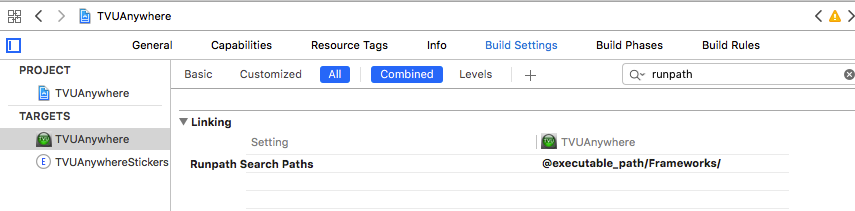

## 说明

我在这里介绍的是如何往自己的工程中引入第三方动态库。所以，我假定你现在已经准备好了你要引入的动态库。（已经签过名的动态库）

## 具体步骤

### 添加动态库到工程文件

通过以下方式将你的 `framework`添加到工程中：

	 Targets-->Build Phases--> Link Binary With Libraries
	 
把动态库添加到 Copy Files 中：

	Targets-->Build Phases-->Copy Files

如图所示：

如果没有上述选项，点击'+'添加分组。

### 自动连接动态库

添加完动态库之后，如果希望动态库在软件启动时自动连接，可以通过以下方式设置动态库依赖路径：

	Targets-->Build Setting-->Linking-->Runpath Search Paths

设置具体值得内容为：

	@executable_path/Frameworks/
	
如图所示：

其中的`@executable_path/`表示可执行文件所在路径，即沙盒中的.app目录，注意不要漏掉最后的/。

如果你将动态库放到了沙盒中的其他目录，只需要添加对应路径的依赖就可以了。