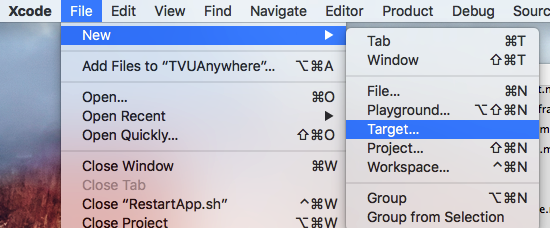
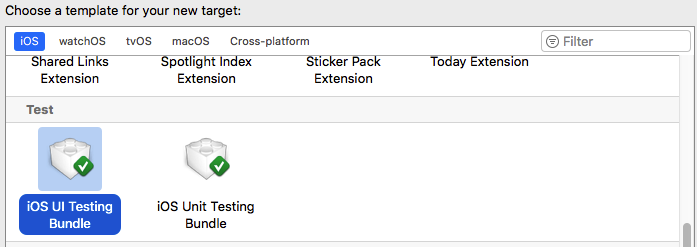
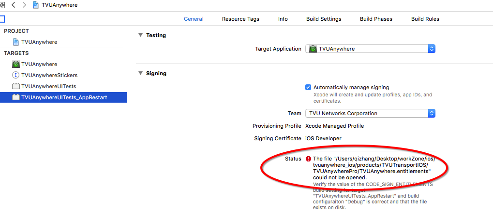
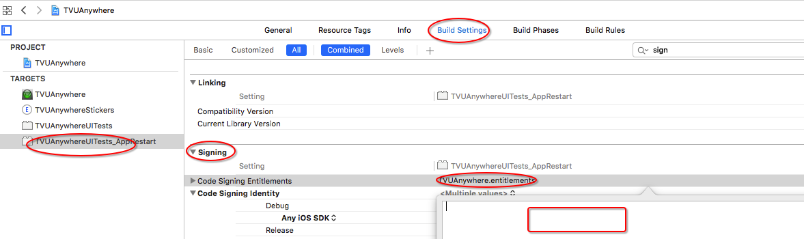
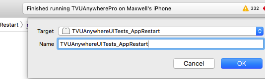
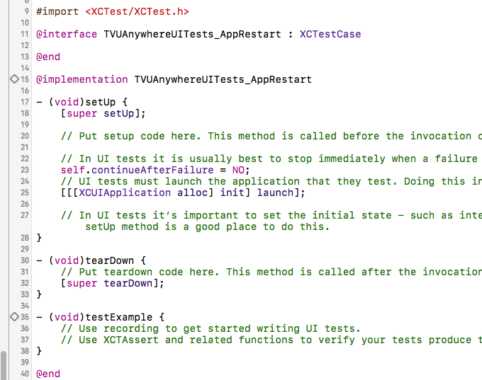

## 关于XCTest

XCTest 是Apple官方提供的一个测试工具，一个内置的测试框架，提供了各个层次的测试。允许你找到UI元素并与之交互，还能检查属性和状态。

以前，对App进行自动化测试是使用Instruments中的一个automation的插件。

## 使用XCTest的具体步骤

首先，你需要在你的项目中创建一个target：

在选择的时候，选择UI Testing Bundle:

此时有可能会发生一个签名错误，如图所示：

上述错误的解决方法是，把 `targets->Build Setting->Signing` 中的内容全部删掉：

紧接着，再选择上面创建的target，为其创建一个scheme 。

下面是创建成功后的截图：

## 在命令行中启动测试脚本

简单的单词启动脚本：

	xcodebuild -project /Users/qizhang/Desktop/workZone/ios/tvuanywhere_ios/products/TVUTransportIOS/TVUAnywherePro/TVUAnywhere.xcodeproj \
	   -scheme "TVUAnywhereUITests" \
           -destination 'platform=iOS,id=6f2eb102cd69721a1456d0bca56ad0d0a23b6e89' \
           test

结合shell脚本重复启动App:

	i=0
	while [ $i -lt 100 ]
	do
		i = $(( $i + 1))
		xcodebuild -project /Users/qizhang/Desktop/workZone/ios/tvuanywhere_ios/products/TVUTransportIOS/TVUAnywherePro/TVUAnywhere.xcodeproj \
		   -scheme "TVUAnywhereUITests" \
	           -destination 'platform=iOS,id=6f2eb102cd69721a1456d0bca56ad0d0a23b6e89' \
	           test
	done
	echo "The total number of tests $i"
 
关于如何使用 `xcodebuild ` 可以在terminal 中使用 `man xcodebuild` 指令查看帮助文档。

