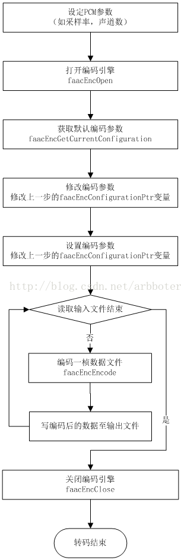

## 概述

我们知道，音频pcm格式是最原始的音频数据，它没有经过压缩，因此体积比较大，而aac是已经压缩后的数据，通常网络传输传送aac格式的音频数据比较好。

在ios开发中，手机捕获到的原始音频数据就是pcm数据，当然我们也面临着需要将其转化为aac格式。我们今天总结的就是如何将pcm数据转化成aac数据。

这篇文章具体包括：

* 利用`AudioToobox`进行转化
* `faac`库
* 利用`faac`库进行转化

## 利用AudioToolbox转化

### 几个重要的结构体

下面是创建转换器时，所需要了解的几个结构体。

#### AudioStreamBasicDescription

这个结构体封装了描述音频流的所有属性。

在音频数据中，帧是所有通道的一个样本。在非交织的音频中，每帧字段标识一个通道；在交织音频中，每帧字段标识n个通道的集合。对于未压缩的音频来说，一个数据包就是一帧的音频数据；在压缩的音频中，一个数据包是一个不可分割的压缩数据块，比如一个`AAC`包就包含了1024个音频帧。

下面是其具体定义：

		struct AudioStreamBasicDescription
		{
		    Float64             mSampleRate; // 数据流中每秒帧数（帧率）
		    AudioFormatID       mFormatID;  //  AudioFormatID指示流中的一般数据类型
		    AudioFormatFlags    mFormatFlags; // AudioFormatFlags为mFormatID指示的格式
		    UInt32              mBytesPerPacket; // 一个数据包中包含数据的字节数
		    UInt32              mFramesPerPacket; // 每个数据包中的帧数
		    UInt32              mBytesPerFrame; // 单个采样帧数据中的字节数
		    UInt32              mChannelsPerFrame; // 每帧数据中的通道数
		    UInt32              mBitsPerChannel; // 数据帧中每个通道的采样数据的位数
		    UInt32              mReserved; // 将结构粘贴到强制甚至8字节对齐
		};

#### AudioClassDescription

该结构体用于描述编解码器。

下面是其具体的定义：

	struct AudioClassDescription {
	    OSType  mType; 	// 四个字符代码代表编解码器类型
	    OSType  mSubType; // 四个字符代码代表编解码器子类型
	    OSType  mManufacturer; // 四个字符代码代表编解码器制造商
	};
	typedef struct AudioClassDescription    AudioClassDescription;

### 具体步骤

在这里我罗列一下实现pcm转aac数据的简单步骤，并附加上具体的细节。

#### 创建转换器

创建转换器包括设置编码参数和获取编解码器。设置编码参数时需要设置两种音频格式的编码参数，它们分别是：设置输入音频编码参数和设置输出音频编码参数。

不同的音频格式，设置的音频编码方式当然也就不同。我们现在所做的工作是将pcm数据转为aac数据，所以我们当前音频格式(转换器中的输入音频)就是pcm格式，输出音频的格式就是aac。

##### 获取输入音频的编码参数

在做音频的采集时，我们肯可以设置要采集音频的格式，在那个时候就已经设置了输入音频的编码参数。下面来看一个设置pcm音频数据参数的例子：
	
	// dataFormat就是输入音频的编码描述
	-(void)setUpRecoderWithFormatID:(UInt32)formatID {
	    //setup auido sample rate, channel number, and format ID
	    memset(&dataFormat, 0, sizeof(dataFormat));
	    
	    UInt32 size = sizeof(dataFormat.mSampleRate);
	    AudioSessionGetProperty(kAudioSessionProperty_CurrentHardwareSampleRate,
	                            &size,
	                            &dataFormat.mSampleRate);
	    dataFormat.mSampleRate = kTVUAudioSampleRate;
	    
	    size = sizeof(dataFormat.mChannelsPerFrame);
	    AudioSessionGetProperty(kAudioSessionProperty_CurrentHardwareInputNumberChannels,
	                            &size,
	                            &dataFormat.mChannelsPerFrame);
	    
	    dataFormat.mFormatID = formatID;
	    
	    if (formatID == kAudioFormatLinearPCM)
	    {
	        dataFormat.mFormatFlags     = kLinearPCMFormatFlagIsSignedInteger | kLinearPCMFormatFlagIsPacked;
	        dataFormat.mBitsPerChannel  = 16;
	        dataFormat.mBytesPerPacket  = dataFormat.mBytesPerFrame = (dataFormat.mBitsPerChannel / 8) * dataFormat.mChannelsPerFrame;
	        dataFormat.mFramesPerPacket = kTVURecoderPCMFramesPerPacket;    // 用AudioQueue采集pcm需要这么设置
	    }
	}

上面的方法需要传入一个音频数据的类型。下面我罗列出ios中音频数据的各种类型：

	CF_ENUM(AudioFormatID)
	{
	    kAudioFormatLinearPCM               = 'lpcm',
	    kAudioFormatAC3                     = 'ac-3',
	    kAudioFormat60958AC3                = 'cac3',
	    kAudioFormatAppleIMA4               = 'ima4',
	    kAudioFormatMPEG4AAC                = 'aac ',
	    kAudioFormatMPEG4CELP               = 'celp',
	    kAudioFormatMPEG4HVXC               = 'hvxc',
	    kAudioFormatMPEG4TwinVQ             = 'twvq',
	    kAudioFormatMACE3                   = 'MAC3',
	    kAudioFormatMACE6                   = 'MAC6',
	    kAudioFormatULaw                    = 'ulaw',
	    kAudioFormatALaw                    = 'alaw',
	    kAudioFormatQDesign                 = 'QDMC',
	    kAudioFormatQDesign2                = 'QDM2',
	    kAudioFormatQUALCOMM                = 'Qclp',
	    kAudioFormatMPEGLayer1              = '.mp1',
	    kAudioFormatMPEGLayer2              = '.mp2',
	    kAudioFormatMPEGLayer3              = '.mp3',
	    kAudioFormatTimeCode                = 'time',
	    kAudioFormatMIDIStream              = 'midi',
	    kAudioFormatParameterValueStream    = 'apvs',
	    kAudioFormatAppleLossless           = 'alac',
	    kAudioFormatMPEG4AAC_HE             = 'aach',
	    kAudioFormatMPEG4AAC_LD             = 'aacl',
	    kAudioFormatMPEG4AAC_ELD            = 'aace',
	    kAudioFormatMPEG4AAC_ELD_SBR        = 'aacf',
	    kAudioFormatMPEG4AAC_ELD_V2         = 'aacg',    
	    kAudioFormatMPEG4AAC_HE_V2          = 'aacp',
	    kAudioFormatMPEG4AAC_Spatial        = 'aacs',
	    kAudioFormatAMR                     = 'samr',
	    kAudioFormatAMR_WB                  = 'sawb',
	    kAudioFormatAudible                 = 'AUDB',
	    kAudioFormatiLBC                    = 'ilbc',
	    kAudioFormatDVIIntelIMA             = 0x6D730011,
	    kAudioFormatMicrosoftGSM            = 0x6D730031,
	    kAudioFormatAES3                    = 'aes3',
	    kAudioFormatEnhancedAC3             = 'ec-3'
	};
	
上面设置输入音频编码参数的方法中，`dataFormat`就是 `AudioStreamBasicDescription `类型的输入音频的描述实例。当我们创建转换器时，直接用 `dataFormat`就可以了。

当然了，如果你在获取音频数据之前没有设置音频的格式和具体的参数信息，那么你可以通过 `CMSampleBufferRef` 类型的数据来得到默认的输入音频格式编码参数。

	AudioStreamBasicDescription inAudioStreamBasicDescription = *CMAudioFormatDescriptionGetStreamBasicDescription((CMAudioFormatDescriptionRef)CMSampleBufferGetFormatDescription(sampleBuffer));
	
##### 设置输出音频的编码参数

我们做的是 pcm转aac的操作，输出音频就是aac格式。下面我罗列两种设置方法：

第一种设置方法：

	 AudioStreamBasicDescription outAudioStreamBasicDescription = {0}; // 初始化输出流的结构体描述为0. 很重要。
	    outAudioStreamBasicDescription.mSampleRate = inAudioStreamBasicDescription.mSampleRate; // 音频流，在正常播放情况下的帧率。如果是压缩的格式，这个属性表示解压缩后的帧率。帧率不能为0。
	    outAudioStreamBasicDescription.mFormatID = kAudioFormatMPEG4AAC; // 设置编码格式
	    outAudioStreamBasicDescription.mFormatFlags = kMPEG4Object_AAC_LC; // 无损编码 ，0表示没有
	    outAudioStreamBasicDescription.mBytesPerPacket = 0; // 每一个packet的音频数据大小。如果的动态大小，设置为0。动态大小的格式，需要用AudioStreamPacketDescription 来确定每个packet的大小。
	    outAudioStreamBasicDescription.mFramesPerPacket = 1024; // 每个packet的帧数。如果是未压缩的音频数据，值是1。动态码率格式，这个值是一个较大的固定数字，比如说AAC的1024。如果是动态大小帧数（比如Ogg格式）设置为0。
	    outAudioStreamBasicDescription.mBytesPerFrame = 0; //  每帧的大小。每一帧的起始点到下一帧的起始点。如果是压缩格式，设置为0 。
	    outAudioStreamBasicDescription.mChannelsPerFrame = 1; // 声道数
	    outAudioStreamBasicDescription.mBitsPerChannel = 0; // 压缩格式设置为0
	    outAudioStreamBasicDescription.mReserved = 0; // 8字节对齐，填0.
	    
第二种设置方法：

	AudioStreamBasicDescription sourceDes = dataFormat;
	    AudioStreamBasicDescription targetDes;
	    
	    memset(&targetDes, 0, sizeof(targetDes));
	    targetDes.mFormatID                   = kAudioFormatMPEG4AAC;
	    targetDes.mSampleRate                 = kTVUAudioSampleRate;
	    targetDes.mChannelsPerFrame           = dataFormat.mChannelsPerFrame;
	    targetDes.mFramesPerPacket            = kTVURecoderAACFramesPerPacket;
	    
	    OSStatus status     = 0;
	    UInt32 targetSize   = sizeof(targetDes);
	    status              = AudioFormatGetProperty(kAudioFormatProperty_FormatInfo, 0, NULL, &targetSize, &targetDes);
	    log4cplus_warn("Audio Recoder", "create target data format status:%d",(int)status);
	    
	    memset(&_targetDes, 0, sizeof(_targetDes));
	    memcpy(&_targetDes, &targetDes, targetSize);

两种方法的不同点也就是结构体初始化的不同。其它并没有什么本质的不同。

##### 获取编解码器

编解码器（英语：codec）指的是一个能够对一个信号或者一个数据流进行编解码操作的设备或者程序。这里指的变换既包括将信号或者数据流进行编码（通常是为了传输、存储或者加密）或者提取得到一个编码流的操作，也包括为了观察或者处理从这个编码流中恢复适合观察或操作的形式的操作。编解码器经常用在视频会议和流媒体等应用中。 ----摘自基维百科

下面是获取编解码器的一个小示例：(获取的是软编解码器)

	AudioClassDescription audioClassDes;
	    status = AudioFormatGetPropertyInfo(kAudioFormatProperty_Encoders,
	                                        sizeof(targetDes.mFormatID),
	                                        &targetDes.mFormatID,
	                                        &targetSize);
	    log4cplus_warn("Audio Recoder","get kAudioFormatProperty_Encoders status:%d",(int)status);
	    
	    UInt32 numEncoders = targetSize/sizeof(AudioClassDescription);
	    AudioClassDescription audioClassArr[numEncoders];
	    AudioFormatGetProperty(kAudioFormatProperty_Encoders,
	                           sizeof(targetDes.mFormatID),
	                           &targetDes.mFormatID,
	                           &targetSize,
	                           audioClassArr);
	    log4cplus_warn("Audio Recoder","wrirte audioClassArr status:%d",(int)status);
	    
	    for (int i = 0; i < numEncoders; i++) {
	        if (audioClassArr[i].mSubType == kAudioFormatMPEG4AAC && audioClassArr[i].mManufacturer == kAppleSoftwareAudioCodecManufacturer) {  // 软件编码，没有明显延时
	            memcpy(&audioClassDes, &audioClassArr[i], sizeof(AudioClassDescription));
	            break;
	        }
	    }

对上面的例子做一个简单的封装。传入一个编码格式和类型，获取得到指定的编解码器。

	/**
	 *  获取编解码器
	 *  @param type         编码格式
	 *  @param manufacturer 软/硬编
	 *  @return 指定编码器
	 */
	- (AudioClassDescription *)getAudioClassDescriptionWithType:(UInt32)type
	                                           fromManufacturer:(UInt32)manufacturer
	{
	    static AudioClassDescription desc;
	    
	    UInt32 encoderSpecifier = type;
	    OSStatus st;
	    
	    UInt32 size;
	    // 取得给定属性的信息
	    st = AudioFormatGetPropertyInfo(kAudioFormatProperty_Encoders,
	                                    sizeof(encoderSpecifier),
	                                    &encoderSpecifier,
	                                    &size);
	    if (st) {
	        NSLog(@"error getting audio format propery info: %d", (int)(st));
	        return nil;
	    }
	    
	    unsigned int count = size / sizeof(AudioClassDescription);
	    AudioClassDescription descriptions[count];
	    // 取得给定属性的数据
	    st = AudioFormatGetProperty(kAudioFormatProperty_Encoders,
	                                sizeof(encoderSpecifier),
	                                &encoderSpecifier,
	                                &size,
	                                descriptions);
	    if (st) {
	        NSLog(@"error getting audio format propery: %d", (int)(st));
	        return nil;
	    }
	    
	    for (unsigned int i = 0; i < count; i++) {
	        if ((type == descriptions[i].mSubType) &&
	            (manufacturer == descriptions[i].mManufacturer)) {
	            memcpy(&desc, &(descriptions[i]), sizeof(desc));
	            return &desc;
	        }
	    }
	    
	    return nil;
	}

在上面的例子中，要注意两个方法。它们分别是：

1）取得给定属性的信息

	/*!
	    @function	AudioFormatGetPropertyInfo
	    @abstract   Retrieve information about the given property
	    @param      inPropertyID		an AudioFormatPropertyID constant.
	    @param      inSpecifierSize		The size of the specifier data.
	    @param      inSpecifier			A specifier is a buffer of data used as an input argument to some of the properties.
	    @param      outPropertyDataSize	The size in bytes of the current value of the property. In order to get the property value,
										you will need a buffer of this size.
	    @result     returns noErr if successful.
	*/
	extern OSStatus
	AudioFormatGetPropertyInfo(	AudioFormatPropertyID	inPropertyID,
								UInt32					inSpecifierSize,
								const void * __nullable	inSpecifier,
								UInt32 *				outPropertyDataSize)	__OSX_AVAILABLE_STARTING(__MAC_10_3,__IPHONE_2_0);

2）取得给定属性的数据(取得属性的内容)

	/*!
	    @function	AudioFormatGetProperty
	    @abstract   Retrieve the indicated property data
	    @param      inPropertyID		an AudioFormatPropertyID constant.
	    @param      inSpecifierSize		The size of the specifier data.
	    @param      inSpecifier			A specifier is a buffer of data used as an input argument to some of the properties.
	    @param      ioPropertyDataSize	on input the size of the outPropertyData buffer. On output the number of bytes written to the buffer.
	    @param      outPropertyData		the buffer in which to write the property data. If outPropertyData is NULL and ioPropertyDataSize is
										not, the amount that would have been written will be reported.
	    @result     returns noErr if successful.
	*/
	extern OSStatus
	AudioFormatGetProperty(	AudioFormatPropertyID	inPropertyID,
							UInt32					inSpecifierSize,
							const void * __nullable	inSpecifier,
							UInt32 * __nullable		ioPropertyDataSize,
							void * __nullable		outPropertyData)			__OSX_AVAILABLE_STARTING(__MAC_10_3,__IPHONE_2_0);

##### 创建转换器

`AudioToolbox`提供了创建转换器的方法：

	/*!
	    @function   AudioConverterNewSpecific
	    @abstract   Create a new AudioConverter using specific codecs.
	
	    @param      inSourceFormat
	                    The format of the source audio to be converted.
	    @param      inDestinationFormat
	                    The destination format to which the audio is to be converted.
	    @param      inNumberClassDescriptions
	                    The number of class descriptions.
	    @param      inClassDescriptions
	                    AudioClassDescriptions specifiying the codec to instantiate.
	    @param      outAudioConverter
	                    On successful return, points to a new AudioConverter instance.
	    @result     An OSStatus result code.
	    
	    @discussion
	                This function is identical to AudioConverterNew(), except that the client may
	                explicitly choose which codec to instantiate if there is more than one choice.
	*/
	extern OSStatus
	AudioConverterNewSpecific(  const AudioStreamBasicDescription * inSourceFormat,
	                            const AudioStreamBasicDescription * inDestinationFormat,
	                            UInt32                              inNumberClassDescriptions,
	                            const AudioClassDescription *       inClassDescriptions,
	                            AudioConverterRef __nullable * __nonnull outAudioConverter)
	                                                                                __OSX_AVAILABLE_STARTING(__MAC_10_4,__IPHONE_2_0);
	                                                                                
下面是具体的例子：

    OSStatus status = AudioConverterNewSpecific(&inAudioStreamBasicDescription, &outAudioStreamBasicDescription, 1, description, &_audioConverter); // 创建转换器
    if (status != 0) {
        NSLog(@"setup converter: %d", (int)status);
    }
  
完整代码：

第一种方式：

	- (void) setupEncoderFromSampleBuffer:(CMSampleBufferRef)sampleBuffer {
	    AudioStreamBasicDescription inAudioStreamBasicDescription = *CMAudioFormatDescriptionGetStreamBasicDescription((CMAudioFormatDescriptionRef)CMSampleBufferGetFormatDescription(sampleBuffer));
	    
	    AudioStreamBasicDescription outAudioStreamBasicDescription = {0}; // 初始化输出流的结构体描述为0. 很重要。
	    outAudioStreamBasicDescription.mSampleRate = inAudioStreamBasicDescription.mSampleRate; // 音频流，在正常播放情况下的帧率。如果是压缩的格式，这个属性表示解压缩后的帧率。帧率不能为0。
	    outAudioStreamBasicDescription.mFormatID = kAudioFormatMPEG4AAC; // 设置编码格式
	    outAudioStreamBasicDescription.mFormatFlags = kMPEG4Object_AAC_LC; // 无损编码 ，0表示没有
	    outAudioStreamBasicDescription.mBytesPerPacket = 0; // 每一个packet的音频数据大小。如果的动态大小，设置为0。动态大小的格式，需要用AudioStreamPacketDescription 来确定每个packet的大小。
	    outAudioStreamBasicDescription.mFramesPerPacket = 1024; // 每个packet的帧数。如果是未压缩的音频数据，值是1。动态码率格式，这个值是一个较大的固定数字，比如说AAC的1024。如果是动态大小帧数（比如Ogg格式）设置为0。
	    outAudioStreamBasicDescription.mBytesPerFrame = 0; //  每帧的大小。每一帧的起始点到下一帧的起始点。如果是压缩格式，设置为0 。
	    outAudioStreamBasicDescription.mChannelsPerFrame = 1; // 声道数
	    outAudioStreamBasicDescription.mBitsPerChannel = 0; // 压缩格式设置为0
	    outAudioStreamBasicDescription.mReserved = 0; // 8字节对齐，填0.
	    AudioClassDescription *description = [self
	                                          getAudioClassDescriptionWithType:kAudioFormatMPEG4AAC
	                                          fromManufacturer:kAppleSoftwareAudioCodecManufacturer]; //软编
	    
	    OSStatus status = AudioConverterNewSpecific(&inAudioStreamBasicDescription, &outAudioStreamBasicDescription, 1, description, &_audioConverter); // 创建转换器
	    if (status != 0) {
	        NSLog(@"setup converter: %d", (int)status);
	    }
	}

第二种方式：

	- (NSString *)convertBasicSetting {
	    AudioStreamBasicDescription sourceDes = dataFormat;
	    AudioStreamBasicDescription targetDes;
	    
	    memset(&targetDes, 0, sizeof(targetDes));
	    targetDes.mFormatID                   = kAudioFormatMPEG4AAC;
	    targetDes.mSampleRate                 = kTVUAudioSampleRate;
	    targetDes.mChannelsPerFrame           = dataFormat.mChannelsPerFrame;
	    targetDes.mFramesPerPacket            = kTVURecoderAACFramesPerPacket;
	    
	    OSStatus status     = 0;
	    UInt32 targetSize   = sizeof(targetDes);
	    status              = AudioFormatGetProperty(kAudioFormatProperty_FormatInfo, 0, NULL, &targetSize, &targetDes);
	    log4cplus_warn("Audio Recoder", "create target data format status:%d",(int)status);
	    
	    memset(&_targetDes, 0, sizeof(_targetDes));
	    memcpy(&_targetDes, &targetDes, targetSize);
	    
	    AudioClassDescription audioClassDes;
	    status = AudioFormatGetPropertyInfo(kAudioFormatProperty_Encoders,
	                                        sizeof(targetDes.mFormatID),
	                                        &targetDes.mFormatID,
	                                        &targetSize);
	    log4cplus_warn("Audio Recoder","get kAudioFormatProperty_Encoders status:%d",(int)status);
	    
	    UInt32 numEncoders = targetSize/sizeof(AudioClassDescription);
	    AudioClassDescription audioClassArr[numEncoders];
	    AudioFormatGetProperty(kAudioFormatProperty_Encoders,
	                           sizeof(targetDes.mFormatID),
	                           &targetDes.mFormatID,
	                           &targetSize,
	                           audioClassArr);
	    log4cplus_warn("Audio Recoder","wrirte audioClassArr status:%d",(int)status);
	    
	    for (int i = 0; i < numEncoders; i++) {
	        if (audioClassArr[i].mSubType == kAudioFormatMPEG4AAC && audioClassArr[i].mManufacturer == kAppleSoftwareAudioCodecManufacturer) {  // 软件编码，没有明显延时
	            memcpy(&audioClassDes, &audioClassArr[i], sizeof(AudioClassDescription));
	            break;
	        }
	    }
	    
	//    if (_encodeConvertRef != NULL) {
	//        log4cplus_info("Audio Recoder", "release _encodeConvertRef.");
	//        AudioConverterDispose(_encodeConvertRef);
	//        _encodeConvertRef = NULL;
	//    }
	    
	    if (_encodeConvertRef == NULL) {
	        status          = AudioConverterNewSpecific(&sourceDes, &targetDes, 1,
	                                                    &audioClassDes, &_encodeConvertRef);
	        
	        
	        if (status != noErr) {
	            log4cplus_info("Audio Recoder","new convertRef failed status:%d",(int)status);
	            return @"Error : New convertRef failed";
	        }
	    }
	    
	    targetSize      = sizeof(sourceDes);
	    status          = AudioConverterGetProperty(_encodeConvertRef, kAudioConverterCurrentInputStreamDescription, &targetSize, &sourceDes);
	    log4cplus_warn("Audio Recoder","get sourceDes status:%d",(int)status);
	    
	    targetSize      = sizeof(targetDes);
	    status          = AudioConverterGetProperty(_encodeConvertRef, kAudioConverterCurrentOutputStreamDescription, &targetSize, &targetDes);
	    log4cplus_warn("Audio Recoder","get targetDes status:%d",(int)status);
	    
	    // set rate，need to be consistent with sampling rate.if PCM sampling rate is 44100KHz，rate set 64000bps，if it is 16K，rate set 32000bps。
	    UInt32 bitRate  = kTVURecoderConverterEncodeBitRate;
	    targetSize      = sizeof(bitRate);
	    status          = AudioConverterSetProperty(_encodeConvertRef,
	                                                kAudioConverterEncodeBitRate,
	                                                targetSize, &bitRate);
	
	    if (status != noErr) {
	        log4cplus_info("Audio Recoder","set covert property bit rate status:%d",(int)status);
	        return @"Error : Set covert property bit rate failed";
	    }
	    
	    return nil;
	}

##### 传pcm数据到编码器

用`CMSampleBufferGetDataBuffer`获取到CMSampleBufferRef里面的CMBlockBufferRef，再通过`CMBlockBufferGetDataPointer`获取到_pcmBufferSize和_pcmBuffer；调用`AudioConverterFillComplexBuffer`传入数据，并在callBack函数调用填充buffer的方法。

        CMBlockBufferRef blockBuffer = CMSampleBufferGetDataBuffer(sampleBuffer);
        CFRetain(blockBuffer);
        OSStatus status = CMBlockBufferGetDataPointer(blockBuffer, 0, NULL, &_pcmBufferSize, &_pcmBuffer);
        NSError *error = nil;
        if (status != kCMBlockBufferNoErr) {
            error = [NSError errorWithDomain:NSOSStatusErrorDomain code:status userInfo:nil];
        }
        memset(_aacBuffer, 0, _aacBufferSize);
        
        AudioBufferList outAudioBufferList = {0};
        outAudioBufferList.mNumberBuffers = 1;
        outAudioBufferList.mBuffers[0].mNumberChannels = 1;
        outAudioBufferList.mBuffers[0].mDataByteSize = (int)_aacBufferSize;
        outAudioBufferList.mBuffers[0].mData = _aacBuffer;
        AudioStreamPacketDescription *outPacketDescription = NULL;
        UInt32 ioOutputDataPacketSize = 1;
        // Converts data supplied by an input callback function, supporting non-interleaved and packetized formats.
        // Produces a buffer list of output data from an AudioConverter. The supplied input callback function is called whenever necessary.
        status = AudioConverterFillComplexBuffer(_audioConverter, inInputDataProc, (__bridge void *)(self), &ioOutputDataPacketSize, &outAudioBufferList, outPacketDescription);

callback函数中的内容：

	OSStatus inInputDataProc(AudioConverterRef inAudioConverter, UInt32 *ioNumberDataPackets, AudioBufferList *ioData, AudioStreamPacketDescription **outDataPacketDescription, void *inUserData)
	{
	    AACEncoder *encoder = (__bridge AACEncoder *)(inUserData);
	    UInt32 requestedPackets = *ioNumberDataPackets;
	    
	    size_t copiedSamples = [encoder copyPCMSamplesIntoBuffer:ioData];
	    if (copiedSamples < requestedPackets) {
	        //PCM 缓冲区还没满
	        *ioNumberDataPackets = 0;
	        return -1;
	    }
	    *ioNumberDataPackets = 1;
	    
	    return noErr;
	}
	
	/**
	 *  填充PCM到缓冲区
	 */
	- (size_t) copyPCMSamplesIntoBuffer:(AudioBufferList*)ioData {
	    size_t originalBufferSize = _pcmBufferSize;
	    if (!originalBufferSize) {
	        return 0;
	    }
	    ioData->mBuffers[0].mData = _pcmBuffer;
	    ioData->mBuffers[0].mDataByteSize = (int)_pcmBufferSize;
	    _pcmBuffer = NULL;
	    _pcmBufferSize = 0;
	    return originalBufferSize;
	}

对上面代码的解释：

`AudioConverterFillComplexBuffer`是一个数据格式转换函数。

输入数据(即被转化数据)由一个回调函数提供，支持的格式是非交错格式和包格式。

下面我们看一下它的定义：

	extern OSStatus
	AudioConverterFillComplexBuffer(    AudioConverterRef                   inAudioConverter,
	                                    AudioConverterComplexInputDataProc  inInputDataProc,
	                                    void * __nullable                   inInputDataProcUserData,
	                                    UInt32 *                            ioOutputDataPacketSize,
	                                    AudioBufferList *                   outOutputData,
	                                    AudioStreamPacketDescription * __nullable outPacketDescription);
	// inAudioConverter: 转换器
	// inInputDataProc : 提供输入数据的回调函数
	// inInputDataProUserData : 一个值，被传入回调函数让回调函数使用
	// inOutputDataPacketSize : 在进入时，outoutputdata表示包在转换器的输出格式。在退出时，对转换后的数据被写入到outoutputdata数据包数
	// outOutputData : 转化完成的数据被写入到这个缓冲区中
	// outPacketDescription : 如果非空，转换器的输出使用包描述，然后包描述写入此数组。它必须指向一个能够容纳* iooutputdatapacketsize包描述内存块

 
AudioConverterFillComplexBuffer返回的是AAC原始码流.下面的逻辑就需要根据不同的逻辑做不同的处理。

                                                                                
	                                                                              
## faac库

### faac是什么

faac是一个aac编码器，它具有如下特征：可移植、速度快、支持LC,Main和LTP、通过Dream可以支持DRM等。

### 下载faac并编译

* 代码下载地址：http://www.audiocoding.com/faac.html
* 命令行下载地址：http://www.rarewares.org/aac-encoders.php#faac-win

具体编译方法请查阅官网。

我们的项目中使用的是faac静态库。这个静态库是我们自己构造一个ios静态库项目，自己构建的。具体地址在我的码云中( faacencoder /  AACEncoder)中

### faac转化示意图

下面是faac的aac编码示意图：

### 具体api

这儿介绍一些主要的函数。

#### faacEncOpen

打开并初始化编码器

	faacEncHandle FAACAPI faacEncOpen(unsigned long sampleRate,
					  unsigned int numChannels,
					  unsigned long *inputSamples,
					  unsigned long *maxOutputBytes);
	// sampleRate : 编码输入信息采样率
	// numChannels : 编码输入信息的通道数量，1-单声道 2-立体声
	// inputSamples : 编码后的数据长度
	// maxOutputBytes : 编码后的信息最大长度 

#### faacEnClose

关闭编码器

	int FAACAPI faacEncClose(faacEncHandle hEncoder);
	// hEncoder : faacEnOpen返回的编码器句柄
	
#### faacEncGetCurrentConfiguration

获取当前编码器的配置信息

	faacEncConfigurationPtr FAACAPI
	  faacEncGetCurrentConfiguration(faacEncHandle hEncoder);
	  // hEncoder : faacEnOpen返回的编码器句柄
	  
#### faacEncSetConfiguration

配置解码器参数

	int FAACAPI faacEncSetConfiguration(faacEncHandle hEncoder,
					    faacEncConfigurationPtr config);
	// hEncoder : faacEnOpen返回的编码器句柄
	// config : 编码器的配置信息

#### faacEncEncode

编码一帧信息

	int FAACAPI faacEncEncode(faacEncHandle hEncoder, int32_t * inputBuffer, unsigned int samplesInput,
				 unsigned char *outputBuffer,
				 unsigned int bufferSize);
	// hEncoder : faacEncOpen返回的编码器句柄 
	// inputBuffer : 输入信息缓冲区 
	// samplesInput : faacEncOpen编码后的数据长度，即缓冲区长度  
	// outputBuffer ： 编码后输出信息缓冲区 
	// bufferSize : 输出信息长度 

#### faacEncGetDecoderSpecificInfo
	
得到解码信息，当编码完的aac流要写入mp4文件时，需要调用此方法。此函数支持MPEG4版本，得到的ASC 和ACSLength 数据在录制MP4(mpegip库)文件时用
	
	int FAACAPI faacEncGetDecoderSpecificInfo(faacEncHandle hEncoder, unsigned char **ppBuffer,
						  unsigned long *pSizeOfDecoderSpecificInfo);

#### faacEncGetVersion

 获取FAAC的版本信息，用以参考作用，非必须API

	int FAACAPI faacEncGetVersion(char **faac_id_string, char **faac_copyright_string);  
	// faac_id_string : faac的版本号  
	// faac_copyright_string ： 版权信息  
	

## 利用faac库进行转化

这个示例只写开始转换和结束转换及初始化的方法，其它方法省略。

	@interface TVUConvertAudioDataFormatPCMToAAC()
	{
	    unsigned long m_SampleRate;
	    int m_Channels;
	    int m_PCMBitSize;
	    unsigned long m_InputSample;
	    unsigned long m_MaxOutputBytes;
	    faacEncHandle m_encoder;
	    faacEncConfigurationPtr m_pConfiguration;
	    
	    uint8_t * m_PCMInputBufffer;
	    int m_datainPCMBuffer;
	    uint8_t * m_AACOutputBuffer;
	    
	    TVUAACData *m_tvuAACData;
	}
	
	@end
	
	@implementation TVUConvertAudioDataFormatPCMToAAC
	
	- (instancetype)init
	{
	    if ([super init])
	    {
	        m_SampleRate = kTVUAudioSampleRate;
	        m_Channels = 1;
	        m_PCMBitSize = 16;
	        m_InputSample = 0;
	        m_MaxOutputBytes = 0;
	        m_pConfiguration = NULL;
	        m_encoder = NULL;
	        m_InputSample = 0;
	        m_PCMInputBufffer = NULL;
	        m_AACOutputBuffer = NULL;
	        
	        m_tvuAACData = (TVUAACData *)malloc(sizeof(TVUAACData));
	        m_tvuAACData->audioData = (int8_t *)malloc(kTVUAACAudioDataSize);
	    }
	    return self;
	}
	
	- (void)startConvert
	{
	    unsigned long nInputSample = 0;
	    unsigned long nMaxOutBytes = 0;
	    m_encoder = faacEncOpen(m_SampleRate, m_Channels, &nInputSample, &nMaxOutBytes);
	    if(m_encoder == NULL)
	    {
	        NSLog(@"faacEncOpen failed");
	        return ;
	    }else{
	        NSLog(@"faacEncOpen success,nInputSample=%lu,nMaxOutBytes=%lu",nInputSample,nMaxOutBytes);
	    }
	    
	    if (nInputSample > 0 && nMaxOutBytes > 0)
	    {
	        m_InputSample = nInputSample;
	        m_MaxOutputBytes = nMaxOutBytes;
	        int nPCMBufferSize = (int)(m_InputSample * m_PCMBitSize / 8);
	        m_PCMInputBufffer = (uint8_t *)malloc(nPCMBufferSize);
	        m_AACOutputBuffer = (uint8_t *)malloc(m_MaxOutputBytes);
	        m_datainPCMBuffer = 0;
	        m_pConfiguration = faacEncGetCurrentConfiguration(m_encoder);
	        m_pConfiguration->inputFormat = FAAC_INPUT_16BIT;
	        faacEncSetConfiguration(m_encoder, m_pConfiguration);
	    }
	}
	
	- (void)finishConvert
	{
	    faacEncClose(m_encoder);
	    free(m_PCMInputBufffer);
	    free(m_AACOutputBuffer);
	    m_datainPCMBuffer = 0;
	    m_InputSample = 0;
	    m_MaxOutputBytes = 0;
	    m_pConfiguration = NULL;
	    m_encoder = NULL;
	    m_PCMInputBufffer = NULL;
	    m_AACOutputBuffer = NULL;
	}

## 参考

* [编解码器](https://zh.wikipedia.org/wiki/%E7%BC%96%E8%A7%A3%E7%A0%81%E5%99%A8)
* [ 使用FAAC转换PCM为AAC](http://blog.csdn.net/arbboter/article/details/43152967)
* [ios平台下面编译faac](http://blog.csdn.net/cjj198561/article/details/38382889)
* [Faac 编码实时pcm流到aac流](http://www.xuebuyuan.com/1816548.html)
* [使用AudioToolbox编码AAC](http://www.jianshu.com/p/a671f5b17fc1)