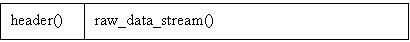
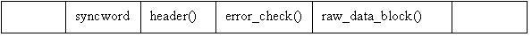
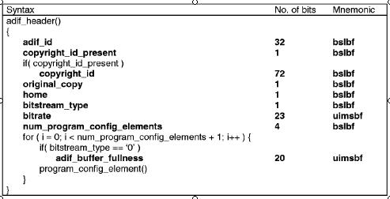
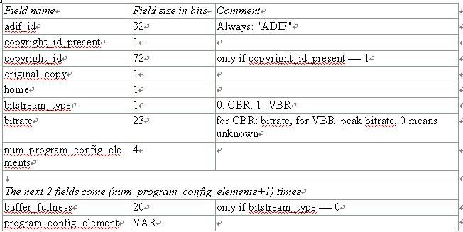
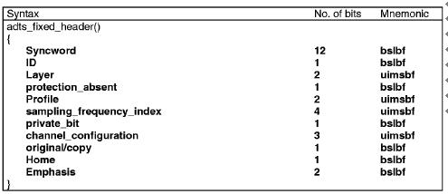
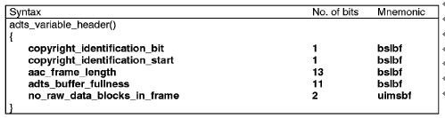
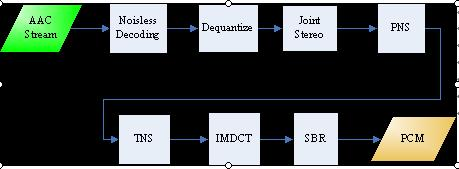

## AAC音频

### AAC音频文件格式

 AAC的音频文件格式有两种分别是`ADIF` 和 `ADTS` 。
 
#### ADIF和ADTS
 
 
 * ADIF : (Audio Data Interchange Format )音频数据交换格式。这种格式的特征是可以确定的找到这个音频数据的开始，不需进行在音频数据流中间开始的解码，即它的解码必须在明确定义的开始处进行。故这种格式常用在磁盘文件中。
 * ADTS : (Audio Data Transport Stream)音频数据传输流。这种格式的特征是它是一个有同步字的比特流，解码可以在这个流中任何位置开始。它的特征类似于mp3数据流格式。

 简单说，ADTS可以在任意帧解码，也就是说它每一帧都有头信息。ADIF只有一个统一的头，所以必须得到所有的数据后解码。且这两种的header的格式也是不同的，目前一般编码后的和抽取出的都是ADTS格式的音频流。
 
 ADIF格式:
 
 
 
 ADTS格式:
 	
 
 
#### ADIF和ADTS的头信息

ADIF的头信息如图：

ADIF头信息位于AAC文件的起始处，接下来就是连续的 raw data blocks。组成 ADIF头信息的各个域如下所示：

ADTS的固定头信息：

ADTS的可变头信息：

* 帧同步目的在于找出帧头在比特流中的位置，13818-7规定，aac ADTS格式的帧头。同步字为12比特的“1111 1111 1111”
* ADTS的头信息为两部分组成，其一为固定头信息，紧接着是可变头信息。固定头信息中的数据每一帧都相同，而可变头信息则在帧与帧之间可变

#### AAC元素信息

 在AAC中，原始数据块的组成可能有六种不同的元素：
 
 * SCE: Single Channel Element单通道元素。单通道元素基本上只由一个ICS组成。一个原始数据块最可能由16个SCE组成。
 * CPE: Channel Pair Element 双通道元素，由两个可能共享边信息的ICS和一些联合立体声编码信息组成。一个原始数据块最多可能由16个SCE组成。
 *  CCE: Coupling Channel Element 藕合通道元素。代表一个块的多通道联合立体声信息或者多语种程序的对话信息。
 *  LFE: Low Frequency Element 低频元素。包含了一个加强低采样频率的通道。
 *  DSE: Data Stream Element 数据流元素，包含了一些并不属于音频的附加信息。
 *  PCE: Program Config Element 程序配置元素。包含了声道的配置信息。它可能出现在ADIF 头部信息中。
 *  FIL: Fill Element 填充元素。包含了一些扩展信息。如SBR，动态范围控制信息等。
 
#### AAC文件的处理流程
 
 1. 判断文件格式，确定为ADIF或ADTS
 2. 若为ADIF，解ADIF头信息，跳至第6步。
 3. 若为ADTS，寻找同步头。
 4. 解ADTS帧头信息。
 5. 若有错误检测，进行错误检测。
 6. 解块信息。
 7. 解元素信息。
 
### AAC解码流程
 
 
 
 在主控模块开始运行后，主控模块将AAC比特流的一部分放入输入缓冲区，通过查找同步字得到一帧的起始，找到后，根据ISO/IEC 13818-7所述的语法开始进行Noisless Decoding(无噪解码)，无噪解码实际上就是哈夫曼解码，通过反量化(Dequantize)、联合立体声（Joint Stereo），知觉噪声替换（PNS）,瞬时噪声整形（TNS），反离散余弦变换（IMDCT），频段复制(SBR）这几个模块之后，得出左右声道的PCM码流，再由主控模块将其放入输出缓冲区输出到声音播放设备。
 
 
 