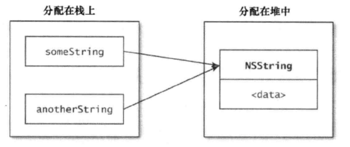

## 熟悉Objective-c

### 相同内容变量的内存分配

```
	NSString *someStr = @"The string";
	NSString *anotherStr = someStr;
```

内存分布图如下所示：



* 分配在堆中的内存必须直接管理，而分配在栈上用于保存变量的内存则会在其栈帧弹出时在动清理
* Objective-C 将堆内存管理抽象出来了。不需要用malloc及free来分配或释放对象所占内存。OC运行环境把这本分工作抽象为一套内存管理架构-引用计数。

### 在类的头文件中尽量少引入其它头文件

`@class Person`  这叫向前声明。

* 除非有必要，否则不要引入头文件。一般来说，应某各类的头文件中使用向前声明来提及别的类，并在实现文件中引入那些类的头文件。这样做可以尽量降低类的耦合，还可以减少编译时间。
* 无法使用向前声明，比如要声明某个类遵循一项协议。这种情况下，尽量把“该类遵循某协议”的这条声明移至"class-continuation分类"中。如果不行的话，就把协议单独放在一个头文件中，然后将其引入。

### 多用字面量语法

使用字面量语法有很多好处：

* 应该使用字面量语法来创建字符串、数值、数组、字典。与创建此类对象的常规方法相比，这么做更加简明扼要。
* 应该通过去下标操作来访问数组下标或字典中的键所对应的元素。
* 用字面量语法创建数组或字典时，若值中有nil，则会抛出异常。因此务必确保值里不含nil。

### 多用类型常量，少用#define预处理指令

不推荐使用 `#define ANIMATION_DURATION 0.3` , 推荐使用 `static const NSTimeInterval kAnimationDuration = 0.3` .

## 对象、消息、运行期

