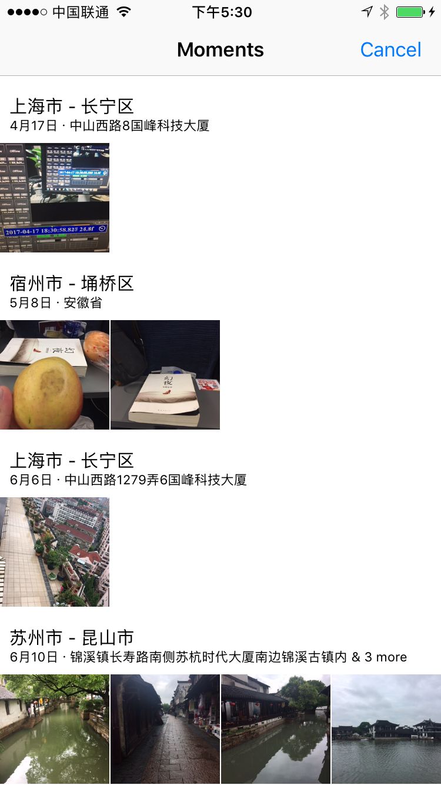

## 概述

本文主要介绍`UIImagePickerController`的用法以及用例。

* UIImagePicker基础知识
* 获取系统相册

## UIImagePickerController

`UIImagePickerController`继承于`UINavigationController`，主要作用有：拍照、摄像、获取相册（通过设置可区分照片和视频）。

### 常用属性和方法

罗列出最常用的属性和方法，更详细的请参考苹果官方文档。

#### sourceType

定义如下：

```
@property(nonatomic)           UIImagePickerControllerSourceType     sourceType;    // default value is UIImagePickerControllerSourceTypePhotoLibrary.
```
UIImagePickerControllerSourceType 是一个枚举型：

UIImagePickerControllerSourceTypePhotoLibrary ： 照片库
，默认值	

UIImagePickerControllerSourceTypeCamera : 摄像头

UIImagePickerControllerSourceTypeSavedPhotosAlbum : 相簿

#### mediaTypes

定义如下：

```
@property(nonatomic,copy)      NSArray<NSString *>  *mediaTypes; // default value is an array containing kUTTypeImage.
```
媒体类型,默认情况下此数组包含kUTTypeImage，所以拍照时可以不用设置；但是当要录像的时候必须设置，可以设置为kUTTypeVideo（视频，但不带声音）或者kUTTypeMovie（视频并带有声音）

* videoMaximumDuration

定义如下：

```
@property(nonatomic) NSTimeInterval   videoMaximumDuration NS_AVAILABLE_IOS(3_1); // default value is 10 minutes.
```
视频最大录制时长，默认为10 s

#### videoQuality

定义如下：

```
@property(nonatomic)  UIImagePickerControllerQualityType videoQuality NS_AVAILABLE_IOS(3_1);         // default value is UIImagePickerControllerQualityTypeMedium. If the cameraDevice does not support the videoQuality, it will use the default value.
```
视频质量，枚举类型（进行视频压缩时需要使用）：

UIImagePickerControllerQualityTypeHigh：高清质量

UIImagePickerControllerQualityTypeMedium：中等质量，适合WiFi传输

UIImagePickerControllerQualityTypeLow：低质量，适合蜂窝网传输

UIImagePickerControllerQualityType640x480：640*480

UIImagePickerControllerQualityTypeIFrame1280x720：1280*720

UIImagePickerControllerQualityTypeIFrame960x540：960*540

#### showsCameraControls

是否显示摄像头控制面板，默认为YES

#### cameraOverlayView

摄像头上覆盖的视图，可用通过这个视频来自定义拍照或录像界面


## 获取相册

我们使用`UIImagePickerController`最多的一种情况就是获取系统的相册。

### 初始化UIImagePickerController

最主要的就是初始化UIImagePickerController,下面是具体代码：(显示视频和图片)

```
- (UIImagePickerController *)imagePickerVC
{
    if (!_imagePickerVC) {
        _imagePickerVC = [[UIImagePickerController alloc] init];
        if (_imagePickerVC.mediaTypes.count < 2) {
            _imagePickerVC.sourceType = UIImagePickerControllerSourceTypePhotoLibrary;
            _imagePickerVC.mediaTypes = [UIImagePickerController availableMediaTypesForSourceType:_imagePickerVC.sourceType];
        }
         [_imagePickerVC setSourceType:UIImagePickerControllerSourceTypeSavedPhotosAlbum];
        _imagePickerVC.allowsEditing = YES;
        _imagePickerVC.delegate = self;
    }
    return _imagePickerVC;
}
```

下面是运行结果截图：

刚进入选择界面：



选择一个图片：


选择一个视频：


### 项目原码

[github下载](https://github.com/MaxwellQi/ios_imagePicker)
