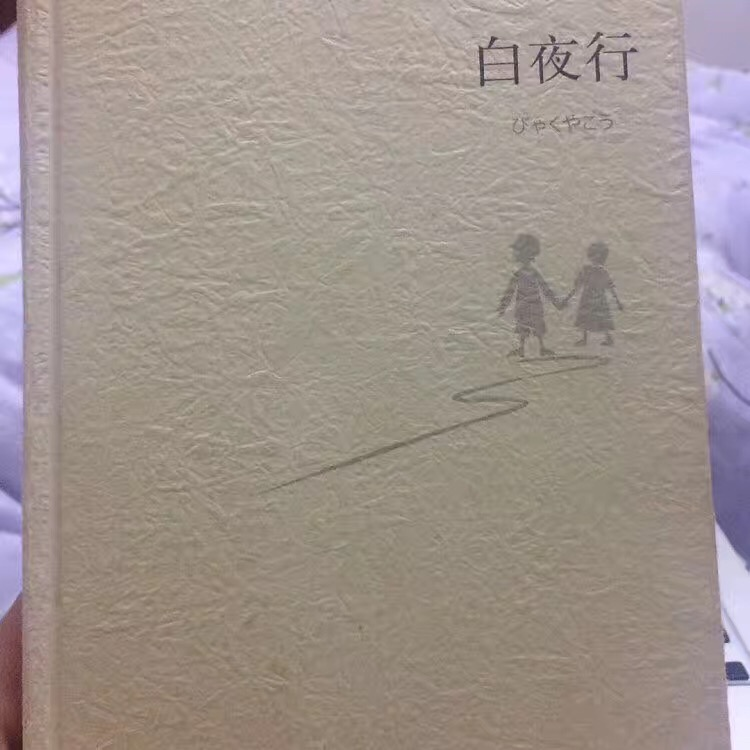

## 话说白夜行

开始读<<白夜行>>的前几章的时候，觉得故事的情节联系不起来。越读越好奇作者写这些到底有什么用，所以就耐着心的往下读看一下究竟作者要表达什么。

后来明白作者通过描写很多的场景来描写主人公的同学、日常生活、朋友关系、男女朋友、警察、私人侦探等看似不相关的东西，来刻画主人公的性格并且为故事情节的发展做铺垫。在这些角色的视角转化中，主人公的形象变得愈加清晰，故事的情节也逐渐进入了高潮。真的不得不佩服作者的这种写作手法，总是让你在不解中得到合情合理的惊喜。

《白夜行》中的两位主人公唐泽雪惠和桐原亮司从小就相识，可谓是青梅竹马。雪慧小时候家境贫寒，父亲意外事故死去之和母亲相依为命。怎奈母亲是一个放荡不羁的人，和很多男人都有不正常关系，后来孩童时期的雪慧在一栋大楼内被亮司的父亲侮辱。而这一幕被亮司看到，他无法直视这一幕，他的灵魂也从此被这活生生的一幕给摧毁，他为了心爱的女人杀死了自己的父亲。

唐泽雪惠和桐原亮司，一个被自己的母亲出卖，一个亲眼目睹自己的父亲猥亵自己心爱的女人。他们两个两个的内心真是恨透了这个肮脏的世界。这两个人都是被自己最亲的人所出卖，他们的心里各自住着对方，并且从此各自将自己的心门关上。并且视彼此为自己心中的太阳。

接下来的故事也就从此开始……

唐泽雪惠和桐原亮司，一个在明处一个在暗处。他们为了自己心中不灭的太阳，接二连三的对自己身边的女同学使用恶劣手段，桐原亮司杀了很多人。他们用这些手段来巩固自己的安全并守护者彼此，他们不管这些手段是否超越了犯罪的范畴，他们无论如何都决定去做，因为在他们心中彼此的太阳远远超越了法律，超越了伦理道德，超越了人性。如果么有个太阳，这缕光芒，这份希望，他们就会失去一切……

这两个人，就是寄生关系……

小说中有一段雪穗的独白，这是她第一次袒露自己的内心，“我的天空里没有太阳，总是黑夜，但并不暗，因为有东西代替了太阳。虽然没有太阳那么明亮，但对我来说已经足够。凭借着这份光，我便能把黑夜当成白天。我从来就没有太阳，所以不怕失去。”

是亮司的爱代替了太阳照亮了雪穗的世界，绝望的亮司纵身一跃结束了自己的生命，雪穗的太阳熄灭了，她和亮司早已合为一体，亮司的死带走了雪穗的灵魂，让她的背影“犹如白色的影子”。她没有回头，不是不爱，而是太爱，为了死去的亮司她绝不能泄露心底的痛楚和悲伤，从此她只能在黑暗中孤独前行。

## 感触

### 做一个身正有恪守的人

小说中的主人公的父母，都是伦理道德败坏的人。若非如此，两位主人公的幼小心灵就不会被严重创伤，就不会变成一个灵魂丢失的人。所以，一个人无论什么时候都要做一个有恪守，知道什么可以为可以不为的人。不论社会风气如何，不论周围的人如何，每个人都应该有自己的一份坚持。而做为一个人的仁义道德是最重要的一份坚持。

### 让人落泪的爱情

小说的主人公——雪慧和亮司之间有着比金坚的爱情。可是，他们的爱情不但不能“牵手”并且不可回头。书中描写他们在一起的场景的镜头一个是在二十年前的那栋大楼内，正是这个场景，他们为彼此守护了二十年；另一次在一起的场景就是雪慧的新店开业，而这个场景的结局是永别……

### 人要有正确的价值取向

法律是凌驾于情感之上的。我们常说善恶到头终有报，的确如此。当一些列违法犯罪的事情掺杂着可歌可泣的爱情，最后逃脱不了法律的制裁时，带给我们的唯有情感的冲击。所以，爱一个人要想长久，千万别和法律对抗。

