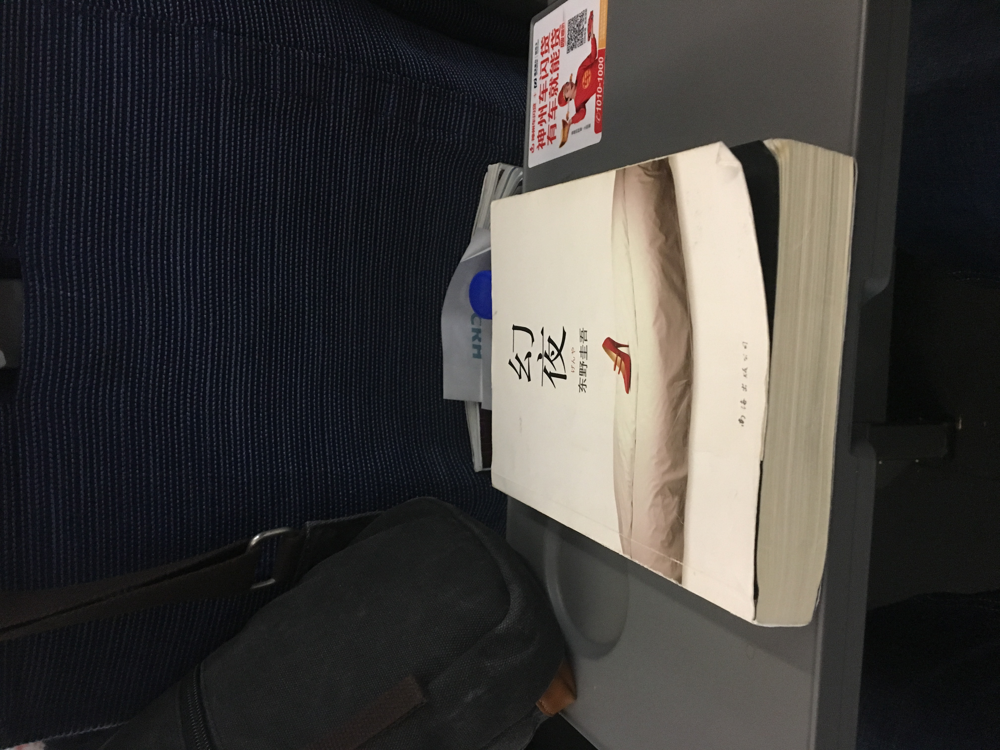

## 话说幻夜

有人说，《幻夜》是《白夜行》的续本。难道《幻夜》中的新海美冬就是《白夜行》中的唐泽雪惠？如果真是这样子，那我只能对《幻夜》中的男主人公雅也呵呵了。

故事的起因是从一次大地震中男主人公雅也杀死自己的舅舅开始，而这一幕被女主人公新海美冬看到。举目无亲的她愿意为雅也守住这个秘密，雅也也被新海美冬的美貌吸引。于是新海美冬就用两个人将来美好的生活为借口，利用雅也扫除自己梦想事业中的阻碍。雅也深爱着美冬，而美冬的心里完全是自己对“美”的事业追求。

水原雅也是最悲催的一个人物，他深爱的女人根本不爱他，只是利用他。雅也对美冬的过去一无所知，到小说的结尾作者都没有告诉我们新海美冬到底是什么来历。雅也就是被这么一个自己一无所知的女人给深深的吸引并且不顾一切的爱上了她。她说“为了我们的未来和幸福”，雅也对此深信不疑。

雅也对美冬的爱真是到了与灵魂同在的级别。后来雅也觉得自己和其他男人有些不一样的时候，竟然还抱着不怨怀疑的心来隐瞒美冬去查美冬的真实身份，一直到最后他发现了真像，还依然在心里为美冬找各种理由。最后，在最美的幻夜，他和加藤警官因抢走火而一命呜呼。而新海美冬从此走上了人生巅峰。

## 感触

### 白夜行和幻夜

《白夜行》和《幻夜》的写作手法和故事情节很相似，它们真的可能有些联系。读完《白夜行》再读《幻夜》就是有一种上下篇的感觉。唐泽雪惠一生只爱桐原亮司一人，她失去了桐原亮司之后就不会再爱任何人。水原雅也注定是个悲哀。。。

