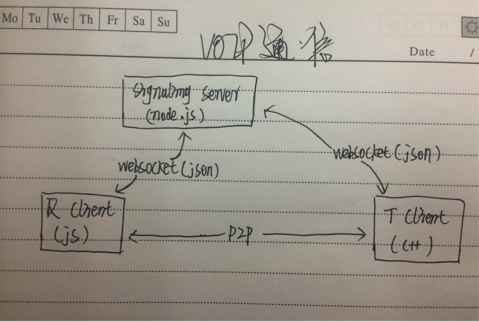
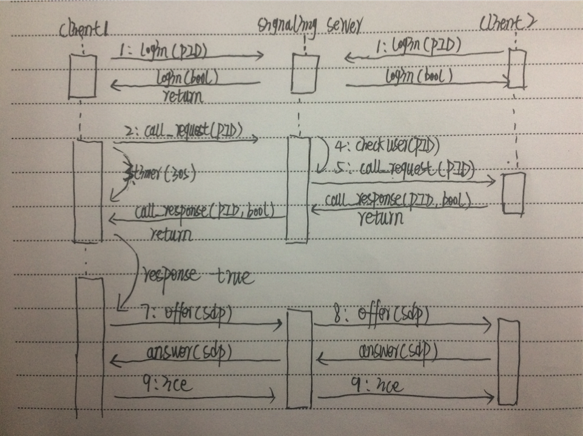

## 说明

### 对项目的说明

本文记录实现webrtc的详细过程，以及中间遇到的各种问题。项目中用到的是 socket.io(c++版本)，webrtc最新版(截止到今天)。webrtc是以动态库的方式引入的。

socket.ios连接的服务器我们称之为信令服务器。我们利用webrtc实现语音电话，中间的信令就是使用socket.io来传递。这点首先要清楚。

### 项目原理图

#### 总体知识结构概览

#### voip通信流程图

## scoket.io

### 介绍socket.io

socket.io 是一个为实时应用提供跨平台实时通信的库。socket.io 旨在使实时应用在每个浏览器和移动设备上成为可能，模糊不同的传输机制之间的差异。

### 引入socket.io

1） 如果没有使用cocopods管理第三方库的话，可以先写一个demo,然后编译出来release库，导入到项目中。

2） 如果使用了cocopods管理，那你肯定会。

3） 直接下载 [WebRTC_IOS_final](https://github.com/MaxwellQi/WebRTC_IOS_final)中的socketIO_lib，并导入到你的项目中。

### 使用socket.io

#### 导入

 	#include "sio_client.h"
 
#### 连接服务器

	int TVUSignaling::beginConnection()
	{
		sclient.set_open_listener(std::bind(&TVUSignaling::onopen, this));
		//  begin connect
	    const char* json = "{\"xx\": \"yy\"}";
	    rapidjson::Document d;
	    d.Parse(json);
	    
	    sclient.connect(WebRTCServer);
    	 return 0;

	}

#### 监听事件

	sclient.socket()->on("login", sio::socket::event_listener_aux([&](string const&name,
                                                                      message::ptr const& data,bool isAck,message::list &ack_resp)
                                                                  {
                                                                      string loginResStr("0");
                                                                      if (data->get_map()["success"]->get_bool()) {
                                                                          loginResStr = "1";
                                                                      }
                                                                      const char* loginRes = loginResStr.c_str();
                                                                      int len = (int)loginResStr.length();
                                                                      
                                                                      this->EnQueue(m_messageQueue,loginRes,len,KSignalingTypeLogin);
                                                                  }));
                                                                  
## WebRTC

### WebRTC通信原理

[WebRTC通信原理](https://maxwellqi.github.io/summ-webrtc-knowledge/) 

### 集成WebRTC的主要过程

#### 创建 RTCPeerConnection

创建peerConnectino的时候，首先需要 RTCPeerConnectionFactory对象和媒体流。下面直接上这部分代码：

	- (RTCPeerConnectionFactory *)pcFactory
	{
	    if (!_pcFactory) {
	        _pcFactory = [[RTCPeerConnectionFactory alloc] init];
	        RTCSetMinDebugLogLevel(RTCLoggingSeverityVerbose);
	    }
	    return _pcFactory;
	}
	
	- (NSArray *)defaultICEServers
	{
	    RTCIceServer *iceserver1 = [[RTCIceServer alloc] initWithURLStrings:@[kStunserver1] username:@"tvu" credential:@"tvu"];
	    RTCIceServer *icerserver3 = [[RTCIceServer alloc] initWithURLStrings:@[kStunserver3]];
	    RTCIceServer *icerserver4 = [[RTCIceServer alloc] initWithURLStrings:@[kStunserver4]];
	
	    return @[iceserver1,icerserver3,icerserver4];
	}

	- (RTCMediaStream *)localStream
	{
	    if (!_localStream) {
	        _localStream = [self.pcFactory mediaStreamWithStreamId:@"ARDAMS"];
	        _audioTrack = [self.pcFactory audioTrackWithTrackId:@"ARDAMSa0"];
	        [_localStream addAudioTrack:_audioTrack];
	    }
	    return _localStream;
	}
	
	- (RTCPeerConnection *)peerConnection
	{
	    if (!_peerConnection) {
	        RTCConfiguration *config = [[RTCConfiguration alloc] init];
	        [config setIceServers:[self defaultICEServers]];
	        _peerConnection = [self.pcFactory peerConnectionWithConfiguration:config constraints:nil delegate:self];
	       
	        [_peerConnection addStream:self.localStream];
	    }
	    return _peerConnection;
	}
	
#### 设置localSdp

* 在拨打电话时，在 create offer 的回调章设置localsdp
* 在接听电话时，在 create answer 的回调中设置localsdp

##### 拨打电话

在 peerConnection的 offer 回调中设置本地sdp

	- (void)processCallResponseUseMessageData:(NSString *)message
	{
	    if ([message isEqualToString:@"{}"]) {
	        NSLog(@"WebRTC CallResponse: return info is null");
	        return;
	    }
    
    NSString *phoneNumber = [NSJSONSerialization getJsonValueWithKey:@"from" jsonString:message];
    if (phoneNumber == NULL) {
        return;
    }
    
    [self.peerConnection offerForConstraints:nil completionHandler:^(RTCSessionDescription * _Nullable sdp, NSError * _Nullable error) {
        if (sdp == NULL) {
            return;
        }
        _tvuSignal->postoffer([sdp.sdp UTF8String], [phoneNumber UTF8String]);
        [self.peerConnection setLocalDescription:sdp completionHandler:^(NSError * _Nullable error) {
            error == NULL ? NSLog(@"Set local sdp succ..") : NSLog(@"Set local sdp failed..");
        }];
    }];
}

##### 接听电话

在 peerConnection的 answer 回调中设置 本地 sdp

	- (void)beginAcceptCall
	{
	        [self.peerConnection answerForConstraints:nil completionHandler:^(RTCSessionDescription * _Nullable sdp, NSError * _Nullable error) {
	            self.m_sdp = sdp;
	            if (error != NULL) {
	
	            }else{
	                dispatch_async(TVUMainQueue, ^{
	                    [self.peerConnection setLocalDescription:sdp completionHandler:^(NSError * _Nullable error) {
	                        error != NULL ? NSLog(@"set local sdp failed") : NSLog(@"set local sdp succ");
	                    }];
	                });
	            }
	        }];
	}

#### 设置remoteSdp

* 拨打电话时，在监听到对方发送 answer 后设置 remotesdp
* 在接听电话时，在监听到对方发送 offer 后设置 remotesdp

##### 拨打电话

在收到对方的 answer 后，设置 remotesdp

	- (void)processAnswerUseMessageData:(NSString *)message
	{
    if ([message isEqualToString:@"{}"]) {
        NSLog(@"WebRTC Answer: return info is null");
        return;
    }
    NSString *sdpstr = [NSJSONSerialization getJsonValueWithKey:@"sdp" jsonString:message];
    if (sdpstr != NULL) {
        RTCSessionDescription *remoteSDP = [[RTCSessionDescription alloc] initWithType:RTCSdpTypePrAnswer sdp:sdpstr];
        [self.peerConnection setRemoteDescription:remoteSDP completionHandler:^(NSError * _Nullable error) {
            error == NULL ? NSLog(@"set remote sdp succ") : NSLog(@"set remote sdp failed");
        }];
    }
}

##### 接听电话

在收到 server端返回offer信息之后，设置remoteSdp

	- (void)processOfferInfoUseMessageData:(NSString *)message
	{
	    if (_peerConnection == nil) {
	        NSLog(@"webRTCPeerConnection is nil.");
	        return;
	    }
	    if ([message length] <= 0) {
	        return;
	    }
	    NSData *jsonData = [message dataUsingEncoding:NSUTF8StringEncoding];
	    NSDictionary *dic = [NSJSONSerialization JSONObjectWithData:jsonData options:NSJSONReadingMutableContainers error:NULL];
	    NSString *sdpstr = [dic objectForKey:@"sdp"];
	
	    RTCSessionDescription *remoteSDP = [[RTCSessionDescription alloc] initWithType:RTCSdpTypeOffer sdp:sdpstr];
	    if (remoteSDP != NULL) {
	        [self.peerConnection setRemoteDescription:remoteSDP completionHandler:^(NSError * _Nullable error) {
	            if (error != NULL) {
	                NSLog(@"set remote sdp failed");
	            }else{
	                NSLog(@"set remote sdp succ");
	            }
	        }];
	    }
	} 

#### 回复 answer

回复answer的时候，是在RTCPeerConnectionDelegate的方法中发送的，要确保 ICE穿透已经完成的时候再发送。

	/** Called any time the IceGatheringState changes. */
	- (void)peerConnection:(RTCPeerConnection *)peerConnection
	didChangeIceGatheringState:(RTCIceGatheringState)newState
	{
	    NSLog(@"%s---------peerConnection:------%@-------newState:-----%ld---end",__func__,[peerConnection description],(long)newState);
	    
	    if (newState == RTCIceGatheringStateComplete) {
	        _tvuSignal->postanswer([self.peerConnection.localDescription.sdp UTF8String],[self.callfromnumber UTF8String]);
	        self.beginCallTime = [[NSDate date] timeIntervalSince1970];
	    }
	}

#### 回复ice

回复 ice 可以在RTCPeerConnectionDelegate的方法中完成的，注意ice方法参数的构造。

	/** New ice candidate has been found. */
	- (void)peerConnection:(RTCPeerConnection *)peerConnection
	didGenerateIceCandidate:(RTCIceCandidate *)candidate
	{
	    self.m_stricecandidate = [candidate description];
	    NSData *data = [candidate JSONData];
	    
	    NSDictionary *dict = [NSJSONSerialization JSONObjectWithData:data options:NSJSONReadingMutableLeaves error:NULL];
	    NSString *candidateStr = (NSString *)[dict objectForKey:@"candidate"];
	    NSLog(@"%@-----------%ld-----------%@",candidate.sdpMid,(long)candidate.sdpMLineIndex,candidateStr);
	    _tvuSignal->postice([candidateStr UTF8String], [candidate.sdpMid UTF8String], [[NSString stringWithFormat:@"%ld",(long)candidate.sdpMLineIndex] UTF8String],[self.callfromnumber UTF8String]);
	}
	

为PeerConnection添加远端ice信息。我把它放在了消息队列中处理。下面是我的代码：

	- (void)processIceCandidateUseMessageData:(NSString *)message
	{
	    if ([message isEqualToString:@"{}"] || message == NULL) {
	        log4cplus_error("WebRTC", "WebRTC ICE: return info is null..");
	        return;
	    }
	    NSString *candidate = [NSJSONSerialization getJsonValueWithKey:@"candidate" jsonString:message];
	    NSString *sdpMLineIndexStr = [NSJSONSerialization getJsonValueWithKey:@"sdpMLineIndex" jsonString:message];
	    NSString *sdpMid = [NSJSONSerialization getJsonValueWithKey:@"sdpMid" jsonString:message];
	    NSString *phoneNumber = [NSJSONSerialization getJsonValueWithKey:@"from" jsonString:message];
	    RTCIceCandidate *iceCandidate = [[RTCIceCandidate alloc] initWithSdp:candidate sdpMLineIndex:[sdpMLineIndexStr intValue] sdpMid:sdpMid];
	    
	    RTCPeerConnection *peerConnection = NULL;
	    if (phoneNumber == NULL) {
	        log4cplus_error("WebRTC", "WebRTC ICE: phoneNumber is null..");
	        return;
	    }
	    
	    peerConnection = [self getOrCreatePeerConnectionUsePhoneNumber:phoneNumber];
	    [peerConnection addIceCandidate:iceCandidate];
	}

### 挂断电话

特别是挂断电话的时候，要注意音频资源的释放。

	- (IBAction)onpressedbuttonEndCall:(id)sender {
	    [self.peerConnection close ];
	    [self dismissViewControllerAnimated:YES completion:^{
	        
	        self.beginCallTime = 0;
	        self.peerConnection = nil;
	        self.localStream = nil;
	        
	        if (self.callfromnumber == NULL) {
	            return;
	        }
	        
	        _tvuSignal->postDisconnectpeer([self.callfromnumber UTF8String]);
	        self.callfromnumber = NULL;
	
	    }];
	}

## 注意事项

* 信令服务器返回的内容，最好使用一个消息队列，这样我们就可以启动一个线程来专门检测这个消息队列的内容。在消息队列中存放的内容分为类型和消息体。在检测消息队列的线程中处理一个消息，删除一个消息。之所以使用消息队列就是因为这是多线程访问资源。这样或许能让我们的APP更流畅。

* peerConnection的创建一定要尽可能早，这样能使电话尽早接通。
* 如果不配置iceserver,那么在公网上是不能通的。
* 我当时设置 localSdp的时候，总是不成功，后来就改成了在收到对方的offer时，先设置 remoteSDP 紧接着就设置了 localSDP

