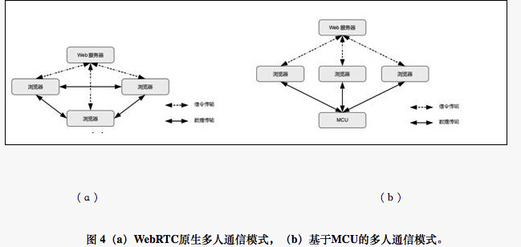

## 前言

WebRTC（Web Real-Time Communication——网页实时通信）是一个基于浏览器的实时多媒体通信技术。该项技术旨在使Web浏览器具备实时通信能力；同时，通过将这些能力封装并以JavaScript API的方式开放给Web应用开发人员，使得Web应用开发人员能够通过HTML标签和JavaScript API快速地开发出基于Web浏览器的实时音视频应用，而无需依赖任何第三方插件。该项技术将Web浏览器打造成一个适用于在所有用户设备（比如移动智能终端和个人电脑等）间进行实时的音视频和数据通信的通用平台。

在WebRTC技术出现之前，基于Web浏览器的多媒体通信服务是构建在特定的浏览器插件（如Adobe Flash Player）之上的，因为浏览器所依赖的HTTP协议是一种无连接状态的协议——即浏览器与服务器建立连接，下载文件，断开连接，再显示接收到的文件。因此，浏览器不能与服务器实时动态地交换数据。无连接状态的HTTP协议导致需要实时通信的服务（如聊天等）只能采取定时访问服务器的方法（即轮询方式）来实现。然而，在用户访问量增多时，这种方式严重的消耗服务器端资源，进而严重的影响服务器的性能。由于软硬件平台日趋多样性，下列问题将在基于浏览器插件的多媒体应用中突显:

* 加大IT公司对于插件和基于该插件的应用的研发和维护成本；
* 加大插件开发人员对于插件和基于该插件的应用的开发、测试和维护工作；
* 加大涉及到受版权保护的技术的整合难度；
* 加大说服用户安装插件的难度。

目前，WebRTC由IETF（Internet Engineering Task Force——互联网工程任务组）和W3C（World Wide Web Consortium——万维网联盟）联合负责其标准化工作。IETF定制WebRTC的互联网基础协议标准，该标准也被称为RTCWeb（Real-Time Communication in Web-browsers）。W3C则负责定制WebRTC的客户端JavaScript API接口的标准。目前参与该技术标准定制的公司主要有思科、微软、谷歌和爱立信等。其中，微软为揭示现有WebRTC存在的不足，进而推动其不断向前发展，提出了WebRTC的另一种形式，即CU-RTC-Web（Customizable, Ubiquitous Real Time Communication over the Web）。

----本文来自国家信息部网站

## 系统构成

WebRTC是通过将如下功能集成到现有浏览器来实现为异构系统提供统一的多媒体实时通讯平台：会话管理、音频引擎、视频引擎和网络传输。同时，WebRTC为Web开发人员提供了Web API （即JavaScript API）来开发基于Web的音视频应用；为浏览器厂商提供了WebRTC Native C++ API用于实现Web API的函数集（如图1所示）。在本章节，首先，我们介绍WebRTC的组成模块；其次，我们介绍WebRTC的API接口；最后，我们介绍组成模块与接口之间的对应关系。

### 组成模块

#### 会话管理

WebRTC的会话管理也被称为抽象信令。抽象信令的作用是将具体业务与信令控制的分离，从而适应广大Web应用中的信令控制。会话管理的实现有两种方式：一种是以浏览器为主的实现方式ROAP（RTCWeb Offer/Answer Protocol），另一种是以Javascript为主的实现方式JSEP（Javascript Session Establishment Protocol）。前者的优点在于可以直接使用现有协议栈实现；缺点是灵活度较低，无法支持私有协议，另外，如果将过多的协议栈集成到浏览器，将使得浏览器会变得“臃肿”。后者的优势在于灵活度高，能够适用于多种协议。为提高会话管理的普适性，以及简化会话管理，W3C通过多次讨论，最终采用了JSEP（JavaScript Session Establishment Protocal）方式来进行会话管理。
　　
#### 音频引擎

音频引擎负责从麦克到网络侧、网络侧到音箱的音频处理。它包含的功能主要有音频编解码和声音处理两部分。在音频编解码上，WebRTC主要采用两种语音编码格式：iSAC（internet Speech Audio Codec）和iLBC(internet Low Bitrate Codec)，来分别对宽带与窄带环境的语音进行编码。在声音处理上，WebRTC主要包括回声消除、错误隐藏和降噪处理等功能，用来降低由网络抖动和丢包等对声音质量造成的影响，并尽可能降低声音延迟。

#### 视频引擎

视频处理引擎负责摄像机到网络侧、网络侧到屏幕显示的视频处理。它主要包括视频编解码和图像处理。在视频编解码上，目前WebRTC主要采用VP8技术（未来VP9也将被集成到WebRTC中），使得WebRTC在较低码率的环境，提供较高质量的视频。在图像处理上，WebRTC主要包括抖动缓冲和图像增强等功能，用来降低从摄像机采集到的图像的噪音。

#### 网络传输

网络传输负责对采集到的音视频数据进行加密、防火墙穿透和传输。WebRTC将设备采集到的音视频数据在加密的情况下采用SRTP协议进行传输，以确保信息在传输过程中的安全性。另外，WebRTC采用STUN、TURN和ICE等协议栈对VoIP网络中的防火墙或者NAT进行穿透。其中，STUN可以处理大部分NAT穿透问题；TURN是STUN协议的一个增强版，专门用于处理对称形NAT穿透问题；ICE是一个整合了STUN和TURN的框架，为VoIP或视频通话配置以及媒体传输提供可靠的服务。

### 封装API

WebRTC将音视频数据从设备采集到网络传输过程中涉及的功能封装到以下3个主要API：MediaStream、PeerConnection和DataChanel。MediaStream（即getUserMedia）用于表示被获取的媒体数据，例如来自麦克风和摄像头音视频流。PeerConnection用于表示在两个浏览器之间的连接。DataChannel表示一个在两个节点之间的双向的数据通道。值得注意的是由于WebRTC的标准化工作还未完成，所以目前这几个API的名称在不同浏览器及同一浏览器的不同版本之间略有差异，比如PeerConnection在FireFox上叫做mozRTCPeerConnection，而在当前版本的Chrome上叫做webkitRTCPeerConnection。

### 模块与APP之间的关系

在这节，我们将通过WebRTC的工作原理来阐述WebRTC各个组成模块与所封装的JavaScript API之间的关联关系。图2是一个WebRTC的工作原理示意图。在图2中，有两个集成WebRTC的浏览器，一个信令服务器，一个STUN/TURN服务器。浏览器访问基于WebRTC的Web应用。信令服务器对Web应用的信令进行解析。STUN/TURN服务器对Web应用进行NAT或防火墙穿透，以建立两个客户端的通信连接。具体工作流程如下：首先，使用Web应用的双方通过PeerConnection API将呼叫和应答请求发送给信令服务器；然后，STUN/TURN服务器对呼叫双方的防火墙和NAT进行穿透；之后，MediaStream通过音视频引擎对音视频数据进行采集；最后，Web应用将采集到的音视频数据发送到DataChanel，并采用RTP/SRTP协议进行传输。

### 应用场景

WebRTC的音视频应用从连接的客户端的数量角度来区分，可以分为一对一模式和多人模式。同时，WebRTC为了取得快速的发展，其势必对传统网络，例如SIP，XMPP和PSTN网络进行无缝对接。

#### 一对一模式

该模式是最简单的应用模式。在上文图2中阐述WebRTC模块与API之间关联关系时的例子就是一个一对一模式。该模式的工作原理描述如下。首先，基于WebRTC的Web应用通过Web服务器来进行信令解析。然后，每个浏览器将本地采集到的音视频数据发送给对端浏览器。最后，每个浏览器对本地和对端的多媒体数据进行处理和显示。

#### 多人模式

相比较于一对一模式，多人模式则更加复杂。该模式与一对一模式不同的是，每个浏览器将本地采集到的音视频数据广播给其余所有浏览器（如图4（a）所示）。由于终端的处理能力，电池续航能力以及网络带宽的限制。为摆脱由于终端的有限能力对WebRTC多人模式中人数的限制，目前，有些公司（例如因特尔）为WebRTC的特定应用提供MCU媒体控制单元。MCU负责对不同格式的音视频进行转码和将多人模式中的音视频流整合在一起再广播给每一个终端。基于MCU的多人模式的工作流程。如图

#### WebRTC与现有网络的互通模式

由于在WebRTC出现之前，实时通讯业务已经取得了很大的发展。因此，WebRTC应与现有的实时通信业务无缝对接，才能取得快速的发展。为了与传统实时通信业务进行无缝对接，目前，各个厂商根据WebRTC和现有的实时通信业务开发出相应的网关设备，比如对应SIP/XMPP的服务器和PSTN（Public Switched Telephone Network——公共交换电话网络）网关。该网关负责将通过浏览器访问的Web应用和传统客户端访问的现有实时通信应用的信令进行适配，甚至多媒体格式之间的转化。

## WebRTC的发展与影响

### 发展

首先，Android系统内置的浏览器和个人电脑中主流的Web浏览器（例如Chrome，Firefox和Opera）已经支持WebRTC。根据Dialogic公布的2013年“WebRTC影响调查”报告，在2013年，Android在移动智能终端的市场占有率是69%；Chrome，Firefox和Opera三大主流Web浏览器在个人电脑的市场占有率是39%。另外，其他Web浏览器（比如，Maxthon）也将支持WebRTC。因此，WebRTC将被快速的部署在日常设备（即移动智能终端和个人电脑等）。其次，由于WebRTC的本质是一项基于Web浏览器的实时通信技术，它将最先应用在IM（Instant Messenger——即时通信）领域。由于IM应用通常应用在社交网络，这使得WebRTC可以依靠社交网络所具有的小世界网络特性（即虽然这种网络中大部份的节点彼此并不相连，但绝大部份节点之间经过少数几步就可到达——摘自维基百科）快速的被用户所使用。基于以上两点，WebRTC技术的部署和使用将呈现爆炸式的增长。

### 影响

WebRTC技术的快速普及将对现有的很多领域产生巨大的影响。 首先，受到影响的是现有的VoIP业务领域。目前我们正在经历一个硬件多样化的时代，比如可穿戴设备的兴起。这将促进适应新型设备的操作系统的涌现和加大现有操作系统的分化。因此，操作系统的异构性和繁杂性使得VoIP应用的开发、更新与维护的复杂性和成本剧增。随着WebRTC集成到浏览器中，基于Web的实时通信应用可以通过HTML标签和JavaScript API实现快速的开发，并避免了由于操作系统的异构性带来的重复开发和由于版本升级带来的维护费用以及不便。这将导致现有的应用开发人员从现有的基于浏览器插件或者原生VoIP应用模式转向使用WebRTC进行Web应用开发，进而使得现有的VoIP应用的普通用户向基于浏览器的Web应用的迁移。目前，涉及VoIP业务的客服以及在线教育领域很关注WebRTC技术在自身领域的应用。其次，现有的IM应用通过其拥有的大量用户，并通过构建在这些IM应用上的衍生应用形成生态圈。这些IM应用及其所形成的生态圈正在试图取代浏览器成为互联网入口。这种现象在移动智能终端表现的更加突出。然而，如上文所述，WebRTC技术的部署和使用将呈现爆炸式的增长，这将导致IM应用向IM Web应用的转变和用户向IM Web应用的迁移。因此，构建在现有IM应用的生态圈将被打破。现有的IM应用及其生态圈必将做出相应的布局调整以适应新的技术环境。

同时，WebRTC的普及将给企业带来监管和安全问题。目前，有些公司在公司内部封锁了IM应用（比如QQ，Skype）的端口，以防止员工在工作过程中由于对音视频工具的不慎使用所造成的安全问题。基于WebRTC的新型IM Web应用，与正常的Web页面无异，所以很难检测该种IM Web应用。这给企业的监管和安全造成了巨大的隐患。

其次，智能电视的展现形式和业务模式将受到巨大的影响。目前，智能电视主要包括智能操作系统以及显示设备。在智能电视上的主要业务也主要是对多媒体源的直播和点播。随着WebRTC的普及和涌现大量的IM Web应用，智能电视将很可能原生的包含摄像头设备。同时，视频会议业务也将像现在的对多媒体源的直播和点播业务一样，成为智能电视的主要业务。

其次，所上文所述，由于WebRTC所支持的音视频格式的局限，以及WebRTC在多人视频会话中采用的可选网状结构的限制（目前是6人）。新型的服务供应商将产生。这些供应商主要提供1）不同视频编解码的转换；2）在多人会话中，视频流的整合与广播。目前，服务供应商及其产品有：Dialogic推出的PowerMedia XMS 2.1和英特尔推出的Collaboration Service for WebRTC。

最后，集成了WebRTC的Web浏览器将进一步改变传统的应用、Web浏览器和操作系统的格局。Web浏览器将成为介于操作系统与Web应用的一个平台。为Web操作系统的普及进一步铺平道路。包含了WebRTC的浏览器将进一步巩固其互联网入口的地位——近些年，超级应用（例如微信）通过其拥有的大量用户和在其上的开发的衍生应用试图成为互联网入口。Web浏览器及其Web应用将成为一种生态圈。高性能浏览器的研发将成为下一个竞争热点。而浏览器的安全问题将更加凸显。

### 总结

在本文中，我们首先介绍了WebRTC技术产生的意义。其次，我们展示了WebRTC技术架构中各个组成模块和所封装的JavaScript API，以及模块与JavaScript API之间的对应关系；同时，我们也阐述了WebRTC的工作模式以及与现有多媒体网络的对接模式。之后，我们根据WebRTC的载体（即Web浏览器）在移动终端和个人PC中的占有率以及这些载体对WebRTC的支持程度做出了WebRTC技术的部署和使用将呈现爆炸式的增长的判断。最后，我们阐述了WebRTC对现有实时通讯行业和智能电视行业的影响，并阐述由于WebRTC的引入将进一步改变应用、Web浏览器和操作系统三者的格局。
　　
　　