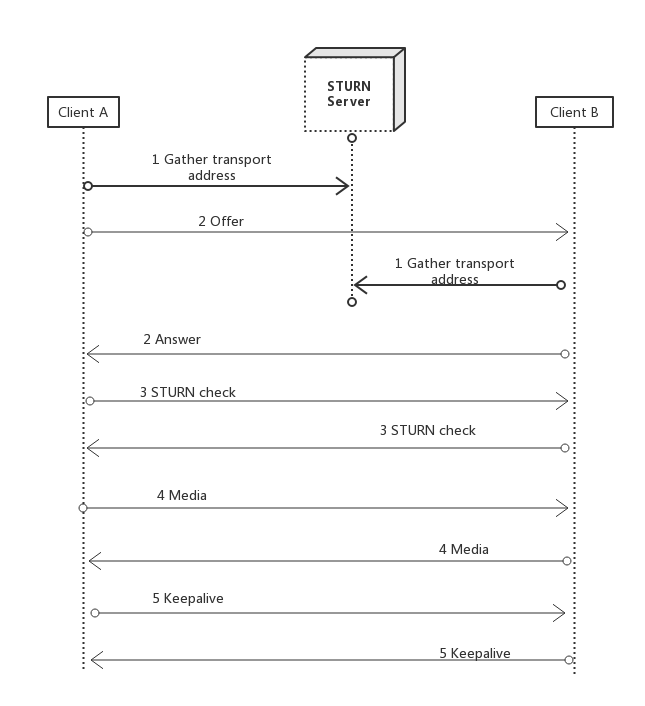
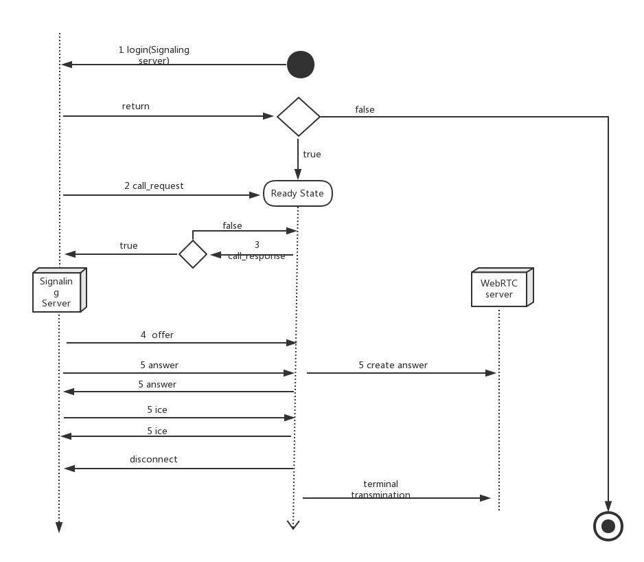
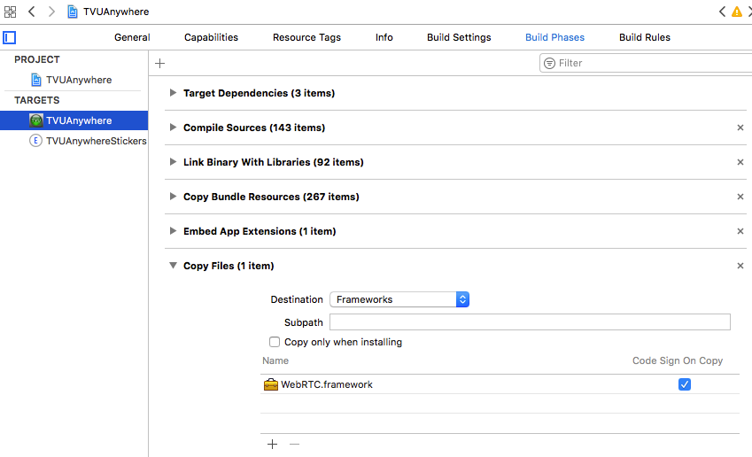
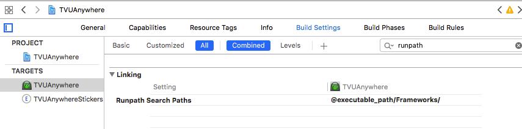

## 引言

这篇文档介绍的是往 TVUAnywhere 中集成 VOIP 通话的技术。实现这个功能需要用到两个第三方框架——WebRTC、Socket.io .我会从以下几个方面具体阐述：

* 概述
* 功能结构
* 数据流图
* 集成步骤
* 问题总结
* 参考内容

在介绍上述内容之前，你需要了解到我们这个 VOIP 通话技术的应用场景——利用网络在不同设备(PC和移动设备、移动设备和移动设备)之间进行语音通话。了解了应用场景，才能体会我们为什么选择这些技术来实现上述功能。

## 概述

在这一小节中我主要介绍一些关键的概念，因为了解这些概念能让我们对这些第三方框架有更清楚的认识。这部分包含的内容都是一些比较重要的原理，能解决我们开发中为什么要做某些步骤的疑惑。

### WebRTC

在这一小节中将对 WebRTC 技术做简单介绍。

#### WebRTC的概念

WebRTC(Web Real-Time Communication——网页实时通信)是一个基于浏览器的实时多媒体通信技术，该项技术旨在使Web浏览器具备实时通信能力。通过将这些能力封装并以JavaScript API的方式开放给Web应用开发人员，使得Web应用开发人员能够通过HTML标签和JavaScript API快速地开发出基于Web浏览器的实时音视频应用，而无需依赖任何第三方插件。

在WebRTC技术出现之前，基于Web浏览器的多媒体通信服务是构建在特定的浏览器插件（如Adobe Flash Player）之上的。这种技术有什么缺陷请自行查阅。

#### 系统构成

WebRTC是通过将如下功能集成到现有浏览器来实现为异构系统提供统一的多媒体实时通讯平台：会话管理、音频引擎、视频引擎和网络传输。同时，WebRTC为Web开发人员提供了Web API （即JavaScript API）来开发基于Web的音视频应用；为浏览器厂商提供了WebRTC Native C++ API用于实现Web API的函数集。

下面我选择两个比较重要的模块（音频引擎和网络传输）进行说明，其它模块请自行查阅。

##### 音频引擎

音频引擎负责从麦克到网络侧、网络侧到音箱的音频处理。它包含的功能主要有音频编解码和声音处理两部分。在音频编解码上，WebRTC主要采用两种语音编码格式：iSAC（internet Speech Audio Codec）和iLBC(internet Low Bitrate Codec)，来分别对宽带与窄带环境的语音进行编码。在声音处理上，WebRTC主要包括回声消除、错误隐藏和降噪处理等功能，用来降低由网络抖动和丢包等对声音质量造成的影响，并尽可能降低声音延迟。

#### 网络传输

网络传输负责对采集到的音视频数据进行加密、防火墙穿透和传输。WebRTC将设备采集到的音视频数据在加密的情况下采用SRTP协议进行传输，以确保信息在传输过程中的安全性。另外，WebRTC采用STUN、TURN和ICE等协议栈对VoIP网络中的防火墙或者NAT进行穿透。其中，STUN可以处理大部分NAT穿透问题；TURN是STUN协议的一个增强版，专门用于处理对称形NAT穿透问题；ICE是一个整合了STUN和TURN的框架，为VoIP或视频通话配置以及媒体传输提供可靠的服务。

这些概念，能解答为什么 WebRTC 技术里面会有这些方法的疑惑。

#### WebRTC建立连接流程

建立连接的流程如图所示：



对流程的说明：

1. 用户访问stun服务器获取传输地址candidates
2. Candidates在浏览器之间通过信令通道中交换，交换的顺序有优先级，一般是：host candidate,reflexive candidate,relayed candidate
3. 媒体流传输之前进行检查，直到所有checks全部完成。
4. 开始媒体流传输。
5. 媒体流传输过程中，为了确保在媒体会话过程中NAT映射和过滤机制不会超时，每隔一段时间检查一下网络链路是否畅通，如果发生异常，则需要重新连接。


### socket.io

在这一小节中将对 socket.io 技术做简单介绍。

#### socket.io的概念

socket.io 是一个为实时应用提供跨平台实时通信的库。socket.io 旨在使实时应用在每个浏览器和移动设备上成为可能，模糊不同的传输机制之间的差异。

我们使用这个库，主要是用其进行信令控制。

socket.io中的具体方法，请参考  [socket.io-client-cpp（c++版本）](https://github.com/socketio/socket.io-client-cpp)

## 功能结构

在这个小节中，我主要介绍在实现 TVUAnywher的 VOIP 功能中，各个第三方框架所承担的功能，以及他们之间如何协作来完成 VOIP 通话。

1. WebRTC 主要是用来做语音通话，用来传输多媒体信息。
2. socket.io用来做信令控制，也就是往信令服务器发消息，告诉服务器该做什么操作了。

### socket.io的作用

socket.io要参与所有的流程。例如：login,call_request,call_response,offer,answer,ice等。信令控制就是要告诉信令服务器当前app在做什么操作。

### WebRTC的作用

WebRTC用来做会话管理，音视频引擎和网络传输。其具体比较重要的几个操作就是发送 offer,answer,ice等信息。

* offer: 当打电话的时候，电话发起方发送。
* answer/ice: 无论是电话发起方和接收方都要发送。

## 数据流程图

下面是具体的流程图（接电话）：



对上述流程的说明：

1. 流程图中的结束状态是指voip功能用不了的状态，并不是app退出
2. 前3步的操作，发送的是纯信令消息，也即前3步和 WebRTC 无关。
3. 从第4步开始，要先创建 WebRTC层面的，然后再发信令告诉信令服务器你做了什么。比如现在你要打一个电话，那么你就要先在 WebRTC 层面发送一个 offer,然后在用信令告诉信令服务器你发了一个 offer.
4. 当挂断电话以后，要终止 WebRTC 的多媒体传输。等待下一次电话的到来。


## 集成步骤

本小节分别介绍 socket.io和 WebRTC 的集成步骤。

### 集成socket.io

由于Anywhere没有利用cocoapods来管理第三方库，所以我是先写一个 demo 使用cocoapods引入socket.io然后编译出 release 版本的 socket.io 库，然后导入 TVUAnywhere中。

注意：我们使用的是 socket.io 的C++版本库，然后和OC混编。

步骤：

1. 在项目根目录中创建 Podfile 文件，然后输入以下内容：

	```
	source 'https://github.com/CocoaPods/Specs.git'

	platform :ios, '8.3'
	
	target 'SocketIOCpp_Demo' do
	       pod 'SocketIO-Client-CPP'
	end
	```
2. 在你要使用 socket.io的地方引入头文件

	```
	#include <SocketIO-Client-CPP/sio_client.h>
	```

3. 运行项目，把编译出来的socket.io库导入 TVUAnywhere中。

### socket.io中的方法介绍

#### 连接信令服务器

	int TVUSignaling::beginConnection()
	{
		sclient.set_open_listener(std::bind(&TVUSignaling::onopen, this));
		//  begin connect
	    const char* json = "{\"xx\": \"yy\"}";
	    rapidjson::Document d;
	    d.Parse(json);
	    
	    sclient.connect(WebRTCServer);
		 return 0;
	}

#### 监听事件

	sclient.socket()->on("login", sio::socket::event_listener_aux([&](string const&name,
	                                                                  message::ptr const& data,bool isAck,message::list &ack_resp)
	                                                              {
	                                                                  string loginResStr("0");
	                                                                  if (data->get_map()["success"]->get_bool()) {
	                                                                      loginResStr = "1";
	                                                                  }
	                                                                  const char* loginRes = loginResStr.c_str();
	                                                                  int len = (int)loginResStr.length();
	                                                                  
	                                                                  this->EnQueue(m_messageQueue,loginRes,len,KSignalingTypeLogin);
	                                                              }));
	                                                             
其它操作请参考socket.io官网。

### 集成WebRTC

我们使用的是新版本的WebRTC(不是libjingle的那个版本)动态库，所以你首先要找到一个WebRTC的动态库。然后把动态库导入TVUAnywhere项目中。

#### 往工程中引入WebRTC动态库

这里假定你现在已经准备好了已签过名的WebRTC动态库。

##### 添加动态库到工程文件

通过以下方式将你的 `framework`添加到工程中：
	
	 Targets-->Build Phases--> Link Binary With Libraries

把动态库添加到 Copy Files 中：

	Targets-->Build Phases-->Copy Files

如图所示：



如果没有上述选项，点击'+'添加分组。

##### 自动连接动态库

添加完动态库之后，如果希望动态库在软件启动时自动连接，可以通过以下方式设置动态库依赖路径：

	Targets-->Build Setting-->Linking-->Runpath Search Paths

设置具体值得内容为：

	@executable_path/Frameworks/
	
如图所示：



其中的`@executable_path/`表示可执行文件所在路径，即沙盒中的.app目录，注意不要漏掉最后的/。

如果你将动态库放到了沙盒中的其他目录，只需要添加对应路径的依赖就可以了。


#### 创建RTCPeerConnection

创建peerConnectino的时候，首先需要 RTCPeerConnectionFactory对象和媒体流。

	- (RTCPeerConnectionFactory *)pcFactory
	{
	    if (!_pcFactory) {
	        _pcFactory = [[RTCPeerConnectionFactory alloc] init];
	        RTCSetMinDebugLogLevel(RTCLoggingSeverityVerbose);
	    }
	    return _pcFactory;
	}
	- (NSArray *)defaultICEServers
	{
	    RTCIceServer *iceserver1 = [[RTCIceServer alloc] initWithURLStrings:@[kStunserver1] username:@"tvu" credential:@"tvu"];
	    RTCIceServer *icerserver3 = [[RTCIceServer alloc] initWithURLStrings:@[kStunserver3]];
	    RTCIceServer *icerserver4 = [[RTCIceServer alloc] initWithURLStrings:@[kStunserver4]];
	    return @[iceserver1,icerserver3,icerserver4];
	}
	- (RTCMediaStream *)localStream
	{
	    if (!_localStream) {
	        _localStream = [self.pcFactory mediaStreamWithStreamId:@"ARDAMS"];
	        _audioTrack = [self.pcFactory audioTrackWithTrackId:@"ARDAMSa0"];
	        [_localStream addAudioTrack:_audioTrack];
	    }
	    return _localStream;
	}
	- (RTCPeerConnection *)peerConnection
	{
	    if (!_peerConnection) {
	        RTCConfiguration *config = [[RTCConfiguration alloc] init];
	        [config setIceServers:[self defaultICEServers]];
	        _peerConnection = [self.pcFactory peerConnectionWithConfiguration:config constraints:nil delegate:self];
	       
	        [_peerConnection addStream:self.localStream];
	    }
	    return _peerConnection;
	}	                       
	                       

#### 设置localSdp

在 peerConnection的 answer 回调中设置 本地 sdp

	- (void)beginAcceptCall
	{
	        [self.peerConnection answerForConstraints:nil completionHandler:^(RTCSessionDescription * _Nullable sdp, NSError * _Nullable error) {
	            self.m_sdp = sdp;
	            if (error != NULL) {
	            }else{
	                dispatch_async(TVUMainQueue, ^{
	                    [self.peerConnection setLocalDescription:sdp completionHandler:^(NSError * _Nullable error) {
	                        error != NULL ? NSLog(@"set local sdp failed") : NSLog(@"set local sdp succ");
	                    }];
	                });
	            }
	        }];
	}

#### 设置remoteSdp

在收到 server端返回offer信息之后，设置remoteSdp

	- (void)processOfferInfoUseMessageData:(NSString *)message
	{
	    if (_peerConnection == nil) {
	        NSLog(@"webRTCPeerConnection is nil.");
	        return;
	    }
	    if ([message length] <= 0) {
	        return;
	    }
	    NSData *jsonData = [message dataUsingEncoding:NSUTF8StringEncoding];
	    NSDictionary *dic = [NSJSONSerialization JSONObjectWithData:jsonData options:NSJSONReadingMutableContainers error:NULL];
	    NSString *sdpstr = [dic objectForKey:@"sdp"];
	    RTCSessionDescription *remoteSDP = [[RTCSessionDescription alloc] initWithType:RTCSdpTypeOffer sdp:sdpstr];
	    if (remoteSDP != NULL) {
	        [self.peerConnection setRemoteDescription:remoteSDP completionHandler:^(NSError * _Nullable error) {
	            if (error != NULL) {
	                NSLog(@"set remote sdp failed");
	            }else{
	                NSLog(@"set remote sdp succ");
	            }
	        }];
	    }
	} 

#### 回复 answer

回复answer的时候，是在RTCPeerConnectionDelegate的方法中发送的，要确保 ICE穿透已经完成的时候再发送。

	/** Called any time the IceGatheringState changes. */
	- (void)peerConnection:(RTCPeerConnection *)peerConnection
	didChangeIceGatheringState:(RTCIceGatheringState)newState
	{
	    NSLog(@"%s---------peerConnection:------%@-------newState:-----%ld---end",__func__,[peerConnection description],(long)newState);
	    
	    if (newState == RTCIceGatheringStateComplete) {
	        _tvuSignal->postanswer([self.peerConnection.localDescription.sdp UTF8String],[self.callfromnumber UTF8String]);
	        self.beginCallTime = [[NSDate date] timeIntervalSince1970];
	    }
	}
	
#### 回复ice

回复 ice 也是在RTCPeerConnectionDelegate的方法中完成的，注意ice方法参数的构造。

	/** New ice candidate has been found. */
	- (void)peerConnection:(RTCPeerConnection *)peerConnection
	didGenerateIceCandidate:(RTCIceCandidate *)candidate
	{
	    self.m_stricecandidate = [candidate description];
	    NSData *data = [candidate JSONData];
	    
	    NSDictionary *dict = [NSJSONSerialization JSONObjectWithData:data options:NSJSONReadingMutableLeaves error:NULL];
	    NSString *candidateStr = (NSString *)[dict objectForKey:@"candidate"];
	    NSLog(@"%@-----------%ld-----------%@",candidate.sdpMid,(long)candidate.sdpMLineIndex,candidateStr);
	    _tvuSignal->postice([candidateStr UTF8String], [candidate.sdpMid UTF8String], [[NSString stringWithFormat:@"%ld",(long)candidate.sdpMLineIndex] UTF8String],[self.callfromnumber UTF8String]);
	}
	
#### 挂断电话

特别是挂断电话的时候，要注意音频资源的释放。

	- (IBAction)onpressedbuttonEndCall:(id)sender {
	    [self.peerConnection close ];
	    [self dismissViewControllerAnimated:YES completion:^{
	        
	        self.beginCallTime = 0;
	        self.peerConnection = nil;
	        self.localStream = nil;
	        
	        if (self.callfromnumber == NULL) {
	            return;
	        }
	        
	        _tvuSignal->postDisconnectpeer([self.callfromnumber UTF8String]);
	        self.callfromnumber = NULL;
	    }];
	}

## 问题总结

* 信令服务器返回的内容，最好使用一个消息队列，这样我们就可以启动一个线程来专门检测这个消息队列的内容。在消息队列中存放的内容分为类型和消息体。在检测消息队列的线程中处理一个消息，删除一个消息。之所以使用消息队列就是因为这是多线程访问资源。这样或许能让我们的APP更流畅。
* peerConnection的创建一定要尽可能早，这样能使电话尽早接通。
* 如果不配置iceserver,那么在公网上是不能通的。
* 我当时设置 localSdp的时候，总是不成功，后来就改成了在收到对方的offer时，先设置 remoteSDP 紧接着就设置了 localSDP


## 参考内容

* socket.io官方示例（github）
* WebRTC官方示例 (github)
* 如何在项目中使用动态库
