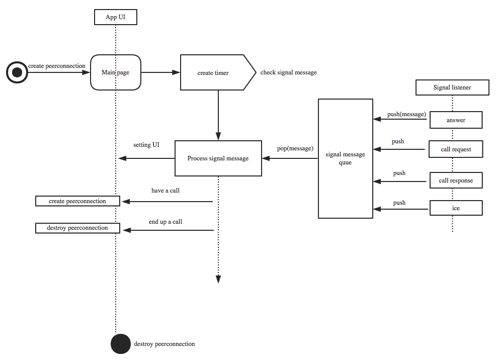
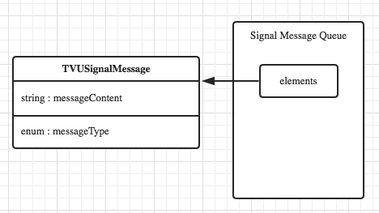
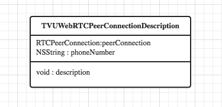
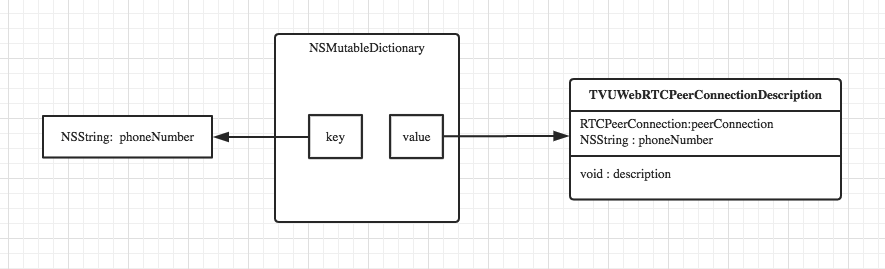

## 概述

Anywhere中现有voip的通话是一对一的，已不能满足现在一对多的需求,所以需要我们重新设计这一模块的开发。我们知道，一对一的通话就是创建一个peerconnection去管理两个通话的终端，那么一对多的通话就需要创建多个peerconnection来管理这些通话的终端设备。所以，完成了一对多就完成了一对一通话。

由于现在已经完成了一对一通话，这就说明我们的设计文档不是从无到有设计一个功能，而是基于现有的功能去设计新的功能。所以我从以下几
几个方面来阐述：

* 一对一通话的实现
* 一对多通话的设计

## 一对一通话的实现

### peerConnection

peerConnection在Voip通话中一个非常关键的部分。我们在createOffer和createAnswer时会用到peerConnection对象。两个设备之间的每一次通话都对应着一个peerConnection所以创建peerConnection的时机，以及其生命周期是非常重要的。

#### peerConnection的创建时机

在一对一通话中，peerConnection是作为'Voip通话类[1]' 的一个属性，它在主页面刚刚加载完成之后就已经创建了。和peerConnection一样，创建peerConnection所需要的localStream和audioTrack都是Voip通话类的一个属性。获取audioTrack和localStream是根据唯一ID获取的。

#### 管理peerConnection

 peerConnection是被Voip通话类的实例所管理的，他的创建时随着Voip通话类实例的创建而创建,随着一次通话的结束而销毁。当有下一次通话的时候，重新创建新的peerConnection。
 
### 信令消息处理

在一对一通话中，所有的信令消息都是放在消息队列中的。我们通过判断消息队列中消息的类型而做相应的处理。因为一对一通话只有一个peerConnection,所以对信令消息的处理比较简单。在此不做过多描述。

### 通话状态

在一对一通话中，通话的状态是根据对方电话号码是否为空来进行判断的。电话号码是在信令消息处理中设置的。

### 控制流程图

说明： 

* 在app启动的时候，会自动创建一个peerConnection,当打电话或有电话来的时候，会利用这个peerConnection进行操作。但是，如果挂断电话，那么peerConnection就销毁了。下次有电话过来的时候会创建新的peerConnection
* 所有的状态控制，都是在处理信令消息的方法中控制的

## 一对多通话

相较与一对一通话，一对多通话比较复杂。其关键点有：

* 一对多通话需要创建多个peerConnection
* 如何统一管理这些peerConnection ？ 具体包括能够根据电话号码查找、销毁这些peerConnection.

如何解决上述问题呢？我们可以通过创建一个TVUWebRTCPeerConnectionDescription类，来包含peerConnection、电话号码信息。一个通话对应于一个TVUWebRTCPeerConnectionDescription类，然后把一组TVUWebRTCPeerConnectionDescription放入一个可变字典中，通过字典来统一管理。

### 信令消息处理

在一对一的通话中，信令消息值包含两个字段（类型，消息内容）。现在信令消息应该多增加一个字段（电话号码），通过改字段来查找到是哪一个peerConnection来管理这个通话的，然后进行余下的操作。具体差异如图所示：

一对一(多)通话

#### 消息类型

	typedef  enum
		{
		    KSignalingTypeLogin = 0,  	// login
		    KSignalingTypeCallRequest,   // call request
		    KSignalingTypeCallResponse,  // call response
		    KSignalingTypeOffer,         // offer
		    KSignalingTypeIce,           // ice
		    KSignalingTypeAnswer,        // answer
		    KSignalingTypeDisconnectPeer // disconnection
		}KSignalingType;
		
上面是监听信令服务器的时候，为服务器返回的消息内容添加的几种类型标记。

#### 监听信令消息的代码

        // bind other event
	    sclient.socket()->on("call_request", sio::socket::event_listener_aux([&](string const&name,
	                                                                             message::ptr const& data,bool isAck,message::list &ack_resp)
	                                                                         {
	                                                                             const char* callrequest = data->get_string().c_str();
	                                                                             int len = (int)data->get_string().length();
	                                                                             
	                                                                             this->EnQueue(m_messageQueue,callrequest,len,KSignalingTypeCallRequest);
	                                                                             
	                                                                         }));
	                                                                             

### peerConnection的管理

如上所述，我们自己封装一个类，叫TVUWebRTCPeerConnectionDescription,其中包含peerConnection。然后把这个类的对象当成元素放入可变字典中。

TVUWebRTCPeerConnectionDescription的类图：

TVUWebRTCPeerConnectionDescription在其容器中的存储结构图：

### 通话状态的查询

单路电话的通话状态，定义如下：

	typedef enum{
	    KTVUVoipUserStateDisconnect = 0,        // disconnect
	    KTVUVoipUserStateConnecting,   // connecting
	    KTVUVoipUserStateCalling        // The user is on the phone
	}KTVUVoipUserState;

通话状态是根据存储在本地可变字典中对应的电话号码的peerConnection的iceGatheringState来决定的。如果对应电话号码的peerConnection不存在，就是断开状态。

	- (KTVUVoipUserState)tvuSelectCallState:(NSString *)phoneNumber
	{
	    if (phoneNumber == NULL || [phoneNumber length] <= 0) {
	        log4cplus_error("WebRTC", "the phoneNumber is null..%s",__func__);
	        return KTVUVoipUserStateDisconnect;
	    }
	    RTCPeerConnection *peerConnection = [self getPeerConnectionUsePhoneNumber:phoneNumber];
	    [_tvuWebRTCLock lock];
	    if (peerConnection == NULL) {
	        [_tvuWebRTCLock unlock];
	        return KTVUVoipUserStateDisconnect;
	    }
	    RTCIceGatheringState gatherState = peerConnection.iceGatheringState;
	    KTVUVoipUserState userState = gatherState == RTCIceGatheringStateComplete ? KTVUVoipUserStateCalling : KTVUVoipUserStateConnecting;
	    [_tvuWebRTCLock unlock];
	    return userState;
	}

### 一对多通话注意事项

#### SDK切换问题

由于一对多通话时使用原生的WebRTC,而当在主view上的时候，使用的是TVUWebRTC(我们自己修改的原生WebRTC而编译出来的库)。所以就有了这两个SDK切换的问题。

当前切换SDK的时候，要保证用前一个SDK生成的对象全部销毁，然后在用另一个SDK创建新的对象。要想让所有对象全部销毁，那么就需要把RTCPeerConnectionFactory对象设置为nil 。 所以挂断电话的时候，必须销毁该次通话的所有有关对象。

	- (void)tvuEndUpCall:(NSArray *)phoneNumbers
	{
	    if (phoneNumbers == NULL || [phoneNumbers count] <= 0) {
	        log4cplus_error("WebRTC", "The end up call request array is null..%s",__func__);
	        return;
	    }
	    
	    dispatch_async(TVUGlobalQueue, ^{
	        _tvuSignal->ClearMessageQueue();
	        
	        for (NSString *phone in phoneNumbers) {
	            RTCPeerConnection *peerConnection = [self getPeerConnectionUsePhoneNumber:phone];
	            if (peerConnection == NULL) {
	                continue;
	            }
	            _tvuSignal->postDisconnectpeer([phone UTF8String]);
	            [peerConnection close];
	            peerConnection = nil;
	            [self removeElementsFromPeerConnectionsDict:phone];
	        }
	        _pcFactory = nil;
	        
	        dispatch_async(TVUMainQueue, ^{
	            [self.delegate endupCallWithTVUWebRTCManager:self];
	        });
	    });
	}
	
	- (void)processDisconnectPeerUseMessageData:(NSString *)message
	{
	    if (message == NULL || [message isEqualToString:@"{}"]) {
	        log4cplus_error("WebRTC", "WebRTC Disconnect: return info is null..");
	    }
	    NSString *phoneNumber = [NSJSONSerialization getJsonValueWithKey:@"from" jsonString:message];
	    if (phoneNumber == NULL) {
	        return;
	    }
	    RTCPeerConnection *peerConnection = [self getPeerConnectionUsePhoneNumber:phoneNumber];
	    [peerConnection close];
	    peerConnection = nil;
	    [self removeElementsFromPeerConnectionsDict:phoneNumber];
	    [self.delegate endupCallWithTVUWebRTCManager:self];
	}
	
#### 添加ice和发送ice

为peerConnection添加ice,是添加对方的ice信息。发送ice是向对方发送自己的ice信息。所以，发送ice信息是在peerConnection的代理中发送的。而添加对方的ice是在收到对方ice信息之后为PeerConnection添加的。下面是具体代码：

1） 添加ice信息：

	- (void)processIceCandidateUseMessageData:(NSString *)message
	{
	    if ([message isEqualToString:@"{}"] || message == NULL) {
	        log4cplus_error("WebRTC", "WebRTC ICE: return info is null..");
	        return;
	    }
	    NSString *candidate = [NSJSONSerialization getJsonValueWithKey:@"candidate" jsonString:message];
	    NSString *sdpMLineIndexStr = [NSJSONSerialization getJsonValueWithKey:@"sdpMLineIndex" jsonString:message];
	    NSString *sdpMid = [NSJSONSerialization getJsonValueWithKey:@"sdpMid" jsonString:message];
	    NSString *phoneNumber = [NSJSONSerialization getJsonValueWithKey:@"from" jsonString:message];
	    RTCIceCandidate *iceCandidate = [[RTCIceCandidate alloc] initWithSdp:candidate sdpMLineIndex:[sdpMLineIndexStr intValue] sdpMid:sdpMid];
	    
	    RTCPeerConnection *peerConnection = NULL;
	    if (phoneNumber == NULL) {
	        log4cplus_error("WebRTC", "WebRTC ICE: phoneNumber is null..");
	        return;
	    }
	    
	    peerConnection = [self getOrCreatePeerConnectionUsePhoneNumber:phoneNumber];
	    [peerConnection addIceCandidate:iceCandidate];
	}

2) 发送ICE

	/** New ice candidate has been found. */
	- (void)peerConnection:(RTCPeerConnection *)peerConnection
	didGenerateIceCandidate:(RTCIceCandidate *)candidate
	{
	    if (candidate == NULL || _peerConnectionsDict.count <= 0 ) {
	        return;
	    }
	    
	    NSData *data = [candidate JSONData];
	    NSDictionary *dict = [NSJSONSerialization JSONObjectWithData:data options:NSJSONReadingMutableLeaves error:NULL];
	    NSString *candidateStr = (NSString *)[dict objectForKey:@"candidate"];
	    
	    NSArray *phonesArray = [_peerConnectionsDict allKeys];
	    
	    for (NSString *phone in phonesArray) {
	        RTCPeerConnection *peerConn = [self getPeerConnectionUsePhoneNumber:phone];
	        if (peerConn == NULL) {
	            continue;
	        }
	        if (peerConn == peerConnection) {
	            _tvuSignal->postice([candidateStr UTF8String], [candidate.sdpMid UTF8String], [[NSString stringWithFormat:@"%ld",(long)candidate.sdpMLineIndex] UTF8String],[phone UTF8String]);
	            break;
	        }
	    }
	}
