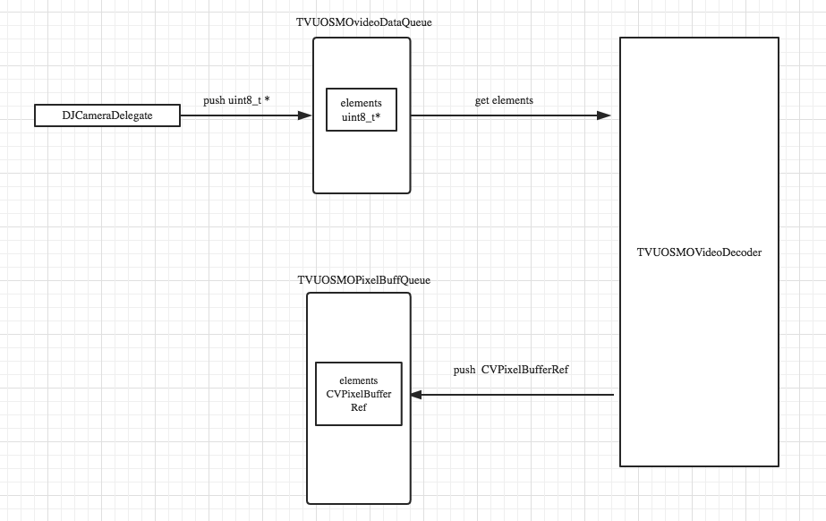
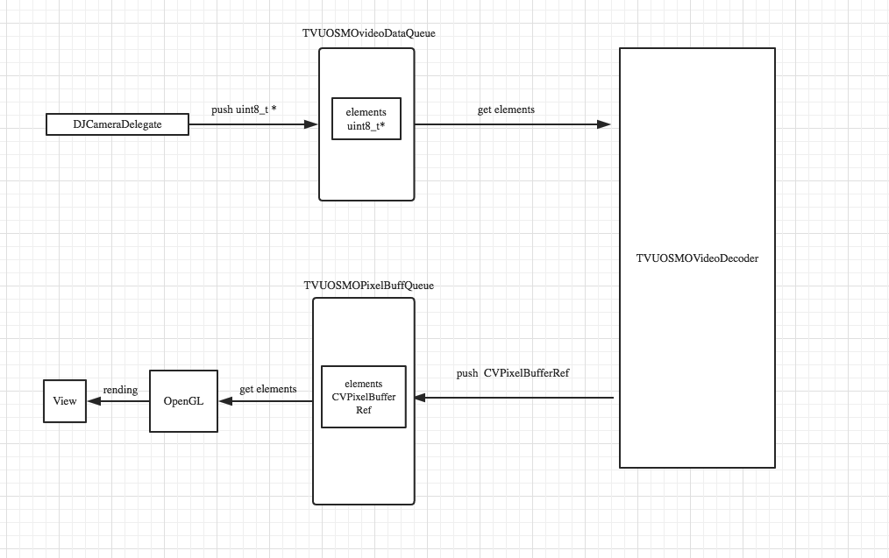
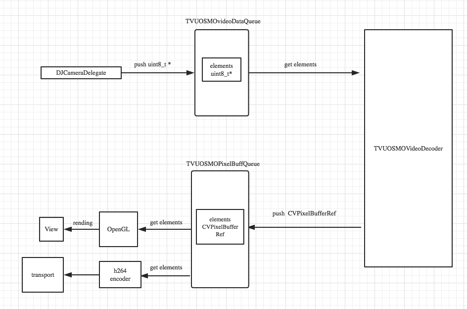

## 概述

这篇文档主要是介绍如何往Anywhere中集成OSMO，所做的最终效果就是在Anywhere中能显示DJI设备回传的视频。我将从以下几个方面做描述：

* 需求说明
* 集成DJI SDK
* 解码DJI视频码流并渲染
* 把DJI视频传给transport
* DJI视频和Anywhere视频自由切换控制逻辑设计

## 需求说明

需求主要有一下两点：

* 在Anywhere中能显示DJI设备回传的视频
* 传输DJI设备的视频到R端（传递给transport）

## 集成 DJI SDK

参考 DJI官网示例程序 [Creating a Camera Application](https://developer.dji.com/cn/mobile-sdk/documentation/ios-tutorials/index.html)

集成DJI SDK 的关键目的：

* 从`DJICameraDelegate`方法中获取大疆回传的视频码流数据，这是集成OSMO的入口。

## 解码DJI视频码流并渲染

我们从 `DJICameraDelegate` 方法中获取得到的是大疆回传的编码后的视频数据。所以我们要对这些编码后的视频数据进行解码，解码后得到视频原始帧数据，用OPenGL渲染这些原始帧数据。

### 视频解码

#### 视频解码流程

解析大疆设备回传的视频码流为原始视频帧数据，最后把这些原始视频帧数据存放到一个队列中。

流程图：

#### 解码器的设计

解码器是 `TVUOSMOVideoDecoder` ,需要一个辅助类，用于描述视频码流信息 `TVUOSMOVideoPacket`

具体细节：待研究

### 视频渲染

大疆回传的数据格式是 YUV420p,所以我们直接从原始帧数据队列`TVUOSMOPixelBufferQueue` 中获取原始视频帧数据进行渲染即可。

为上面流程图添加渲染模块，如图所示：

## 把DJI视频传给transport

为了把DJI的视频传输到R端，我们需要把大疆的码流传递给我们自己的transport进行传输。做到这一点，有两种解决方法：

* 利用我们解码后的原始视频帧，调用我们现有的编码器编码传输(先编码，再传输)
* 把DJI的码流，转化为我们要求的格式，传递给transport（直接利用大疆编码后的码流，按要求转化为我们需要的格式，传递给transport）

在这里我们选择使用第一种方式，即先编码再传输。我们可以在渲染的同时进行编码传输。选择这种方式的缺点是多进行了一次视频编码，浪费了性能；优点是可以利用Anywhere中的现有代码。

如果选择第二种方式，就需要从 uint8_t* 入手，转化为我们transport层接口需要的参数格式，进行传输。这种方法的效率更好。但具体如何使用及难易程度，有待探索。

下面是利用第一种方法的具体流程图:

## DJI视频和Anywhere视频自由切换控制逻辑设计

DJIOSMO视频和Anywhere本地捕获的视频的自由切换是一个比较复杂的控制逻辑，特先写设计文档来更好地理清楚编码思路。我以下几个方面入手：

* Anywhere采集视频编码逻辑
* DJIOSMO视频渲染编码逻辑
* 自由切换的需求
* 自由切换控制逻辑

### Anywhere采集视频编码逻辑

Anywhere是通过相机捕获音频和视频数据，视频是YUV(yuv420,422等)类型，经过 H264编码往Transport层传输。

### DJIOSMO视频渲染和解码逻辑

首先介绍解码： 
我们从大疆SDK的回调中，可以得到h264码流，我们使用H264解码的方式，得到了 uint_8* 类型的视频数据，存放到了一个消息队列`m_tvuOSMODecodedVideoDataQueue`里。 
视频渲染: 
我们单独开启了一个线程，从`m_tvuOSMODecodedVideoDataQueue`队列里取出数据，利用OpenGL进行渲染。

### 自由切换的需求

要实现Anywhere视频和DJIOSMO视频的自由切换，有以下需求：

* 当发现手机连接的是OSMO热点时，app自动显示OSMO的视频数据
* 当手机与OSMO热点断开时，APP所显示的OSMO视频就会自动消失，APP不能让手机自动连接上OSMO热点并渲染其视频数据
* OSMO视频的分辨率是 1280*720p ，帧率是 30FPS ,其和Anywhere本身的分辨率和fps是独立的，两者没有关系
* app界面不提供OSMO视频和Anywhere视频的切换开关，只有当手机与OSMO热点失去连接的时候，APP才切换到Anywhere的视频上，并能进行正常的直播功能。

### 自由切换控制逻辑

下面是具体的控制：

* app实时监测是否连接到OSMO，若连接到，则直接return Anywhere的 `captureOutput:`  方法，并启动渲染和解码线程。
* 当OSMO热点断开时，不关闭渲染和解码的线程，直接放开 Anywhere的 'captureOutput' 方法，重走原来的逻辑。
* 当App推到后台时(点击home键)，停止渲染和解码线程。

