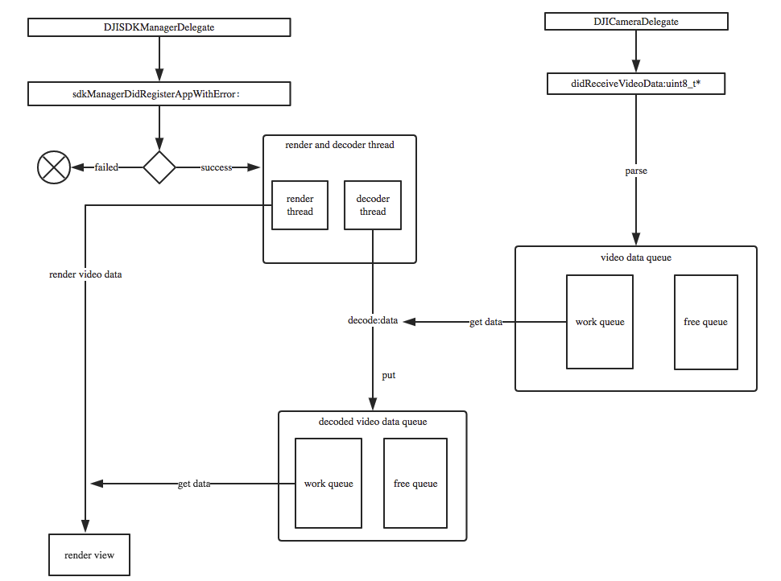
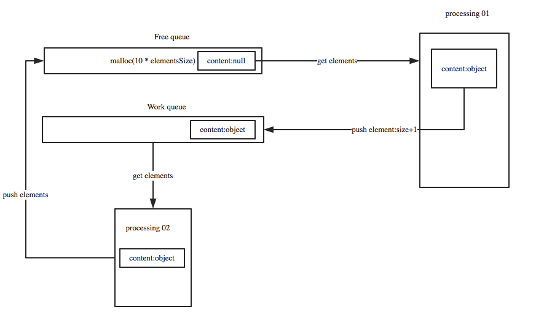
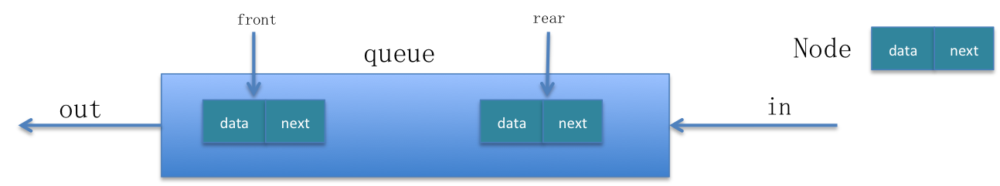
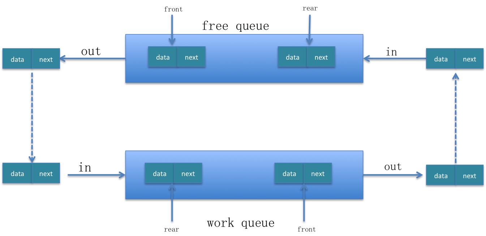
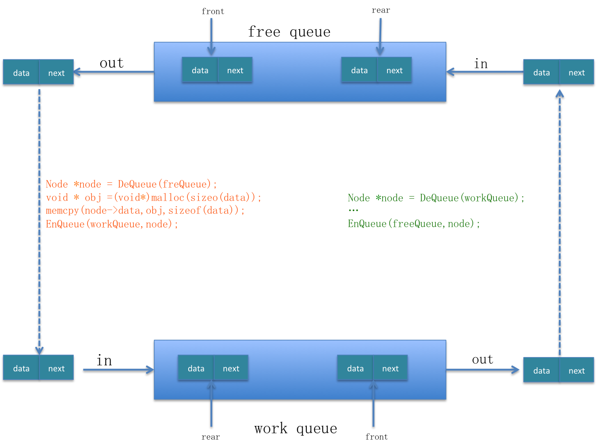
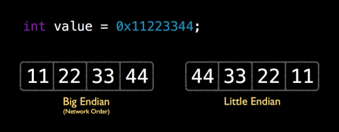

## 概述

这篇文章主要介绍往Anywhere中集成OSMO功能的开发过程，主要包括整体控制逻辑、parse视频流、解码操作、存储结构、渲染、线程的使用等。下面是具体包括的内容：

* 控制流程
* 顺序循环队列
	* 问题引入
	* 概念定义
	* 优化顺序循环队列
		* 性能优化
		* 存储优化
* H264解码
	* parse视频流
		* 对parse视频流的介绍
		* parse视频流代码
	* 制式转化(little endian->big endian)
	* 获取sps和pps信息
	* 视频时间戳
		* 对视频帧时间戳的理解 
		* CMSampleTimingInfo和CMTime
		* 时间戳的构造
			* 时间戳差值均值法构造时间戳
			* 利用时间戳和FPS构造时间戳
			* 构造视频时间戳是需要注意的问题
	* 纠正时间戳
	* 构造I帧并解码
* 渲染视频
	* CVImageBufferRef转化为 uint8_t *
	* 平滑渲染视频 	
* 版本发布时的 Xcode Configuration

下面我们开始详细介绍。

## 控制流程

控制流程图：

对上述控制流程图做简单说明：

1. 首先，当App成功注册时，启动渲染和解码线程。
2. 当DJICamera的视频流被接受的时候，parse视频流，把parse的结果放在一个循环队列里面parsedQueue
3. 解码线程从parsedQueue里面获取视频内容，进行解码。
4. 解码成功后，把解码后的视频原数据存放到一另一个循环队列里面 decodedQueue
5. 渲染线程从decodedQueue中取原始视频数据进行渲染。

渲染的同时，可以把获取到的原始视频数据转换成 CMSampleBuffer,传递个编码器，进而往 transport 层传输。

## 顺序循环队列

### 问题引入

我们知道，队列都是先进先出的数据结构。普通的队列通常情况下具有如下特点：

* 队列的大小不固定，有一个元素进入队列的长度就加一
* 每次有元素进入的时候，都要进行malloc分配内存的操作

根据以上特点，那么可以看出普通队列的性能不是很高。假设进队列的速度和出队列的速度一样，那么当进队列开始了以后，出队列开始的越晚，队列的长度就越大，需要的内存就越大。为了解决这种问题，我们在队列的基础上，引入了顺序循环队列。

### 概念定义

我们在队列的基础上开创出一种新的数据结构来避免这种弊端——顺序循环队列。下面是具体实现的原理图：

下面对上述原理图的详细说明：

1. 首先是创建一个固定大小的空闲队列，里面的内容都为空 (Free queue-大小为10)
2. 构造节点的处理程序 `Processing 01` 从空闲队列中取出节点，并把节点的真实内容填充进去，填充完成后把节点放入工作队列(work queue)
3. 处理节点逻辑 `Processing 02` 从工作队列中取出节点，处理完成后并把该节点重新扔到空闲队列中。

所以呢，只要出队列比进队列的速度快，那么队列的大小就不会增长。只要进出队列的速度调控的得当，队列能保持一个恒定的大小。下面是顺序循环队列的特点：

* 使用固定的内存，不需要隐式或意外的内存分配
* 高效的固定容量FIFO(先进先出)或LIFO(后进先出)队列，当队列满时删除最旧的(即最早插入的)元素
* 保存最近接收到的取样数据，在新的取样数据到达时覆盖最旧的数据。

### 实现代码

#### 节点定义

队列中包含的每个元素即节点。

	// video data node
	typedef struct TVUOSMOVideoDataNode
	{
	    TVUOSMOFrameType videoDataType;
	    uint8_t *data;
	    size_t size;  // data size
	    struct TVUOSMOVideoDataNode *next;
	}TVUOSMOVideoDataNode;
	
#### 队列定义

定义了空闲队列(free queue)和工作队列(work queue)

		// video data free queue
	typedef struct TVUOSMOVideoDataFreeQueue
	{
	    int size;
	    TVUOSMOVideoDataNode *front;
	    TVUOSMOVideoDataNode *rear;
	}TVUOSMOVideoDataFreeQueue;
	
	// video data work queue
	typedef struct TVUOSMOVideoDataWorkQueue
	{
	    int size;
	    TVUOSMOVideoDataNode *front;
	    TVUOSMOVideoDataNode *rear;
	}TVUOSMOVideoDataWorkQueue;

#### 队列的操作	

.h文件

	class TVUOSMODecodedVideoDataProcess
	{
	public:
	    TVUOSMODecodedVideoDataProcess();
	    ~TVUOSMODecodedVideoDataProcess();
	    static TVUOSMODecodedVideoDataProcess *getInstance();
    
    // queue
    void InitQueue(TVUOSMOVideoDataFreeQueue *freeQueue,TVUOSMOVideoDataWorkQueue *workQueue);
    void EnQueue(TVUOSMOVideoDataFreeQueue *freeQueue,TVUOSMOVideoDataWorkQueue *workQueue,TVUOSMOVideoDataNode *node);
    TVUOSMOVideoDataNode *DeQueue(TVUOSMOVideoDataFreeQueue *freeQueue,TVUOSMOVideoDataWorkQueue *workQueue);
    TVUOSMOVideoDataNode *GetNode(TVUOSMOVideoDataFreeQueue *freeQueue,TVUOSMOVideoDataWorkQueue *workQueue);
    void FreeNode(TVUOSMOVideoDataNode* Node);
    void ClearTVUOSMOVideoDataQueue();
    void storeDecodedOSMOVideoData(CVImageBufferRef pixelBuffer);
    
    TVUOSMOVideoDataFreeQueue *m_tvuOSMODecodedVideoDataFreeQueue;
    TVUOSMOVideoDataWorkQueue *m_tvuOSMODecodedVideoDataWorkQueue;
    
	private:
	    static TVUOSMODecodedVideoDataProcess *m_instance;
    
    pthread_mutex_t free_queue_mutex;
    pthread_mutex_t work_queue_mutex;
	};
	
.mm文件

		TVUOSMODecodedVideoDataProcess::TVUOSMODecodedVideoDataProcess()
	{
	    m_tvuOSMODecodedVideoDataFreeQueue = (TVUOSMOVideoDataFreeQueue *)malloc(sizeof(struct TVUOSMOVideoDataFreeQueue));
	    m_tvuOSMODecodedVideoDataWorkQueue = (TVUOSMOVideoDataWorkQueue *)malloc(sizeof(struct TVUOSMOVideoDataWorkQueue));
	    InitQueue(m_tvuOSMODecodedVideoDataFreeQueue, m_tvuOSMODecodedVideoDataWorkQueue);
	    
	    for (int i = 0; i < TVUOSMODecodedVideoDataFreeQueueSize; i++) {
	        TVUOSMOVideoDataNode* node = (TVUOSMOVideoDataNode *)malloc(sizeof(TVUOSMOVideoDataNode));
	        node->size = 0;
	        node->videoDataType = KTVUOSMOFrame_I;
	        node->data = NULL;
	        this->EnQueue(m_tvuOSMODecodedVideoDataFreeQueue, NULL,node);
	    }
	    
	    pthread_mutex_init(&free_queue_mutex, NULL);
	    pthread_mutex_init(&work_queue_mutex, NULL);
	}
	
	TVUOSMODecodedVideoDataProcess::~TVUOSMODecodedVideoDataProcess()
	{
	    this->ClearTVUOSMOVideoDataQueue();
	    free(m_tvuOSMODecodedVideoDataFreeQueue);
	    free(m_tvuOSMODecodedVideoDataWorkQueue);
	    m_tvuOSMODecodedVideoDataWorkQueue = nil;
	    m_tvuOSMODecodedVideoDataFreeQueue = nil;
	    pthread_mutex_destroy(&free_queue_mutex);
	    pthread_mutex_destroy(&work_queue_mutex);
	    
	}
	
	TVUOSMODecodedVideoDataProcess * TVUOSMODecodedVideoDataProcess::m_instance = NULL;
	TVUOSMODecodedVideoDataProcess* TVUOSMODecodedVideoDataProcess::getInstance()
	{
	    if (m_instance == NULL) {
	        m_instance = new TVUOSMODecodedVideoDataProcess();
	    }
	    return m_instance;
	}
	
	// queue
	void TVUOSMODecodedVideoDataProcess::InitQueue(TVUOSMOVideoDataFreeQueue *freeQueue,TVUOSMOVideoDataWorkQueue *workQueue)
	{
	    if (freeQueue != NULL) {
	        freeQueue->size = 0;
	        freeQueue->front = NULL;
	        freeQueue->rear = NULL;
	    }
	    
	    if (workQueue != NULL) {
	        workQueue->size = 0;
	        workQueue->front = NULL;
	        workQueue->rear = NULL;
	    }
	
	}
	
	void TVUOSMODecodedVideoDataProcess::EnQueue(TVUOSMOVideoDataFreeQueue *freeQueue,TVUOSMOVideoDataWorkQueue *workQueue,TVUOSMOVideoDataNode *node)
	{
	    node->next = NULL;
	    
	    if (freeQueue != NULL) {
	        pthread_mutex_lock(&free_queue_mutex);
	        if (freeQueue->front == NULL)
	        {
	            freeQueue->front = node;
	            freeQueue->rear = node;
	        }
	        else
	        {
	            freeQueue->rear->next = node;
	            freeQueue->rear = node;
	        }
	        freeQueue->size += 1;
	        log4cplus_debug("DJIOSMO", "DVDataQueue EnFree size=%d",freeQueue->size);
	         pthread_mutex_unlock(&free_queue_mutex);
	    }
	    
	    if (workQueue != NULL) {
	         pthread_mutex_lock(&work_queue_mutex);
	        if (workQueue->front == NULL)
	        {
	            workQueue->front = node;
	            workQueue->rear = node;
	        }
	        else
	        {
	            workQueue->rear->next = node;
	            workQueue->rear = node;
	        }
	        workQueue->size += 1;
	        log4cplus_debug("DJIOSMO", "DVDataQueue EnWork size=%d",workQueue->size);
	        pthread_mutex_unlock(&work_queue_mutex);
	    }
	}
	
	TVUOSMOVideoDataNode * TVUOSMODecodedVideoDataProcess::DeQueue(TVUOSMOVideoDataFreeQueue *freeQueue,TVUOSMOVideoDataWorkQueue *workQueue)
	{
	    TVUOSMOVideoDataNode* element = NULL;
	    if (freeQueue != NULL) {
	        pthread_mutex_lock(&free_queue_mutex);
	        element = freeQueue->front;
	        if(element == NULL)
	        {
	            pthread_mutex_unlock(&free_queue_mutex);
	            return NULL;
	        }
	        
	        freeQueue->front = freeQueue->front->next;
	        freeQueue->size -= 1;
	        pthread_mutex_unlock(&free_queue_mutex);
	        log4cplus_debug("DJIOSMO", "DVDataQueue DeFree size=%d",freeQueue->size);
	        return element;
	    }else{
	        pthread_mutex_lock(&work_queue_mutex);
	        element = workQueue->front;
	        if(element == NULL)
	        {
	            pthread_mutex_unlock(&work_queue_mutex);
	            return NULL;
	        }
	        
	        workQueue->front = workQueue->front->next;
	        workQueue->size -= 1;
	        log4cplus_debug("DJIOSMO", "DVDataQueue DeWork size=%d",workQueue->size);
	        pthread_mutex_unlock(&work_queue_mutex);
	        return element;
	    }
	
	}
	
	void TVUOSMODecodedVideoDataProcess::FreeNode(TVUOSMOVideoDataNode* Node)
	{
	    if(Node != NULL){
	        free(Node->data);
	        free(Node);
	    }
	
	}
	
	void TVUOSMODecodedVideoDataProcess::ClearTVUOSMOVideoDataQueue()
	{
	    while (m_tvuOSMODecodedVideoDataFreeQueue->size) {
	        TVUOSMOVideoDataNode *node = this->DeQueue(m_tvuOSMODecodedVideoDataFreeQueue,NULL);
	        this->FreeNode(node);
	    }
	    while (m_tvuOSMODecodedVideoDataWorkQueue->size) {
	        TVUOSMOVideoDataNode *node = this->DeQueue(NULL,m_tvuOSMODecodedVideoDataWorkQueue);
	        this->FreeNode(node);
	    }
	    log4cplus_debug("DJIOSMO", "clear DJIOSMO message queue...");
	}
	

#### 节点重用

从空闲队列取元素填充数据后放入工作队列：

	 TVUOSMOVideoDataNode *videoDataNode = this->DeQueue(m_tvuOSMOVideoDataFreeQueue,NULL);
    if (videoDataNode == NULL) {
        log4cplus_info("DJIOSMO", "drop frame, freeQueueSize:%d-----%s-----videoDataNode is NULL...",m_tvuOSMOVideoDataFreeQueue->size,__func__);
        return;
    }
    
    if (videoDataNode->size != 0) {
        free(videoDataNode->data);
    }
    videoDataNode->data = (uint8_t *)malloc(packet.size);
    videoDataNode->videoDataType = KTVUOSMOFrame_I;
    videoDataNode->size = packet.size;
    memcpy(videoDataNode->data,packet.data,packet.size);
    getParseSpeed();
    this->EnQueue(NULL,m_tvuOSMOVideoDataWorkQueue,videoDataNode);

### 优化顺序循环队列

谈到优化顺序循环队列，我们知道优化任何一段程序就是从两方面入手，一方面是优化存储，另一方面是优化性能。我们首先来看一下队列的操作。

如图所示，简要的说明的普通队列的操作。一个元素(节点)有两部分构成，data(可能包含多种数据类型)和next。关于队列的操作都是元素从尾部进入，从头部出。

进队列操作：EnQueue(Node *node)

	// 队列不为空时
	queue->rear->next = node;
	queue->rear = node;

出队列操作：DeQueue()
	
	// 队列不为空时
	Node *node = queue->front;
	queue->front = queue->front->next;
	return node;

#### 性能优化

我们首先看一下顺序循环队列的元素变换流程图：

从上面的元素变换流程图中可以看出，节点总是在`free queue`和`work queue`之间循环流动。我们真正用到的是 `work queue`，`free queue` 只是用来缓冲元素的，所以说`free queue`中的元素没有必要从队列的`rear`端移动到`front`端的时候才能被取出来。这种从队列尾到队列头的移动，就会降低程序的性能。 

所以我们可以把`free queue`的进队列和出队列操作都在同一端进行，就会减少空闲队列中元素的移动，从而提高程序的性能。我们这里都在队列的头部操作元素。由于队列本身的出队列操作就是在头部进行的，所以我们只需要改变其进队列也在头部进就行了。这样改变之后，`free queue`本质上就是一个栈了。

修改`free queue`的进队列操作在头部进行： EnQueue(Node *node)

	// 队列不为空时
	node->next = queue->front;
	queue->front = node;

#### 存储优化

所谓的存储优化，就是用为了实现同一个功能，能用更少的内存来完成。通常情况下是使用不同的存储结构。我们把单一队列改成顺序循环队列这本身就是一个存储优化。还有一点就是我们每次从`free queue`里面取节点然后为节点添加内容后往`work queue`里面扔元素的时候，为了给节点添加内容每次都要malloc一段内存，这样就会浪费很多内存。下面是示意图：

我们之所以在为`work queue`构造元素时，每次都`malloc`一段内存，就是因为我们不知道data的长度是多少，它的长度不是固定的。

为了避免为`work queue`构造元素时每次为都`malloc`一段内存，我们可以通过以下机制：

* 在Node节点中，除了存储data的真实size之外，我们还要存储一个长度，叫做bufferSize，用它来记录`malloc`的长度。
* 每次在构造节点时，都用data的真实长度和节点的bufferSize做对比。如果bufferSize=0,则malloc一段内存；如果`bufferSize < dataLength`,则使用relloc扩充内存；如果`bufferSize > dataLength`,则直接memcpy。
* 在`malloc`的时候，可以`malloc`的内存比真实的data length大一些，这样避免`malloc`的次数过多。

通过以上机制，就能减少`malloc`的次数，此时就会减少内存的使用，提高了性能。

##### 重新定义节点

为节点添加 `buffersize` 属性：

	// video data node
	typedef struct TVUOSMOVideoDataNode
	{
	    TVUOSMOFrameType videoDataType;
	    uint8_t *data;
	    size_t size;  // data size
	    size_t buffersize;
	    Float64 decodeTimestamp;
	    struct TVUOSMOVideoDataNode *next;
	}TVUOSMOVideoDataNode;

##### 优化代码

当从`free queue`中取出节点，构造节点的内容并把该节点放入`work queue`时：

	TVUOSMOVideoDataNode *videoDataNode = this->DeQueue(m_tvuOSMOVideoDataFreeQueue,NULL);
    if (videoDataNode == NULL) {
        log4cplus_info("DJIOSMO", "drop frame, freeQueueSize:%d-----%s-----videoDataNode is NULL...",m_tvuOSMOVideoDataFreeQueue->size,__func__);
        return;
    }
    
    // Optimization memory(Auccording to the packet size , to optimization the memory)
    if (videoDataNode->buffersize == 0) {
        log4cplus_debug("DJIOSMO", "parse video data, malloc video data,bufferSize=%d,packetSize=%d",(int)videoDataNode->buffersize,(int)packet.size);
        int buffersize = packet.size + kExpanBufferSize;
        videoDataNode->data = (uint8_t *)malloc(buffersize);
        videoDataNode->buffersize = buffersize;
    }
    else if(videoDataNode->buffersize < packet.size)
    {
        log4cplus_debug("DJIOSMO", "parse video data, realloc video data,realloc=%d,packetSize=%d",(int)videoDataNode->buffersize,(int)packet.size);
        int buffersize = packet.size + kExpanBufferSize;
        videoDataNode->data = (uint8_t *)realloc(videoDataNode->data, buffersize);
        videoDataNode->buffersize = buffersize;
    }
    else
    {
        log4cplus_debug("DJIOSMO", "parse video data, copy video data,bufferSize=%d,packetSize=%d",(int)videoDataNode->buffersize,(int)packet.size);
    }
    videoDataNode->videoDataType = KTVUOSMOFrame_I;
    videoDataNode->size = packet.size;
    videoDataNode->decodeTimestamp = 0.0f;
    memcpy(videoDataNode->data,packet.data,packet.size);
    
    getParseSpeed();
    this->EnQueue(NULL,m_tvuOSMOVideoDataWorkQueue,videoDataNode);

## H264解码

### 对解码的说明

我们是单独起一个线程进行视频解码的。具体的解码是硬解码(H264-VideoToolBox)。要做硬解码，我们必须知道`H264-VideoToolBox`解码的数据是 `CMSampleBuffer`,解码成功之后出来的数据是pixeBuffer .所以我们首先要做的就是把 `H264码流`转化为`CMSampleBuffer`流，然后送给解码器去解码。

我们知道, CMSampleBuffer = CMTime + FormatDesc + CMBlockBuffer . 需要从H264的码流里面提取出以上的三个信息。最后组合成CMSampleBuffer，提供给硬解码接口来进行解码工作。

H264码流是有NALU单元组成，一个NALU单元中可能包含有视频帧、SPS、PPS等.所以呢，我们解码的主要工作就是在处理NALU单元进而转化成CMSampleBuffer .

要想成功解码，首先需要做到以下：

* parse网络视频流
* 制式转化(little endian->big endian)
* 获取到sps和pps的信息(包括内容和大小)
* 时间戳的构造
* 时间戳的纠正
* 构造I帧并解码

### parse视频流

在解码之前，首先要做的就是对网络视频流做parse(提取)。这是解码的开始。

#### 对parse视频流的介绍

解析视频流。av_parser_parse2()的作用就是拿到一个完整帧对应的packet数据，因为帧数据可能比较大，一个网络数据包可能承载不了一帧数据 . 而解码的时候需要一帧一帧完整的传给解码器。所以要想成功解码，要么自己查找帧并传给解码器，要么调用av_parser_parse2查找。

av_parser_parse2()的作用就是拿到一个完整的帧对应的数据包。

#### parse视频流代码

下面是parse完视频流之后，把处理后的视频数据放到一个工作队列中，等待解码。

	uint8_t audbuffer2[] = {0x00,0x00,0x00,0x01,0x09,0x10};
	uint8_t audsize2 = 6;
	uint8_t fillerbuffer2[] = {0x00,0x00,0x00,0x01,0x0C,0x00,0x00,0x00,0x01,0x09,0x10};
	uint8_t fillersize2 = 11;
	uint8_t audaudbuffer2[] = {0x00,0x00,0x00,0x01,0x09,0x10, 0x00,0x00,0x00,0x01,0x09,0x10};
	uint8_t audaudsize2 = 12;

	#define kExpanBufferSize 1000
	void TVUOSMOVideoDataExtractor::privatePraseVideo(uint8_t * buf,int length)
	{
	    if(_pCodecCtx == NULL) return;
    
    int paserLength_In = length;
    int paserLen;
    uint8_t *paserBuffer_In = buf;
    
    // Removing the aud bytes.
    if(length >= fillersize2 && memcmp(fillerbuffer2, paserBuffer_In+length-fillersize2, fillersize2) == 0)
    {
        
        paserLength_In = length - fillersize2;
    }
    else if (length >= audaudsize2 && memcmp(audaudbuffer2, paserBuffer_In+length-audaudsize2, audaudsize2) == 0)
    {
        paserLength_In = length - audaudsize2;
        log4cplus_info("DJIOSMO", "audaudsize=%d , bufLength=%d",paserLength_In,length);
    }
    else if (length >= audsize2 && memcmp(audbuffer2, paserBuffer_In+length-audsize2, audsize2) == 0)
    {
        paserLength_In = length - audsize2;
    }

    while (paserLength_In > 0) {
        AVPacket packet;
        av_init_packet(&packet);
        paserLen = av_parser_parse2(_pCodecPaser, _pCodecCtx, &packet.data, &packet.size, paserBuffer_In, paserLength_In, AV_NOPTS_VALUE, AV_NOPTS_VALUE, AV_NOPTS_VALUE);
        paserLength_In -= paserLen;
        paserBuffer_In += paserLen;
        if (packet.size > 0) {
            _outputWidth = 1280;
            _outputHeight = 720;
            
            TVUOSMOVideoDataNode *videoDataNode = this->DeQueue(m_tvuOSMOVideoDataFreeQueue,NULL);
            if (videoDataNode == NULL) {
                log4cplus_info("DJIOSMO", "drop frame, freeQueueSize:%d-----%s-----videoDataNode is NULL...",m_tvuOSMOVideoDataFreeQueue->size,__func__);
                return;
            }
            
            // Optimization memory(Auccording to the packet size , to optimization the memory)
            if (videoDataNode->buffersize == 0) {
                log4cplus_debug("DJIOSMO", "parse video data, malloc video data,bufferSize=%d,packetSize=%d",(int)videoDataNode->buffersize,(int)packet.size);
                int buffersize = packet.size + kExpanBufferSize;
                videoDataNode->data = (uint8_t *)malloc(buffersize);
                videoDataNode->buffersize = buffersize;
            }
            else if(videoDataNode->buffersize < packet.size)
            {
                log4cplus_debug("DJIOSMO", "parse video data, realloc video data,realloc=%d,packetSize=%d",(int)videoDataNode->buffersize,(int)packet.size);
                int buffersize = packet.size + kExpanBufferSize;
                videoDataNode->data = (uint8_t *)realloc(videoDataNode->data, buffersize);
                videoDataNode->buffersize = buffersize;
            }
            else
            {
                log4cplus_debug("DJIOSMO", "parse video data, copy video data,bufferSize=%d,packetSize=%d",(int)videoDataNode->buffersize,(int)packet.size);
            }
            videoDataNode->videoDataType = KTVUOSMOFrame_I;
            videoDataNode->size = packet.size;
            videoDataNode->decodeTimestamp = 0.0f;
            memcpy(videoDataNode->data,packet.data,packet.size);
            
            getParseSpeed();
            this->EnQueue(NULL,m_tvuOSMOVideoDataWorkQueue,videoDataNode);
        }else{
            av_free_packet(&packet);
            break;
        }
        av_free_packet(&packet);
    }
    
}

### 制式转化(little endian->big endian)

如果当前系统对字节的存储制式和你提供的字节存储制式不同的话，是需要制式转化的。

#### 关于little endian 和 big endian

这儿有一个对[little endian and big endian](https://www.cs.umd.edu/class/sum2003/cmsc311/Notes/Data/endian.html)的介绍。下面我简单总结一下：

所谓的`little endian`和`big endian`就是数据(字节)在CPU中存储的两种形式。`little endian`就是将低序字节存储在起始位置；`big endian`是将高序字节存储在起始位置。下面一张图明显的诠释了它们的差别(反序):

由此我们可以得出结论，`little endian`和`big endian`之间的转换就是做字节的反序操作。

#### 制式转化代码

这段代码包含的有制式转换和获取sps、pps信息。

	static const uint8_t *ff_avc_find_startcode_internal(const uint8_t *p, const uint8_t *end)
	{
    const uint8_t *a = p + 4 - ((intptr_t)p & 3);
    
    for (end -= 3; p < a && p < end; p++) {
        if (p[0] == 0 && p[1] == 0 && p[2] == 1)
            return p;
    }
    
    for (end -= 3; p < end; p += 4) {
        uint32_t x = *(const uint32_t*)p;
        //      if ((x - 0x01000100) & (~x) & 0x80008000) // little endian
        //      if ((x - 0x00010001) & (~x) & 0x00800080) // big endian
        if ((x - 0x01010101) & (~x) & 0x80808080) { // generic
            if (p[1] == 0) {
                if (p[0] == 0 && p[2] == 1)
                    return p;
                if (p[2] == 0 && p[3] == 1)
                    return p+1;
            }
            if (p[3] == 0) {
                if (p[2] == 0 && p[4] == 1)
                    return p+2;
                if (p[4] == 0 && p[5] == 1)
                    return p+3;
            }
        }
    }
    
    for (end += 3; p < end; p++) {
        if (p[0] == 0 && p[1] == 0 && p[2] == 1)
            return p;
    }
    
    return end + 3;
	}

	static const uint8_t *ff_avc_find_startcode(const uint8_t *p, const uint8_t *end){
	    const uint8_t *out= ff_avc_find_startcode_internal(p, end);
	    if(p<out && out<end && !out[-1]) out--;
	    return out;
	}
	
	// 对于每一帧数据，在解码前都要进行一次过滤
	- (void)parseNalUnits:(const uint8_t *)buf_in Size:(int)size
	{
    const uint8_t *p = buf_in;
    const uint8_t *end = p + size;
    const uint8_t *nal_start, *nal_end;
    
    int nal_type = 0;
    size = 0;
    nal_start = ff_avc_find_startcode(p, end);
    
    for (;;) {
        while (nal_start < end && !*(nal_start++));
        if (nal_start == end)
            break;
        
        nal_end = ff_avc_find_startcode(nal_start, end);
	//        printf("NAL size:%ld\n", nal_end - nal_start);
	//        printf("%02x %02x %02x %02x\n", *(nal_start-4),*(nal_start-3),*(nal_start-2),*(nal_start-1));
	//        printf("%02x %02x %02x %02x\n", nal_start[0],nal_start[1],nal_start[2],nal_start[3]);
	//        printf("%02x %02x %02x %02x\n", nal_start[4],nal_start[5],nal_start[6],nal_start[7]);
	        uint32_t nal_size = htonl(uint32_t(nal_end - nal_start));
	        //uint8_t *nal_head_convert = (uint8_t*)&nal_size;
	        //printf("%02x %02x %02x %02x\n", nal_head_convert[0],nal_head_convert[1],nal_head_convert[2],nal_head_convert[3]);
	        uint8_t* nal_head = (uint8_t*)(nal_start - 4);
	        memcpy(nal_head, &nal_size, sizeof(uint32_t));
	//        nal_head[0] = nal_head_convert[3];
	//        nal_head[1] = nal_head_convert[2];
	//        nal_head[2] = nal_head_convert[1];
	//        nal_head[3] = nal_head_convert[0];
        
        //memcpy((uint8_t*)nalu_buf + 4, buffer+start_code_offset, nal_payload_size);
        //memcpy(nalu_buf, nalStartTag4Byte, 4);
        nal_type = nal_start[0] & 0x1f;
        
        if (nal_type == 7) { /* SPS */
            log4cplus_debug("DJIOSMO", "find sps, size is:%ld",nal_end - nal_start);
            _spsSize =  nal_end - nal_start;
            memcpy(_sps, nal_start, _spsSize);
        } else if (nal_type == 8) { /* PPS */
            log4cplus_debug("DJIOSMO", "find pps, size is:%ld",nal_end - nal_start);
            _ppsSize = nal_end - nal_start;
            memcpy(_pps, nal_start, _ppsSize);
        }
        
        size += 4 + nal_end - nal_start;
        nal_start = nal_end;
    }
	}

### 获取sps和pps信息

我们知道，H264码流的NALU中包含有SPS和PPS信息，我们根据SPS和PPS信息可以通过`CMVideoFormatDescriptionCreateFromH264ParameterSets()`方法来转化成 FormatDesc .这是我们的最终目的。所以如何获取SPS和PPS，你需要知道：

* 每个H264码流的NALU的开始码是 `0X00 00 01`或者是`OX00 00 00 01`，按照开始码来定位NALU
* 通过类型信息找到sps和pps并提取，开始码后第一个byte的后5位，7代表sps，8代表pps

完成以上两步骤之后，通过调用 `CMVideoFormatDescriptionCreateFromH264ParameterSets`函数来构建CMVideoFormatDescriptionRef.

具体代码：

1. 获取sps和pps信息在上一小节的代码中已经贴出来了
2. 构造videoFormatDes:

		const uint8_t* const parameterSetPointers[2] = {_sps,_pps};
	    const size_t parameterSetSizes[2] = {static_cast<size_t>(_spsSize),static_cast<size_t>(_ppsSize)};
	    
	    OSStatus status = CMVideoFormatDescriptionCreateFromH264ParameterSets(kCFAllocatorDefault,
	                                                                          2, parameterSetPointers,
	                                                                          parameterSetSizes,
	                                                                          4,
	                                                                          &_decoderFormatDescription);

### 视频时间戳

我们知道 CMSampleBuffer = CMTime + FormatDesc + CMBlockBuffer，视频时间戳这一模块是非常重要的。我们从下面几个方面介绍：

* 对视频时间戳的理解
* CMSampleTimingInfo和CMTime
* 时间戳的构造
	* 时间戳差值均值法构造时间戳
	* 利用时间戳和FPS构造时间戳
	* 利用时间戳和可变FPS构造时间戳，增加数据缓冲
	* 构造视频时间戳是需要注意的问题

#### 对视频时间戳的理解

其实视频的时间戳就是`DTS`和`PTS`的统称。我们理解了DTS和PTS也就明白了视频时间戳是怎么回事。

* DTS(Decoding Time Stamp) : 即解码时间戳，是解码器进行解码时相对于SCR(系统参考时间)的时间戳。它主要标识读入内存的bit流在什么时候开始送入解码器中进行解码 。
* PTS(Presentation Time Stamp) : 即显示时间戳，是显示帧时相对于SCR的时间戳。它主要是度量解码后的视频什么时候被显示出来。

DTS主要用于视频的解码，在解码阶段使用。PTS主要用于视频的同步和输出，在 display 的时候使用。总结来说就是DTS告诉解码器在什么时候去解码帧数据，PTS告诉渲染器在什么时候去显然帧数据.

视频的时间戳是通过`CMSampleTimingInfo`构造的，下面我们了解一下这个东东。

#### CMSampleTimingInfo和CMTime

CMSampleTimingInfo就是视频时间戳的表现形式，我们看一下它的定义：

		typedef struct
	{
		CMTime duration;				/*! @field duration
											The duration of the sample. If a single struct applies to
											each of the samples, they all will have this duration. */
		CMTime presentationTimeStamp;	/*! @field presentationTimeStamp
											The time at which the sample will be presented. If a single
											struct applies to each of the samples, this is the presentationTime of the
											first sample. The presentationTime of subsequent samples will be derived by
											repeatedly adding the sample duration. */
		CMTime decodeTimeStamp;			/*! @field decodeTimeStamp
											The time at which the sample will be decoded. If the samples
											are in presentation order, this must be set to kCMTimeInvalid. */
	} CMSampleTimingInfo;

我们看到 `CMSampleTimingInfo`里面包含的有`PTS`和`DTS`，它们的类型都是CMTime .

##### 获取host time

`host time`是系统的一个参考时间。直接上代码：

	CMClockRef hostClockRef = CMClockGetHostTimeClock();
        CMTime hostTime = CMClockGetTime(hostClockRef);
        
##### 关于CMTime的几个函数

我简单的罗列两个关于CMTime的函数，关于其含义和其它函数请自行查阅。

* Float64 CMTimeGetSeconds(
				CMTime time)
* CMTime CMTimeMakeWithSeconds(
				Float64 seconds,
				int32_t preferredTimescale)

#### 时间戳的构造

时间戳的构造逻辑是一个很重要的问题。当我们从网络上获取视频流的时候，如果这些视频帧数据中自带时间戳，那么就会为我们省去很多麻烦，那么此模块也就是多余的。但是，有可能我们从网络上获取的视频帧中并没有包含时间戳信息，那么我们就要想办法自己去构造了。构造时间戳的方法可能根据不同的需求进而会有多种构造方法。下面我简单描述我们用到的两种构造方法：

* 时间戳差值均值法构造时间戳
* 利用时间戳和FPS构造时间戳

##### 时间戳差值均值法构造时间戳

应用场景: 从网络上获取视频流时，不是均匀的一帧一帧的获取，有可能同一时刻突然获取到很多帧，那么我们如何合理的构造这些帧的时间戳呢？

构造原理: 当FPS固定时，原理上来说每一帧的时间戳都是固定的。所以针对于以上场景，大多数帧之间的时间戳是固定的。当某一时刻有同时又多帧到达的时候，我们可以根据前几帧的时间戳的差值来做一个时间戳差值的均值，然后用得出的时间戳差值的均值加上上一帧的时间戳就等于当前帧的时间戳。下面是原理图（FPS=30）

实现代码：

java版本：

	private  int    [ ]  interval_array = new int[4];
	private static final int INTERVAL_FRAME = 33  1000  1000;
	private static final int MAX_INTERVAL_FRAME = 250  1000  1000;
	private static final int MIN_INTERVAL_FRAME = 15  1000  1000;
	private  long  time_pre = 0;//pre timestamp
	private  int     index = 0;
	private  long time_current_modified = 0;
	private  long time_former_modified = 0;
	
	private tvuRawFrame modifyFrameTimestamp(tvuRawFrame data) {
			int len = 0;
			int sum = 0;
			long time_current = data.timestamp;
			int average_interval;
			len = interval_array.length;

		if (time_current - time_pre > MAX_INTERVAL_FRAME) {
			Log.e(TAG, "reset timestamp when frame interval exceed 250ms");
			time_pre = time_current;
			time_former_modified = time_current - INTERVAL_FRAME;
			for (int i = 0; i < len; i++) {
				interval_array[i] = INTERVAL_FRAME;
			}
		}
		index = index % len;
		interval_array[index] = Long.valueOf(time_current - time_pre).intValue();

		/*compute average interval*/
		for (int i = 0; i < len; i++) {
			sum += interval_array[i];
		}

		average_interval = sum / len;
		time_current_modified = time_former_modified + Integer.valueOf(average_interval).longValue();
		if (average_interval > (INTERVAL_FRAME + MIN_INTERVAL_FRAME) || average_interval < (INTERVAL_FRAME - MIN_INTERVAL_FRAME))
			Log.d(TAG, "curT: " + time_current + " laT:" + time_pre +
					" diff:" + (time_current - time_pre) / 1000000 + " MT:" + time_current_modified +
					" ltMT:" + time_former_modified + " interval:" + (time_current_modified - time_former_modified) / 1000000 +
					" offset:" + (time_current_modified - time_current) / 1000000);

		time_pre = time_current;
		time_former_modified = time_current_modified;
		interval_array[index] = average_interval;
		data.timestamp = time_current_modified / 1000;
		index ++;

		return data;
	}
		
OC版本：

	// _interval_array = [NSMutableArray arrayWithArray:@[@0.0f,@0.0f,@0.0f,@0.0f,@0.0f,@0.0f]];
	static Float64 time_pre = 0; // per timestamp
	static Float64 time_current_modified = 0;
	static Float64 time_former_modified = 0;
	static Float64 interval_frame = 0.033;
	static int temp_index = 0;
	- (Float64)modifyFrameTimestamp:(Float64)value
	{
    
    Float64 time_current = value;
    Float64 average_interval;
    int len = 0;
    Float64 sum = 0;
    len = (int)_interval_array.count;
    
    if (time_current - time_pre > 0.25 ) {
        log4cplus_error("DJIOSMO","reset timestamp when frame interval exceed 250ms");
        time_pre = time_current;
        time_former_modified = time_current - interval_frame;
        for (int i = 0 ;i < len; i++) {
            self.interval_array[i] = [NSNumber numberWithFloat:interval_frame];
        }
    }
    temp_index = temp_index % len;
    _interval_array[temp_index] =  [NSNumber numberWithFloat:(time_current - time_pre)];
    
    // 计算平均值
    for (int i = 0; i < len; i++) {
        sum += [_interval_array[i] floatValue];
    }
    average_interval = sum / len;
    time_current_modified = time_former_modified + average_interval;
    
    log4cplus_debug("DJIOSMO", "decord before:curT:%f , laT:%f , diff:%f , MT:%f , ltMT:%f , interval:%f , offset:%f ",
          time_current,
          time_pre,
          (time_current - time_pre),
          time_current_modified,
          time_former_modified,
          (time_current_modified-time_former_modified),
          (time_current_modified - time_current)
          );
    
    
    time_pre = time_current;
    time_former_modified = time_current_modified;
    _interval_array[temp_index] = [NSNumber numberWithFloat:average_interval];
    temp_index ++;
    return time_current_modified;;
	}
	
##### 利用时间戳和FPS构造时间戳

和 `时间戳差值均值法构造时间戳`法构造时间戳的场景相同，我们根据FPS来构造每一帧的时间戳。下面是构造的原理：第一帧的时间戳是当前时间curtime，以后每一帧的时间戳都加上固定的数值timestamp，那么当前帧的时间戳nowtimestamp = curtime+timestamp（timestamp = 1/FPS 单位是毫秒）。

利用这种方法构造时间戳的话，有可能会引入一些问题。比如，从某帧开始，时间戳来的忽然很慢或者忽然很快，那么当时间戳(curtime)累加到一定值得时候，就有可能会偏离真实的时间戳很多，由此可能会导致解码和渲染的异常。那么我们就得有一个时间戳检错纠正机制。

时间戳检错纠正机制原理:我们根据当前帧时间戳nowtimestamp,和当前`hosttime(当前时间)`做对比，如果差值超过一定数值(我们设置的半个时间戳差值),那么就重置当前帧的时间戳为当前时间。

具体代码：

	 CMSampleBufferRef sampleBuffer = NULL;
        const size_t sampleSizeArray[] = {dataSize};
        
        const CMTime interval = CMTimeMake(1, 30);
        static CMTime cur_ts;
        static CMTime last_ts;
        Float64 curtime;
        if(initOSMOTime == 0){
            curtime = [self getCurrentTimestamp];
            curtime = curtime - 0.25;
            cur_ts = CMTimeMakeWithSeconds(curtime, 30);
            initOSMOTime = 1;
        }else{
            cur_ts = CMTimeAdd(cur_ts, interval);
            Float64 modified_curtime = CMTimeGetSeconds(cur_ts);
            
            
            
            curtime = [self getCurrentTimestamp];
            curtime = curtime - 0.25;
            
            Float64 cur_interval = curtime - modified_curtime;
            if(cur_interval > 0.015){ //one frame interval 0.033s
                //modified_curtime = modified_curtime + 0.015;
                cur_ts = CMTimeMakeWithSeconds(curtime, 30);
                log4cplus_error("DJIOSMO", "decode>0.015 reset base time, because current interval:%f exceed [-0.066,0.066]", cur_interval);
            }else if(cur_interval < -0.015){
                Float64 lastTS =  CMTimeGetSeconds(last_ts);
                modified_curtime = lastTS + 0.015;
                cur_ts = CMTimeMakeWithSeconds(modified_curtime, 30);
                log4cplus_error("DJIOSMO", "decode<-0.015 reset base time, because current interval:%f exceed [-0.066,0.066]", cur_interval);
            }
            
        }
        CMSampleTimingInfo timingInfo;
        timingInfo.duration = kCMTimeInvalid;
        timingInfo.decodeTimeStamp = cur_ts;
        timingInfo.presentationTimeStamp = cur_ts;
        last_ts = cur_ts;
        
        Float64 dtTime = CMTimeGetSeconds(timingInfo.decodeTimeStamp);
        log4cplus_debug("DJIOSMO", "DecodeInfo dtTime=%f",dtTime);
        
        status = CMSampleBufferCreateReady(kCFAllocatorDefault,
                                           blockBuffer,
                                           _decoderFormatDescription ,
                                           1, 1,&timingInfo, 1, sampleSizeArray,
                                           &sampleBuffer);
                                           
##### 利用时间戳和可变FPS构造时间戳并增加数据缓冲区

我们利用`时间戳和FPS构造时间戳`的方法，有可能构造出来的时间戳大多数都不是不准确的。因为每一帧的时间戳都是根据第一帧（当前时间）去计算出来的，当有一帧的时间戳计算的不准确时，往后的每一帧都有可能不准确。这样就有可能会导致视频延迟、音视频不同步的现象。那么我们就衍生出了一种新的方法。下面做一下具体的分析：

我们知道，我们之所以为没一帧构造时间戳，是因为DJI过来的视频流没有再带时间戳。更重要的是，DJI的视频流传输过来的时候，并不是均匀传输的，有可能某一时刻过来好几帧的数据，我们之所以出现视频延时不正确，音视频不同步等问题，就是因为这个原因。如果DJI过来的视频码流都是均匀的按照30FPS的话，这些问题自然也就消失了。所以我们构造时间戳的问题其实也就是转换成了这样一个模型：如何让不均匀的流入数据均匀的流出。

如何能让数据均匀的流出。就好比池子里面的水，如果池子里面有一定量的水，那么你给池子下面开个口，下面的水就会流出，倘若你能保证池子里面的水一直是这么多，那么这个水就是均匀的流出的。同样的道理，我们调用解码的方法就是在流水，我们可以在调用解码前先看一下池子里面的水量够不够，即池子里面的水有没有达到一定的量。然后再调用解码方法。。而这个池子，就是一个buffer,就是一个缓冲区。这个是解决时间戳精准的第一步。

我们第二步要做的就是在解码之前尽量让这一帧的时间戳更加精准(即更加接近当前时间)。比如现在要处理的帧时F(n)，即第n帧。我们根据帧率是 30FPS 来计算的。 F(n)理论值 = F(n-1) + 1/30  ,我们假设当前时间是 curTime,下面是具体的情况分析：

	float curTime = getHostTime();
	float diff =  curTime - F(n)理论值;
	// 如果 diff > 0 ,说明计算出来的理论值是没有到达当前时间的，那么我们可以在计算 F(n)的理论值时，从F(n-1)那一帧多加一些，可以把帧率改成 25FPS
	if(diff > 0){
		F(n) = F(n-1) + 1/25
	}
	// 如果 diff < 0 ,说明计算出来的理论值是超过了当前时间的，那么我们可以在计算 F(n)的理论值时，从F(n-1)那一帧少加一些，可以把帧率改成 33FPS
	if(diff < 0){
		F(n) = F(n-1) + 1/33
	}
	
	if(diff == 0){
		F(n) = F(n)理论值
	}
	
通过上面这种方法，计算出来的时间戳的值，就会尽可能的接近了当前时间。再加上数据缓冲，这样算出的每一帧的时间戳似乎更合理一些。下面是具体的代码(缓冲了6个元素，即buffer大小为6)：

控制调用速度均衡：

	uint8_t nalStartTag4Byte[] = {0, 0, 0, 1};
	- (void)prepareDecoder
	{
	    TVUOSMOVideoDataWorkQueue *osmoVideoDataWorkQueue = [_tvuOSMOVideoDataProcessor getTVUOSMOVideoDataWorkQueue];
	    TVUOSMOVideoDataExtractor *videoDataExtractor = [_tvuOSMOVideoDataProcessor getTVUOSMOVideoDataExtractor];
	    
	    if (osmoVideoDataWorkQueue == NULL) {
	        log4cplus_error("DJIOSMO", "decode error, osmoVideoDataWorkQueue is null...");
	        return;
	    }
	    if (videoDataExtractor == NULL) {
	        log4cplus_error("DJIOSMO", "decode error, videoDataExtractor is null...");
	        return;
	    }
	    
	    TVUOSMOVideoDataNode *videoDataNode = NULL;
	    while(!self.isStopDecodeThread){
	        
	        int workQueueSize = videoDataExtractor->getWorkQueueSize();
	        if (workQueueSize < 6 && !self.isInitVideoWorkQueue) {
	            usleep(self.timerSleepMSEC*1000);
	            continue;
	        }else if(workQueueSize == OSMO_IP_STREAM_FLOW_CONTROL_MAX_QUEUE_SIZE){
	            self.isInitVideoWorkQueue = YES;
	        }
	        
	        Float64 curTime = [self getCurrentTimestamp];
	        Float64 dev = curTime -self.lastFrameTimestamp;
	        
	        if(dev > OSMO_IP_STREAM_INTERVAL_THREASHOLD){
	            //when video stream interupts >1s, reset all
	            log4cplus_error("DJIOSMO", "offset>1 reset all, because current interval:%f", dev);
	            self.isInitVideoWorkQueue = NO;
	            self.lastFrameTimestamp = curTime;
	            initOSMOTime = 0;
	            
	            usleep(self.timerSleepMSEC*1000);
	            continue;
	        }
	        
	        if (dev < 0.031 || workQueueSize <= OSMO_IP_STREAM_FLOW_CONTROL_MIN_QUEUE_SIZE) {
	            usleep(self.timerSleepMSEC*1000);
	            continue;
	        }
	        
	        self.lastFrameTimestamp = curTime;
	        log4cplus_debug("DJIOSMO", "DecodeInfodtTime curTime=%f,lastFrameTimestamp=%f,dev=%f,workQueueSize=%d",curTime,self.lastFrameTimestamp,dev,workQueueSize);
	        
	
	        videoDataNode = videoDataExtractor->DeQueue(NULL, osmoVideoDataWorkQueue);
	        if (videoDataNode == NULL || videoDataNode == nil) {
	            usleep(self.timerSleepMSEC*1000);
	            continue;
	        }
	        
	        [self getDecodeSpeed];
	        
	        int remain_size = (int)videoDataNode->size;
	        uint8_t* data = videoDataNode->data;
	        [self parseNalUnits:data Size:remain_size];
	        
	        if (self.decoderInited) {
	            [self decoder:data size:remain_size];
	        }else{
	            
	            if (_spsSize != 0 && _ppsSize != 0) {
	                log4cplus_info("DJIOSMO", "spsSize:%d,ppsSize:%d",(int)_spsSize,(int)_ppsSize);
	                [self initTVUOSMOH264Decoder];
	            }
	        }
	        videoDataExtractor->EnQueue(videoDataExtractor->m_tvuOSMOVideoDataFreeQueue, NULL, videoDataNode);
	    }
	    
	    if (self.isStopDecodeThread) {
	        log4cplus_info("DJIOSMO", "stop decoder thread...");
	        videoDataExtractor->ClearTVUOSMOVideoDataQueue();
	    }
	    
	}

构造时间戳：

	 static int initOSMOTime = 0;
	- (CVPixelBufferRef)decoder:(uint8_t *)data size:(size_t)dataSize
	{
	    CVPixelBufferRef outputPixelBuffer = NULL;
	    
	    CMBlockBufferRef blockBuffer = NULL;
	    OSStatus status = CMBlockBufferCreateWithMemoryBlock(kCFAllocatorDefault,
	                                                         (void *)data,
	                                                         dataSize,
	                                                         kCFAllocatorNull,
	                                                         NULL,
	                                                         0,
	                                                         dataSize,
	                                                         0,
	                                                         &blockBuffer);
	    if (status == kCMBlockBufferNoErr) {
	        CMSampleBufferRef sampleBuffer = NULL;
	        const size_t sampleSizeArray[] = {dataSize};
	        
	        const CMTime interval_30 = CMTimeMake(1, 30);
	        const CMTime interval_31 = CMTimeMake(1, 31);
	        const CMTime interval_25 = CMTimeMake(1, 25);
	        
	        static CMTime cur_ts;
	        static CMTime last_ts;
	        Float64 curtime;
	        
	        if(initOSMOTime == 0){
	            curtime = [self getCurrentTimestamp];
	            curtime = curtime - OSMO_AV_OFFSET;
	            cur_ts = CMTimeMakeWithSeconds(curtime, 30);
	            initOSMOTime = 1;
	        }else{
	            cur_ts = CMTimeAdd(cur_ts, interval_30);
	            Float64 modified_curtime = CMTimeGetSeconds(cur_ts);
	            
	            curtime = [self getCurrentTimestamp];
	            curtime = curtime - OSMO_AV_OFFSET;
	            
	            Float64 cur_interval = curtime - modified_curtime;
	            
	            if(cur_interval > 0){ //one frame interval 0.033s
	                //modified_curtime = modified_curtime + 0.015;
	                
	                cur_ts = CMTimeAdd(last_ts, interval_25);
	//                cur_ts = CMTimeMakeWithSeconds(curtime, 30);
	                log4cplus_debug("DJIOSMO", "offset>0 reset base time, because current interval:%f", cur_interval);
	            }else if(cur_interval < 0){
	//                Float64 lastTS =  CMTimeGetSeconds(last_ts);
	//                modified_curtime = lastTS + 0.040;
	//                cur_ts = CMTimeMakeWithSeconds(modified_curtime, 30);
	                
	                cur_ts = CMTimeAdd(last_ts, interval_31);
	                
	                log4cplus_debug("DJIOSMO", "offset<0 reset base time, because current interval:%f", cur_interval);
	            } else {
	                log4cplus_debug("DJIOSMO", "offset=0 do noting, because current interval:%f", cur_interval);
	            }
	            
	            
	        }
	        CMSampleTimingInfo timingInfo;
	        timingInfo.duration = kCMTimeInvalid;
	        timingInfo.decodeTimeStamp = cur_ts;
	        timingInfo.presentationTimeStamp = cur_ts;
	        last_ts = cur_ts;
	        
	        Float64 dtTime = CMTimeGetSeconds(timingInfo.decodeTimeStamp);
	        log4cplus_debug("DJIOSMO", "DecodeInfodtTime=%f",dtTime);
	        
	        //self.lastFrameTimestamp = dtTime;
	        
	        
	        /*
	        
	        CMClockRef hostClockRef = CMClockGetHostTimeClock();
	        CMTime hostTime = CMClockGetTime(hostClockRef);
	        Float64 curtime = CMTimeGetSeconds(hostTime);
	        curtime = curtime - 0.25;
	        curtime = [self modifyFrameTimestamp:curtime];
	        
	        //        int64_t mytime = int64_t(curtime*1000);
	        
	        CMSampleTimingInfo timingInfo;// = (CMSampleTimingInfo *)malloc(sizeof(CMSampleTimingInfo));
	        timingInfo.duration = kCMTimeInvalid;//CMTimeMake(1, 30);
	        //        timingInfo.decodeTimeStamp = CMTimeMake(mytime*30, 30);
	        //        timingInfo.presentationTimeStamp = CMTimeMake(mytime*30, 30);
	        timingInfo.decodeTimeStamp = CMTimeMakeWithSeconds(curtime, 30);
	        timingInfo.presentationTimeStamp = CMTimeMakeWithSeconds(curtime, 30);
	        */
	        
	        status = CMSampleBufferCreateReady(kCFAllocatorDefault,
	                                           blockBuffer,
	                                           _decoderFormatDescription ,
	                                           1, 1,&timingInfo, 1, sampleSizeArray,
	                                           &sampleBuffer);
	        if (status == kCMBlockBufferNoErr && sampleBuffer) {
	            VTDecodeFrameFlags flags = 0;
	            VTDecodeInfoFlags flagOut = 0;
	            OSStatus decodeStatus = VTDecompressionSessionDecodeFrame(_decoderSession,
	                                                                      sampleBuffer,
	                                                                      flags,
	                                                                      &outputPixelBuffer,
	                                                                      &flagOut);
	            
	            if(decodeStatus == kVTInvalidSessionErr) {
	                log4cplus_error("DJIOSMO", "H264Decoder Invalid session, reset decoder session...");
	            } else if(decodeStatus == kVTVideoDecoderBadDataErr) {
	                log4cplus_error("DJIOSMO", "H264Decoder decode failed status=%d(Bad data)...",(int)decodeStatus);
	            } else if(decodeStatus != noErr) {
	                log4cplus_error("DJIOSMO", "H264Decoder decode failed status=%d",(int)decodeStatus);
	            }else{
	//                NSLog(@"DJIOSMO: H264Decoder decode success...");
	            }
	            
	            CFRelease(sampleBuffer);
	        }
	        CFRelease(blockBuffer);
	    }else{
	        log4cplus_error("DJIOSMO", "H264Decoder CMBlockBufferCreateWithMemoryBlock failed status=%d",(int)status);
	    }
	    
	    return outputPixelBuffer;
	}

	                                           
##### 构造时间戳需要注意的问题

问题：当你计算出的相邻两帧之间的时间戳差值很小时，为这两帧赋值时间戳的时候，有时候会出一些问题。比如为A帧设置的时间戳和赋值成功后A帧的时间戳的值不相同。我么可以通过打印A的时间戳的值来发现问题。

引起问题的原因：可能是因为相邻两帧的时间戳的差值太小而引起的。

解决方法：

		CMClockRef hostClockRef = CMClockGetHostTimeClock();
	        CMTime hostTime = CMClockGetTime(hostClockRef);
	        Float64 curtime = CMTimeGetSeconds(hostTime);
	        curtime = curtime - 0.25;
	        curtime = [self modifyFrameTimestamp:curtime];
	        
	//        int64_t mytime = int64_t(curtime*1000);
	        
	        CMSampleTimingInfo timingInfo;// = (CMSampleTimingInfo *)malloc(sizeof(CMSampleTimingInfo));
	        timingInfo.duration = kCMTimeInvalid;//CMTimeMake(1, 30);
	//        timingInfo.decodeTimeStamp = CMTimeMake(mytime*30, 30);
	//        timingInfo.presentationTimeStamp = CMTimeMake(mytime*30, 30);
	        timingInfo.decodeTimeStamp = CMTimeMakeWithSeconds(curtime, 30);
	        timingInfo.presentationTimeStamp = CMTimeMakeWithSeconds(curtime, 30);
	        
	        
	        int cha = (curtime - CMTimeGetSeconds(timingInfo.presentationTimeStamp)) * 1000000;
	        CMTime chaCMTime = CMTimeMake(cha, 1000000);
	        timingInfo.decodeTimeStamp = CMTimeAdd(timingInfo.decodeTimeStamp, chaCMTime);
	        timingInfo.presentationTimeStamp = CMTimeAdd(timingInfo.presentationTimeStamp, chaCMTime);
	        
	        NSLog(@"h264encoder---curtime:%f , timeStamp:%f ,dts:%f",curtime,CMTimeGetSeconds(timingInfo.presentationTimeStamp),CMTimeGetSeconds(timingInfo.decodeTimeStamp));                                           
	                                           

### 纠正时间戳

在上一小节中，我所提到的有一个时间戳纠正方案。上一小节中是为了让解码的时间戳更加精准合理。其实关于纠正时间戳，为了让解码更加精准，避免解码失败次数增加从而避免丢帧。关于纠正时间戳的方法就具体场景具体而定，在此不过多描述。
                                        
### 构造I帧并解码

DJIOSMO的第一个I帧是一个固定的。所以在解码是只需先解码这一帧即可。

## 渲染视频

我们应用的是利用OPenGL进行视频的渲染，具体代码省略。

### CVImageBufferRef转化为 uint8_t *

首先，我们可以根据CVImageBufferRef得到YUV数据。YUV420在内存中的计算方式是： 

	width * hight =Y（总和） 
	U = Y / 4  
	V = Y / 4

所以,YUV420数据在内存中的总大小就是 Y+U+V = `width*height*3/2`,这样就和分辨率扯上关系了。
 
下面是`CVImageBufferRef`转化为 `uint8_t *`的具体代码:

		+ (uint8_t *)convertCVImageBufferRefToUint8_t:(CVImageBufferRef)pixelBuffer
	{
	    CVPixelBufferLockBaseAddress(pixelBuffer, 0);
	    
	    //图像宽度（像素）
	    size_t pixelWidth = CVPixelBufferGetWidth(pixelBuffer);
	    //图像高度（像素）
	    size_t pixelHeight = CVPixelBufferGetHeight(pixelBuffer);
	    
	    //yuv中的y所占字节数
	    size_t y_size = pixelWidth * pixelHeight;
	    //yuv中的uv所占的字节数
	    size_t uv_size = y_size / 2;
	    uint8_t *yuv_frame = (uint8_t *)malloc(uv_size + y_size);
	    
	    //获取CVImageBufferRef中的y数据
	    uint8_t *y_frame = (uint8_t *)CVPixelBufferGetBaseAddressOfPlane(pixelBuffer, 0);
	    memcpy(yuv_frame, y_frame, y_size);
	    
	    //获取CMVImageBufferRef中的uv数据
	    uint8_t *uv_frame = (uint8_t *)CVPixelBufferGetBaseAddressOfPlane(pixelBuffer, 1);
	    memcpy(yuv_frame + y_size, uv_frame, uv_size);
	    
	    CVPixelBufferUnlockBaseAddress(pixelBuffer, 0);
	    NSData *data = [NSData dataWithBytesNoCopy:yuv_frame length:y_size + uv_size];
	    
	    uint8_t * pFrameRGB = (uint8_t *)[data bytes];
	    return pFrameRGB;
	}

下面描述一下如何让视频渲染的更加平滑。

### 平滑渲染视频

控制视频更加平滑的渲染肯定有很多种方法，我这里所描述的是如何更好的控制渲染方法的调用，进而让视频渲染的更加平滑。

场景： 我们使用的是一个渲染线程去做渲染视频的工作，如果等待渲染的容器中有很多的待渲染视频数据，那么渲染线程就有可能在极短的时间内一下子渲染多帧视频数据，这样就会导致视频的花屏甚至是卡顿也许是丢帧。

解决方法：添加一个缓冲逻辑，让每一帧视频都在尽量均匀的时间差间去渲染。Anywhere中是判断当前时间和上一帧被渲染的时间比较，如果差值大于1/fps,那么才去调用渲染逻辑。

下面我总结一下渲染更加平滑的方法：

1. 利用解码时间戳和当前时间戳做对比，决定是否渲染。这样做的前提是保证解码时间戳是正确的，这样渲染的视频才正常达到我们的要求。
2. 如果解码时间戳不稳定，则需要我们自己构造一个缓冲时间。缓冲时间的值视情况而定，渲染的逻辑就是利用当前时间减去上一帧的渲染时间，利用这个差值和缓冲时间做对比。(我们用的就是这种方式)

## Xcode configuration

在开发完成后，上传App到 App Store时，有可能会遇到 i386的错误。而 DJISDK.framework中有一个 strip-frameworks.sh 的脚本，连接内容是具体设置：[Xcode configuration](https://developer.dji.com/mobile-sdk/documentation/application-development-workflow/workflow-deploy.html)

